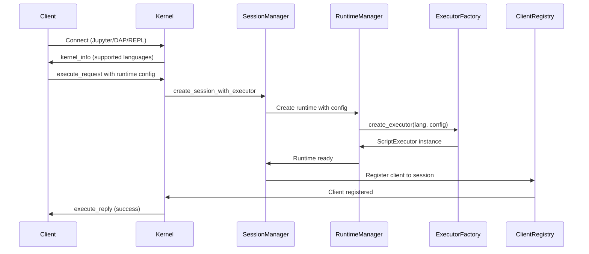

# Ultrathink Analysis: Runtime-per-Session Architecture for 10.18

## Critical Discovery: Configuration & Lifecycle Management

### The Daemon Scenario Problem
**Scenario**: Kernel running as daemon with Lua runtime
- Client A connects, wants Lua with OpenAI provider
- Client B connects, wants JavaScript with Anthropic provider
- Client C connects, wants to share Client A's session
- How does each client specify configuration?
- How to shutdown Client B's runtime without affecting A and C?

### Current Architecture Gaps
1. **Configuration Loading**: Kernel starts with single LLMSpellConfig, no per-session config
2. **Language Selection**: No way to request specific language at session creation
3. **Runtime Lifecycle**: No way to shutdown specific runtime, only entire kernel
4. **Resource Management**: No per-runtime memory limits or cleanup

## Current Architecture Analysis

### Existing Components (What We Have)
- SessionManager (Phase 6) - manages session lifecycle but NOT runtimes
- StateScope::Session (Phase 5) - provides namespace isolation
- MessageRouter (Phase 9) - routes messages to multiple clients
- IntegratedKernel - has single shared script_executor
- ScriptExecutor trait - defines execution interface
- ScriptExecutorFactory trait - can create executors

### Missing Components (What We Need)
- Session-to-Executor binding with configuration
- Client-to-Session mapping with language selection
- Per-session runtime isolation with lifecycle management
- Session sharing policies with access control
- Runtime configuration passing through protocol
- Runtime shutdown without kernel restart
- Memory cleanup on session end

## Naming Convention Analysis

### Discovered Patterns from Codebase
- Managers: SessionManager, StateManager, ConnectionFileManager
- Registries: HookRegistry (not ClientRegistry - should match)
- Contexts: SessionContext, ExecutionContext, GlobalContext
- Bridges: DAPBridge, SignalBridge, ScriptEngineBridge
- Configs: SessionConfig, DaemonConfig, ExecutionConfig
- Errors: SessionError, StateError, KernelError
- Traits: suffix with nothing (Protocol, Transport, ScriptExecutor)
- Async methods: no special suffix, just descriptive names
- Creation methods: new(), new_with_X(), create_X()
- Getters: get_X(), X() for simple fields
- With builders: with_X() returns Self

## Required Changes Analysis

### Core Architectural Changes
1. **Kernel becomes Runtime Orchestrator**: Remove single script_executor, manage multiple
2. **Session-Specific Configuration**: Pass runtime config at session creation
3. **Runtime Lifecycle Management**: Start/stop/restart runtimes independently
4. **Protocol Extensions**: Language and config negotiation in kernel_info/execute_request
5. **Resource Isolation**: Per-runtime memory limits and cleanup

### New Types Needed
```rust
// Enhanced CreateSessionOptions with runtime configuration
pub struct CreateSessionOptions {
    // Existing fields...
    pub name: Option<String>,
    pub description: Option<String>,

    // NEW: Runtime configuration
    pub runtime_language: String,  // "lua", "javascript", "python"
    pub runtime_config: Option<LLMSpellConfig>,  // Override kernel defaults
    pub sharing_policy: SessionSharingPolicy,
}

pub struct SessionSharingPolicy {
    pub mode: SessionSharingMode,
    pub max_clients: usize,
    pub allow_runtime_shutdown: bool,  // Can clients shutdown the runtime?
}

pub enum SessionSharingMode {
    Isolated,      // Single client only
    Collaborative, // Multiple clients, shared state
    Supervised {   // Multiple clients, controlled access
        owner: ClientId,
        readers: HashSet<ClientId>,
    },
}

// Runtime lifecycle management
pub struct RuntimeManager {
    runtimes: DashMap<SessionId, ManagedRuntime>,
    factory: Arc<dyn ScriptExecutorFactory>,
}

pub struct ManagedRuntime {
    executor: Arc<dyn ScriptExecutor>,
    config: LLMSpellConfig,
    language: String,
    created_at: Instant,
    last_activity: Arc<RwLock<Instant>>,
    memory_usage: Arc<AtomicUsize>,
    shutdown_tx: Option<oneshot::Sender<()>>,
}
```

### Method Naming Following Patterns
```rust
// SessionManager additions:
create_session_with_executor() // matches create_session pattern
bind_executor_to_session() // active verb pattern
get_executor_for_session() // get_X_for_Y pattern

// ClientRegistry methods:
register_client() // matches register pattern from HookRegistry
connect_client_to_session() // verb_object_to_target pattern
get_session_for_client() // get_X_for_Y pattern
list_clients_for_session() // list_X_for_Y pattern
```

## Task Breakdown for 10.18

### 10.18.1 Changes
- Rename: ClientRegistry (correct - matches HookRegistry)
- Add: ScriptExecutorFactory integration
- Add: Session binding tracking

### 10.18.2 Changes
- Focus on session-level isolation, not client-level
- Add session executor management
- Implement sharing policies

### 10.18.3 Changes
- Session persistence includes executor state
- Add executor recreation on recovery

## Impact on Subsequent Phases

### Phase 11 (Memory System)
- Memory scoped to sessions, not clients
- Each session has its own memory context
- Shared sessions share memory

### Phase 12-13 (MCP)
- MCP tools scoped to sessions
- Tool state isolated per session

### Phase 14 (JavaScript)
- JavaScript executors created per session
- Same hybrid model applies

## Implementation Priority

1. First: Modify SessionManager to own executors
2. Second: Create ClientRegistry for mappings
3. Third: Update IntegratedKernel execution flow
4. Fourth: Add session sharing policies
5. Fifth: Implement persistence changes

## Detailed Implementation Plan

### New Files Required
1. `llmspell-kernel/src/execution/executor_factory.rs` - Implement ScriptExecutorFactory
2. `llmspell-kernel/src/client_registry.rs` - Client registry module
3. `llmspell-kernel/src/sessions/executor_binding.rs` - Session-executor binding

### Modified Files
1. `llmspell-kernel/src/sessions/manager.rs` - Add executor management
2. `llmspell-kernel/src/execution/integrated.rs` - Remove single executor
3. `llmspell-kernel/src/sessions/types.rs` - Add sharing configuration
4. `llmspell-kernel/src/sessions/session.rs` - Add executor reference

### New Structs Following Naming Patterns

```rust
// In llmspell-kernel/src/execution/executor_factory.rs
pub struct DefaultScriptExecutorFactory {
    base_config: LLMSpellConfig,  // Kernel defaults
}

impl ScriptExecutorFactory for DefaultScriptExecutorFactory {
    async fn create_executor(
        &self,
        language: &str,
        config: Option<LLMSpellConfig>,  // Per-session override
    ) -> Result<Box<dyn ScriptExecutor>, LLMSpellError> {
        // Use session config or fall back to kernel defaults
        let runtime_config = config.unwrap_or_else(|| self.base_config.clone());

        match language {
            "lua" => {
                let runtime = ScriptRuntime::new_with_lua(runtime_config).await?;
                Ok(Box::new(runtime))
            }
            "javascript" => {
                // Phase 14
                Err(LLMSpellError::NotImplemented("JavaScript support in Phase 14".into()))
            }
            _ => Err(LLMSpellError::Validation {
                field: Some("language".to_string()),
                message: format!("Unsupported language: {}", language),
            }),
        }
    }

    fn supported_languages(&self) -> Vec<String> {
        vec!["lua".to_string()]
    }

    async fn create_executor_with_config(
        &self,
        language: &str,
        config: LLMSpellConfig,
    ) -> Result<Box<dyn ScriptExecutor>, LLMSpellError> {
        self.create_executor(language, Some(config)).await
    }
}

// In llmspell-kernel/src/client_registry.rs
pub struct ClientRegistry {
    clients: Arc<DashMap<ClientId, ClientInfo>>,
    client_sessions: Arc<DashMap<ClientId, SessionId>>,
    session_clients: Arc<DashMap<SessionId, HashSet<ClientId>>>,
}

pub struct ClientInfo {
    pub id: ClientId,
    pub session_id: SessionId,
    pub connection_type: ConnectionType,
    pub connected_at: std::time::Instant,
    pub last_activity: Arc<RwLock<std::time::Instant>>,
}

pub enum ConnectionType {
    Jupyter,
    DAP,
    LSP,
    REPL,
}

// In llmspell-kernel/src/sessions/executor_binding.rs
pub struct SessionExecutorBinding {
    pub session_id: SessionId,
    pub executor: Arc<dyn ScriptExecutor>,
    pub language: String,
    pub created_at: DateTime<Utc>,
}

// In llmspell-kernel/src/sessions/types.rs
#[derive(Debug, Clone, Serialize, Deserialize)]
pub enum SessionSharingMode {
    /// No sharing allowed - single client only
    Isolated,
    /// Multiple clients can connect and share state
    Collaborative,
    /// Multiple clients, but some are read-only
    Supervised {
        write_clients: HashSet<ClientId>,
        read_clients: HashSet<ClientId>,
    },
}

#[derive(Debug, Clone, Serialize, Deserialize)]
pub struct SessionSharingPolicy {
    pub mode: SessionSharingMode,
    pub max_clients: usize,
    pub require_auth: bool,
    pub allow_reconnect: bool,
}
```

### Method Implementations Following Patterns

```rust
// SessionManager enhancements with configuration
impl SessionManager {
    /// Create a session with a dedicated executor and configuration
    pub async fn create_session_with_executor(
        &self,
        options: CreateSessionOptions,
    ) -> Result<SessionId> {
        // Extract runtime settings from options
        let language = options.runtime_language.clone();
        let runtime_config = options.runtime_config.clone();

        // Create session
        let session = Session::new(options);
        let session_id = session.id().await;

        // Create executor with session-specific config
        let executor = self.executor_factory
            .create_executor(&language, runtime_config)
            .await?;

        // Create managed runtime with lifecycle controls
        let (shutdown_tx, shutdown_rx) = oneshot::channel();
        let managed_runtime = ManagedRuntime {
            executor: Arc::from(executor),
            config: runtime_config.unwrap_or(self.base_config.clone()),
            language: language.clone(),
            created_at: Instant::now(),
            last_activity: Arc::new(RwLock::new(Instant::now())),
            memory_usage: Arc::new(AtomicUsize::new(0)),
            shutdown_tx: Some(shutdown_tx),
        };

        // Store in runtime manager
        self.runtime_manager.register_runtime(session_id, managed_runtime);

        // Rest of session creation...
    }

    pub fn get_executor_for_session(&self, session_id: &SessionId)
        -> Option<Arc<dyn ScriptExecutor>> {
        self.runtime_manager
            .get_runtime(session_id)
            .map(|rt| rt.executor.clone())
    }

    pub async fn shutdown_session_runtime(
        &self,
        session_id: &SessionId,
        client_id: &ClientId,
    ) -> Result<()> {
        // Check if client has permission
        let session = self.get_session(session_id).await?;
        if !session.sharing_policy.allow_runtime_shutdown {
            return Err("Client not authorized to shutdown runtime");
        }

        // Shutdown the runtime
        self.runtime_manager.shutdown_runtime(session_id).await?;

        // Mark session as completed
        session.complete("Runtime shutdown by client").await?;

        Ok(())
    }

    pub async fn restart_session_runtime(
        &self,
        session_id: &SessionId,
        new_config: Option<LLMSpellConfig>,
    ) -> Result<()> {
        // Get existing runtime info
        let runtime = self.runtime_manager.get_runtime(session_id)?;
        let language = runtime.language.clone();

        // Shutdown old runtime
        self.runtime_manager.shutdown_runtime(session_id).await?;

        // Create new runtime with new config
        let config = new_config.or(Some(runtime.config.clone()));
        let executor = self.executor_factory
            .create_executor(&language, config)
            .await?;

        // Register new runtime
        let new_runtime = ManagedRuntime::new(executor, config, language);
        self.runtime_manager.register_runtime(session_id, new_runtime);

        Ok(())
    }
}

// ClientRegistry implementation
impl ClientRegistry {
    pub fn new() -> Self {
        Self {
            clients: Arc::new(DashMap::new()),
            client_sessions: Arc::new(DashMap::new()),
            session_clients: Arc::new(DashMap::new()),
        }
    }

    pub fn register_client(
        &self,
        client_id: ClientId,
        connection_type: ConnectionType,
    ) -> Result<()> {
        // Implementation following register_client pattern from MessageRouter
    }

    pub fn connect_client_to_session(
        &self,
        client_id: &ClientId,
        session_id: &SessionId,
    ) -> Result<()> {
        // Implementation
    }

    pub fn get_session_for_client(&self, client_id: &ClientId)
        -> Option<SessionId> {
        self.client_sessions.get(client_id).map(|s| *s)
    }

    pub fn list_clients_for_session(&self, session_id: &SessionId)
        -> Vec<ClientId> {
        self.session_clients
            .get(session_id)
            .map(|clients| clients.iter().cloned().collect())
            .unwrap_or_default()
    }

    pub fn disconnect_client(&self, client_id: &ClientId) -> Result<()> {
        // Remove from all mappings
    }
}

// RuntimeManager implementation
impl RuntimeManager {
    pub fn new(factory: Arc<dyn ScriptExecutorFactory>) -> Self {
        Self {
            runtimes: DashMap::new(),
            factory,
        }
    }

    pub fn register_runtime(&self, session_id: SessionId, runtime: ManagedRuntime) {
        runtime.last_activity.write().unwrap().clone_from(&Instant::now());
        self.runtimes.insert(session_id, runtime);
    }

    pub async fn shutdown_runtime(&self, session_id: &SessionId) -> Result<()> {
        if let Some((_, mut runtime)) = self.runtimes.remove(session_id) {
            // Send shutdown signal
            if let Some(shutdown_tx) = runtime.shutdown_tx.take() {
                let _ = shutdown_tx.send(());
            }

            // Cleanup resources
            info!("Runtime shutdown for session {}, memory used: {} bytes",
                session_id, runtime.memory_usage.load(Ordering::Relaxed));

            Ok(())
        } else {
            Err(anyhow!("Runtime not found for session"))
        }
    }

    pub fn get_runtime(&self, session_id: &SessionId) -> Option<ManagedRuntime> {
        self.runtimes.get(session_id).map(|r| r.clone())
    }

    pub async fn cleanup_idle_runtimes(&self, idle_timeout: Duration) {
        let now = Instant::now();
        let mut to_remove = Vec::new();

        for entry in self.runtimes.iter() {
            let last_activity = *entry.value().last_activity.read().unwrap();
            if now.duration_since(last_activity) > idle_timeout {
                to_remove.push(*entry.key());
            }
        }

        for session_id in to_remove {
            info!("Cleaning up idle runtime for session {}", session_id);
            let _ = self.shutdown_runtime(&session_id).await;
        }
    }
}
```

## Critical Debug Architecture Impact (10.7-10.11)

### The Fundamental Debug Problem
**Current**: Single ExecutionManager and DAPBridge for entire kernel
**Reality**: Each session needs its own debug context!

#### Current Broken Architecture
```rust
// ONE ExecutionManager for ALL sessions (WRONG!)
pub struct IntegratedKernel {
    execution_manager: Arc<ExecutionManager>,  // Kernel-wide!
    dap_bridge: Arc<Mutex<DAPBridge>>,        // Kernel-wide!
}

// Developer A debugging Lua sets breakpoint:
execution_manager.set_breakpoint("script.lua", 10);

// PROBLEM: Developer B in JavaScript ALSO hits this breakpoint!
// PROBLEM: Variable inspection shows wrong runtime's data!
// PROBLEM: Step command affects random runtime!
```

#### Required: Per-Session Debug Architecture

##### 1. ExecutionManager Per Session
```rust
pub struct SessionContext {
    runtime: Arc<dyn ScriptExecutor>,
    execution_manager: Arc<ExecutionManager>,  // Per-session!
    debug_state: DebugState,
    breakpoints: HashMap<String, Vec<Breakpoint>>,
}

impl SessionManager {
    pub fn create_session_with_debug(
        &self,
        options: CreateSessionOptions,
    ) -> Result<SessionId> {
        let runtime = self.create_runtime(&options)?;
        let execution_manager = Arc::new(ExecutionManager::new(session_id));

        // Link runtime to execution manager for debug hooks
        runtime.set_debug_context(Some(execution_manager.clone()));

        let context = SessionContext {
            runtime,
            execution_manager,
            debug_state: DebugState::Running,
            breakpoints: HashMap::new(),
        };

        self.sessions.insert(session_id, context);
    }
}
```

##### 2. DAPBridge Becomes Session Router
```rust
pub struct DAPBridge {
    session_manager: Arc<SessionManager>,
    // No longer owns ExecutionManager!
}

impl DAPBridge {
    pub fn handle_debug_request(
        &mut self,
        request: DapRequest,
        client_id: ClientId,  // Must know which client!
    ) -> DapResponse {
        // Get session for this client
        let session_id = self.client_registry
            .get_session_for_client(&client_id)?;

        // Get session's execution manager
        let execution_manager = self.session_manager
            .get_execution_manager(&session_id)?;

        match request.command {
            "setBreakpoints" => {
                // Breakpoints only in THIS session
                execution_manager.set_breakpoints(request.arguments)
            }
            "stackTrace" => {
                // Stack from THIS session's runtime
                execution_manager.get_stack_trace()
            }
            "variables" => {
                // Variables from THIS session's runtime
                let runtime = self.session_manager
                    .get_runtime(&session_id)?;
                runtime.get_variables(request.arguments)
            }
        }
    }
}
```

##### 3. Debug Protocol Must Include Session Context
```json
// Jupyter debug_request with session metadata
{
    "header": {
        "msg_type": "debug_request",
        "session": "client-session-id"  // Jupyter session ID
    },
    "content": {
        "type": "request",
        "command": "setBreakpoints",
        "arguments": {
            "source": {"path": "script.lua"},
            "breakpoints": [{"line": 10}]
        }
    },
    "metadata": {
        "kernel_session_id": "session-abc-123"  // Kernel's session ID
    }
}
```

##### 4. REPL Debug Commands Are Session-Scoped
```rust
pub struct REPLSessionWithDebug {
    session: REPLSession,
    runtime: Arc<dyn ScriptExecutor>,
    execution_manager: Arc<ExecutionManager>,  // This session's!
}

impl REPLSessionWithDebug {
    fn handle_debug_command(&self, cmd: &str) -> Result<()> {
        match parse_debug_command(cmd)? {
            DebugCommand::SetBreak(file, line) => {
                // Affects only THIS session
                self.execution_manager.set_breakpoint(file, line)?
            }
            DebugCommand::Step => {
                // Steps only THIS runtime
                self.execution_manager.step_execution().await?
            }
            DebugCommand::Variables => {
                // Shows THIS session's variables
                let vars = self.runtime.get_variables()?;
                self.display_variables(vars);
            }
        }
    }
}
```

#### Debug Scenarios With Session Isolation

##### Scenario 1: Multi-Developer Debugging
```
Developer A (VS Code): Debugging Lua, breakpoint at util.lua:10
Developer B (Jupyter): Running JavaScript, has main.js:10
Developer C (REPL): Stepping through Python at app.py:10

WITH session-scoped debug:
✅ Each has independent ExecutionManager
✅ Breakpoints don't interfere
✅ Variable inspection shows correct runtime
✅ Step commands affect only their runtime
```

##### Scenario 2: Collaborative Debugging
```
Instructor + 3 Students share same session:
- Instructor sets breakpoint → All see pause
- Student inspects variable → All see same data
- Anyone steps → Shared runtime advances

This works because they share:
- Same SessionId
- Same ExecutionManager
- Same Runtime
```

#### Impact on Phase 10.7-10.11 Tasks

**10.7 DAP via Jupyter - COMPLETE REWORK**
- Remove kernel-wide ExecutionManager
- Add session routing to all DAP commands
- Update protocol to pass session context
- Test multi-session debugging

**10.8 Basic REPL - NEEDS DEBUG FIX**
- Each REPL session needs ExecutionManager
- Debug commands scoped to session
- Can't use global debug state

**10.9 Debug Infrastructure - FUNDAMENTAL REDESIGN**
- DebugContext trait must be session-aware
- Debug events need session_id field
- Coordinator per session, not kernel

**10.10 REPL-Debug Integration - SESSION BINDING**
- Connect REPL to its session's debug context
- Route debug events to correct REPL
- Test isolation between REPL sessions

**10.11 DAP Completion - MULTI-SESSION ORCHESTRATION**
- Performance metrics per session
- Concurrent debugging support
- Session-specific debug logs

## Protocol Changes for Multi-Language Support

### Jupyter Protocol Extensions

```python
# kernel_info_reply now reports multi-language support
{
    "protocol_version": "5.3",
    "implementation": "llmspell",
    "implementation_version": "0.9.0",
    # CHANGED: Single language → multiple languages
    "language_info": {
        "name": "multi",  # Indicates multi-language kernel
        "supported_languages": ["lua", "javascript", "python"],
        "default_language": "lua",
    },
    # NEW: Runtime creation info
    "runtime_info": {
        "supports_per_session_config": true,
        "supports_runtime_restart": true,
        "max_runtimes": 100,
    }
}

# execute_request metadata includes runtime config
{
    "header": {...},
    "content": {
        "code": "print('hello')",
        "silent": false
    },
    "metadata": {
        # NEW: Runtime configuration
        "runtime": {
            "language": "javascript",  # Override kernel default
            "config": {  # Optional runtime config
                "providers": {
                    "openai": {"api_key": "..."}
                },
                "tools": {"enabled": ["web-search", "file-read"]}
            },
            "sharing": {
                "mode": "collaborative",
                "max_clients": 5
            }
        }
    }
}
```

### Client Connection Flow



## Daemon Mode Workflows

### Scenario 1: Multiple Languages, Different Configs
```bash
# Start kernel daemon
./llmspell kernel start --daemon --port 9555

# Client A: Lua with OpenAI
jupyter console --kernel llmspell \
  --KernelManager.kernel_cmd='[
    "llmspell", "kernel", "connect",
    "--runtime-language", "lua",
    "--runtime-config", "config-openai.toml"
  ]'

# Client B: JavaScript with Anthropic (Phase 14)
jupyter console --kernel llmspell \
  --KernelManager.kernel_cmd='[
    "llmspell", "kernel", "connect",
    "--runtime-language", "javascript",
    "--runtime-config", "config-anthropic.toml"
  ]'

# Client C: Share Client A's session
jupyter console --kernel llmspell \
  --KernelManager.kernel_cmd='[
    "llmspell", "kernel", "connect",
    "--join-session", "<session-id-from-A>"
  ]'
```

### Scenario 2: Runtime Lifecycle Management
```python
# In Jupyter notebook

# Cell 1: Check current runtime
%kernel runtime info
# Output: {"language": "lua", "memory": "45MB", "uptime": "5m"}

# Cell 2: Restart runtime with new config
%kernel runtime restart --config new-config.toml
# Output: Runtime restarted with new configuration

# Cell 3: Shutdown runtime (if authorized)
%kernel runtime shutdown
# Output: Runtime shutdown. Session ended.

# Cell 4: List all runtimes (admin only)
%kernel runtime list
# Output:
# Session A: lua, 45MB, 2 clients, 10m uptime
# Session B: javascript, 62MB, 1 client, 3m uptime
```

## Configuration Passing Mechanisms

### Option 1: Through Protocol Metadata (Recommended)
- Clients pass config in execute_request metadata
- Works with existing Jupyter protocol
- No CLI changes needed

### Option 2: Connection-Time Configuration
```bash
# Pass config file at connection
llmspell kernel connect --config session-config.toml

# Or inline configuration
llmspell kernel connect \
  --runtime-language javascript \
  --runtime-provider anthropic \
  --runtime-tools "web-search,file-read"
```

### Option 3: Session Creation API
```lua
-- From within running kernel
local new_session = Session.create_with_runtime({
    language = "javascript",
    config = {
        providers = {anthropic = {api_key = "..."}},
        tools = {enabled = {"web-search"}}
    },
    sharing = {mode = "isolated"}
})

-- Switch to new session
Session.switch_to(new_session.id)
```

## Complete TODO.md Changes for All Phase 10 Tasks

### Critical Debug Architecture Changes (10.7-10.11)

#### UPDATE 10.7 DAP via Jupyter - COMPLETE REWORK REQUIRED
**Status**: Change from "BLOCKED" to "NEEDS ARCHITECTURE REWORK"
**New Tasks**:
- **10.7.14**: Remove kernel-wide ExecutionManager
- **10.7.15**: Create ExecutionManager per session
- **10.7.16**: Implement session routing in DAPBridge
- **10.7.17**: Update protocol for session context
- **10.7.18**: Test multi-session debugging isolation

#### UPDATE 10.8 Basic REPL - ADD DEBUG SESSION BINDING
**New Tasks**:
- **10.8.15**: Create ExecutionManager per REPL session
- **10.8.16**: Scope all debug commands to session
- **10.8.17**: Test debug isolation between REPL sessions

#### UPDATE 10.9 Debug Infrastructure - FUNDAMENTAL REDESIGN
**New Tasks**:
- **10.9.10**: Make DebugContext trait session-aware
- **10.9.11**: Add session_id to all debug events
- **10.9.12**: Create DebugCoordinator per session
- **10.9.13**: Test concurrent debug sessions

#### UPDATE 10.10 REPL-Debug Integration - SESSION BINDING
**New Tasks**:
- **10.10.8**: Connect REPL to session's ExecutionManager
- **10.10.9**: Route debug events to correct REPL
- **10.10.10**: Test multi-REPL debug workflows

#### UPDATE 10.11 DAP Completion - MULTI-SESSION SUPPORT
**New Tasks**:
- **10.11.9**: Debug performance metrics per session
- **10.11.10**: Concurrent debugging test suite
- **10.11.11**: Session-specific debug logging

### REVERT 10.13 REPL Service - NEEDS RUNTIME ISOLATION
**Status**: Change from ✅ COMPLETE to 🔧 NEEDS REWORK
**New Tasks**:
- **10.13.7**: Add RuntimeManager to REPLServer
- **10.13.8**: Create runtime per REPL session
- **10.13.9**: Test runtime isolation between sessions
- **10.13.10**: Add debug ExecutionManager per session

### Changes to 10.18 Core Implementation

### Task 10.18.1: Client Registry & Executor Factory
**Title Change**: From "Implement ClientRegistry" to "Implement ClientRegistry with Session Mapping"
**Description Change**: Add runtime-per-session architecture
**New Subtasks**:
- [ ] Create DefaultScriptExecutorFactory implementing ScriptExecutorFactory trait
- [ ] Implement client-to-session mapping (not client isolation)
- [ ] Add session_clients reverse mapping for broadcast
- [ ] Support multiple clients per session

### Task 10.18.2: Session-Level Runtime Isolation
**Title Change**: From "Session Isolation Implementation" to "Runtime-Per-Session Implementation"
**Description Change**: Focus on session-level executor binding
**New Subtasks**:
- [ ] Add executor field to SessionContext
- [ ] Create SessionExecutorBinding type
- [ ] Implement create_session_with_executor method
- [ ] Add get_executor_for_session method
- [ ] Remove single script_executor from IntegratedKernel
- [ ] Update execution path to use session's executor

### Task 10.18.3: Session Persistence with Executors
**Title Change**: Keep as is
**New Subtasks**:
- [ ] Serialize session-executor bindings
- [ ] Recreate executors on session recovery
- [ ] Preserve runtime state across restarts
- [ ] Handle executor language in persistence

### NEW Task 10.18.4: Session Sharing Policies
**Priority**: MEDIUM
**Estimated Time**: 3 hours
**Description**: Implement session sharing configuration
**Acceptance Criteria**:
- [ ] SessionSharingMode enum (Isolated, Collaborative, Supervised)
- [ ] SessionSharingPolicy configuration
- [ ] Access control for shared sessions
- [ ] Read-only client support
- [ ] Max clients per session enforcement

### NEW Task 10.18.5: Multi-Client Execution Routing
**Priority**: HIGH
**Estimated Time**: 4 hours
**Description**: Route execution results to all session clients
**Acceptance Criteria**:
- [ ] Broadcast outputs to all clients in session
- [ ] Track message origins per client
- [ ] Handle client-specific responses (input requests)
- [ ] Maintain execution order across clients

### UPDATE 10.19 Resource Limits - PER-RUNTIME SCOPE
**Fundamental Change**: Resource limits per runtime, not kernel

**10.19.1 CPU Usage Limiting**
- Track CPU per runtime in ManagedRuntime
- Fair scheduling between runtimes
- CPU throttling per session

**10.19.2 Memory Usage Control**
- Memory limits in RuntimeResourceLimits
- Per-runtime OOM protection
- Graceful degradation per session

**10.19.3 Request Rate Limiting**
- Rate limits per session
- Token bucket per runtime
- Prevent runtime starvation

### UPDATE 10.20 Docker - MULTI-RUNTIME CONTAINER
**10.20.1 Multi-Stage Dockerfile**
- Install all language runtimes (lua, nodejs, python3)
- Support runtime selection at session creation
- Not at container start!

### UPDATE 10.21 Metrics - RUNTIME + DEBUG GRANULARITY
**10.21.1 Prometheus Metrics**
```rust
// Runtime metrics
register_gauge_vec!("llmspell_runtime_memory_bytes", &["session_id", "language"]);
register_counter_vec!("llmspell_runtime_executions_total", &["session_id", "status"]);

// Debug metrics per session
register_counter_vec!("llmspell_debug_breakpoints_hit", &["session_id", "file", "line"]);
register_histogram_vec!("llmspell_debug_step_duration_ms", &["session_id", "step_type"]);
```

## Impact on Subsequent Phases

### Phase 11 (Memory System)
- Change: Memory scoped to sessions, not clients
- Each SessionExecutorBinding has associated memory context
- Shared sessions share memory naturally

### Phase 12-13 (MCP)
- MCP tools registered per session executor
- Tool state isolated by session

### Phase 14 (JavaScript)
- Just add "javascript" case to DefaultScriptExecutorFactory
- Same session isolation model works

### 11.1 (Foundational Episodic Memory)
- Change: Link memory to SessionId not ClientId
- Memory persists across client disconnects

### REPL Service (Already Implemented)
- Update to use ClientRegistry instead of custom session tracking
- Each REPL connection is a client with its own session

## Critical Code Changes

### IntegratedKernel Changes
```rust
// REMOVE:
script_executor: Arc<dyn ScriptExecutor>,

// ADD:
client_registry: Arc<ClientRegistry>,
executor_factory: Arc<dyn ScriptExecutorFactory>,

// CHANGE execute method:
async fn execute_request(&self, msg: ExecuteRequest) -> Result<()> {
    // Get client's session
    let session_id = self.client_registry
        .get_session_for_client(&msg.client_id)
        .ok_or("Client not connected to session")?;

    // Get session's executor
    let executor = self.session_manager
        .get_executor_for_session(&session_id)
        .ok_or("No executor for session")?;

    // Execute in session context
    let result = executor.execute_script(&msg.code).await?;

    // Route to ALL clients in session
    let clients = self.client_registry
        .list_clients_for_session(&session_id);
    for client_id in clients {
        self.message_router.route_message(
            &result,
            MessageDestination::Client(client_id),
        ).await;
    }
}
```

### SessionManager Changes
```rust
// ADD field:
session_executors: Arc<DashMap<SessionId, SessionExecutorBinding>>,
executor_factory: Arc<dyn ScriptExecutorFactory>,

// NEW method:
pub async fn create_isolated_session(
    &self,
    options: CreateSessionOptions,
    language: &str,
) -> Result<SessionId> {
    let session = Session::new(options);
    let session_id = session.id().await;

    // Create dedicated executor
    let executor = self.executor_factory
        .create_executor(language)
        .await?;

    // Bind to session
    let binding = SessionExecutorBinding {
        session_id,
        executor: Arc::from(executor),
        language: language.to_string(),
        created_at: Utc::now(),
    };

    self.session_executors.insert(session_id, binding);

    // Continue with existing session creation...
    Ok(session_id)
}
```

## Implementation Order & Dependencies

### Phase 1: Core Runtime Architecture (Days 20-21)
1. **10.18.1**: RuntimeManager implementation
2. **10.18.2**: Session creation with runtime config
3. **10.18.3**: ClientRegistry with session mapping

### Phase 2: Debug Architecture Rework (Days 22-23)
4. **10.7.14-18**: Per-session ExecutionManager
5. **10.8.15-17**: REPL debug session binding
6. **10.9.10-13**: Debug infrastructure redesign

### Phase 3: Service Updates (Days 24-25)
7. **10.13.7-10**: REPL service runtime isolation
8. **10.15.5-8**: Integration testing for isolation

### Phase 4: Production Features (Days 26-28)
9. **10.19**: Per-runtime resource limits
10. **10.20**: Multi-runtime Docker support
11. **10.21**: Runtime & debug metrics

## Critical Success Factors

### The Three Pillars of Session Isolation

1. **Runtime Isolation**
   - Each session has its own ScriptExecutor
   - Independent Lua/JS/Python state
   - No variable leakage between sessions

2. **Debug Isolation**
   - Each session has its own ExecutionManager
   - Breakpoints scoped to sessions
   - Independent debug state and stepping

3. **Resource Isolation**
   - Each session has its own limits
   - Independent memory/CPU tracking
   - Fair scheduling between sessions

**Without ALL THREE, the system is broken for multi-client use!**

## Migration Notes

1. **Breaking Change**: IntegratedKernel loses single executor
2. **Test Updates**: All tests need session creation first
3. **REPL Rework**: Needs RuntimeManager and ExecutionManager per session
4. **Protocol Updates**: Jupyter/DAP need session context in messages
5. **Debug Rework**: Complete rewrite of debug architecture

## Final Summary: The Complete Architectural Transformation

### What We Discovered

Phase 10 was fundamentally designed wrong. It assumed:
- ❌ One runtime per kernel
- ❌ One debug context per kernel
- ❌ Resource limits per kernel
- ❌ One language per daemon

**Reality requires:**
- ✅ Multiple runtimes per kernel (one per session)
- ✅ Multiple debug contexts (one per session)
- ✅ Resource limits per runtime
- ✅ Multiple languages in same daemon

### The Three-Layer Architecture

```
Layer 1: Client Management
├── ClientRegistry (maps clients → sessions)
├── Multiple clients can share sessions
└── Clients are just views into sessions

Layer 2: Session Management
├── SessionManager (owns runtime lifecycle)
├── RuntimeManager (creates/destroys runtimes)
├── ExecutionManager per session (debug state)
└── Sessions are the unit of isolation

Layer 3: Runtime Execution
├── ScriptExecutor per session
├── Independent language state
└── Isolated memory/variables
```

### Impact Scope: 14 Major Task Groups Affected

1. **10.7 DAP** - Complete rewrite for session routing
2. **10.8 REPL** - Add session-scoped debug
3. **10.9 Debug Infra** - Fundamental redesign
4. **10.10 REPL-Debug** - Session binding required
5. **10.11 DAP Complete** - Multi-session orchestration
6. **10.13 REPL Service** - Runtime isolation needed
7. **10.14 Examples** - New multi-runtime examples
8. **10.15 Tests** - Session isolation tests
9. **10.18 Client Registry** - Complete redesign
10. **10.19 Resource Limits** - Per-runtime scope
11. **10.20 Docker** - Multi-language container
12. **10.21 Metrics** - Runtime + debug granularity

### The Payoff

With proper runtime-per-session + debug-per-session architecture:

**Development Teams**
- Each developer gets truly isolated environment
- Different languages/configs per developer
- No debug interference between developers

**Teaching Scenarios**
- Instructor and students can share session
- Collaborative debugging with shared breakpoints
- Or isolated sessions for assignments

**Production Services**
- Different microservices use different runtimes
- Resource limits prevent noisy neighbors
- Dynamic language selection at runtime

**Security**
- Complete isolation between untrusted code
- Per-session resource limits
- No data leakage between sessions

### Timeline Impact

Original Phase 10: 24 days
With corrections: ~28-30 days

Additional 4-6 days for:
- Debug architecture rework (2 days)
- REPL service fixes (1 day)
- Integration testing (1 day)
- Migration and updates (2 days)

### The Bottom Line

**This isn't a minor fix to task 10.18.** This is a **fundamental architectural correction** that affects the entire Phase 10. Without these changes, rs-llmspell cannot be a production multi-tenant service. The kernel must transform from a **single-runtime executor** to a **multi-runtime orchestrator with per-session debug isolation**.

The original design would have resulted in:
- ❌ Shared variables between all clients
- ❌ Shared breakpoints affecting all developers
- ❌ One crashed runtime kills entire kernel
- ❌ Can't use different languages simultaneously

The corrected architecture enables:
- ✅ True multi-tenant isolation
- ✅ Collaborative and isolated modes
- ✅ Multi-language support in one daemon
- ✅ Independent debug sessions
- ✅ Per-runtime resource management

**Sessions are the unit of isolation. Runtimes are per-session. Debug is per-session. Resources are per-runtime. This is the only way Phase 10 works.**