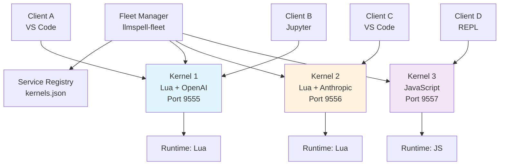

# Ultrathink Analysis: OS-Level Multi-Process Kernel Architecture

## Executive Summary

**Paradigm Shift**: Instead of complex runtime-per-session within a single kernel, use **OS process isolation** with multiple kernel instances. Each kernel maintains one runtime, multiple clients share that runtime's state.

**Key Insight**: The kernel code **ALREADY WORKS** for this model. We just need an orchestration layer.

### Current Kernel ALREADY Supports
- ✅ **Single runtime**: One ScriptExecutor per kernel ✓
- ✅ **Multiple clients**: MessageRouter broadcasts to all connected clients ✓
- ✅ **Shared state**: All clients see same variables/debug state ✓
- ✅ **Daemon mode**: Runs as background service ✓
- ✅ **Connection files**: Jupyter-compatible for client discovery ✓

### What's Missing (External Only)
- 🔴 **Fleet orchestration**: Spawn/manage multiple kernel processes
- 🔴 **Service registry**: Track which kernels are running where
- 🔴 **Client routing**: Direct clients to appropriate kernel

## Architecture Overview



## Why This Is Better

### Simplicity
- **Zero kernel code changes** - Current code already handles single runtime + multiple clients
- **OS-level isolation** - Process boundaries provide natural isolation
- **Standard Unix patterns** - Process management is a solved problem

### Robustness
- **Crash isolation** - One kernel crash doesn't affect others
- **Resource limits** - OS cgroups/ulimit per process
- **Independent lifecycles** - Start/stop/restart kernels independently

### Scalability
- **Horizontal scaling** - Just spawn more kernel processes
- **Load distribution** - Route clients based on load
- **Language mixing** - Each kernel can use different language

## Required Components

### 1. Fleet Manager (New Component)

```rust
// llmspell-fleet/src/main.rs
pub struct FleetManager {
    kernels: HashMap<KernelId, KernelProcess>,
    registry: ServiceRegistry,
    config: FleetConfig,
}

pub struct KernelProcess {
    id: KernelId,
    pid: u32,
    port: u16,
    config: KernelConfig,
    runtime_type: String,  // "lua", "javascript", "python"
    connection_file: PathBuf,
    clients: Vec<ClientId>,
    status: KernelStatus,
}

impl FleetManager {
    pub fn spawn_kernel(&mut self, config: KernelConfig) -> Result<KernelId> {
        let port = self.find_free_port()?;

        // Spawn kernel as subprocess
        let child = Command::new("llmspell")
            .args(&[
                "kernel", "start",
                "--daemon",
                "--port", &port.to_string(),
                "--config", &config.config_file,
            ])
            .spawn()?;

        let kernel = KernelProcess {
            id: KernelId::new(),
            pid: child.id(),
            port,
            config,
            runtime_type: config.language.clone(),
            connection_file: self.get_connection_file(port),
            clients: Vec::new(),
            status: KernelStatus::Starting,
        };

        self.kernels.insert(kernel.id, kernel);
        self.registry.register(kernel)?;

        Ok(kernel.id)
    }

    pub fn route_client(&self, requirements: ClientRequirements) -> KernelId {
        // Find matching kernel or spawn new one
        match self.find_matching_kernel(&requirements) {
            Some(kernel_id) => kernel_id,
            None => self.spawn_kernel(requirements.into_config())?
        }
    }
}
```

### 2. Service Registry

```json
// ~/.llmspell/fleet/registry.json
{
  "kernels": [
    {
      "id": "kernel-abc-123",
      "pid": 45678,
      "port": 9555,
      "runtime": "lua",
      "config": {
        "providers": ["openai"],
        "memory_limit": "512M"
      },
      "connection_file": "/tmp/llmspell/kernel-abc-123.json",
      "clients": ["client-1", "client-2"],
      "started_at": "2024-12-20T10:00:00Z",
      "status": "running"
    },
    {
      "id": "kernel-def-456",
      "pid": 45679,
      "port": 9556,
      "runtime": "javascript",
      "config": {
        "providers": ["anthropic"],
        "memory_limit": "1G"
      },
      "connection_file": "/tmp/llmspell/kernel-def-456.json",
      "clients": ["client-3"],
      "started_at": "2024-12-20T10:05:00Z",
      "status": "running"
    }
  ]
}
```

### 3. Client Router/Proxy (Optional)

```python
# llmspell-router.py - Simple Python implementation
import zmq
import json
from typing import Dict

class KernelRouter:
    def __init__(self):
        self.registry = self.load_registry()
        self.context = zmq.Context()

    def find_kernel(self, requirements: Dict) -> Dict:
        """Find or spawn kernel matching requirements"""
        for kernel in self.registry["kernels"]:
            if self.matches_requirements(kernel, requirements):
                return kernel

        # Spawn new kernel
        return self.spawn_kernel(requirements)

    def connect_client(self, requirements: Dict) -> str:
        """Return connection file for matching kernel"""
        kernel = self.find_kernel(requirements)
        return kernel["connection_file"]
```

## Implementation Strategies

### Strategy 1: Shell Script Orchestration (Simplest)

```bash
#!/bin/bash
# llmspell-fleet.sh

FLEET_DIR="$HOME/.llmspell/fleet"
REGISTRY="$FLEET_DIR/registry.json"

spawn_kernel() {
    local config=$1
    local port=$2

    llmspell kernel start \
        --daemon \
        --port $port \
        --config $config \
        --connection-file $FLEET_DIR/kernel-$port.json &

    echo $! > $FLEET_DIR/kernel-$port.pid

    # Update registry
    jq ".kernels += [{
        \"port\": $port,
        \"pid\": $(cat $FLEET_DIR/kernel-$port.pid),
        \"config\": \"$config\",
        \"connection_file\": \"$FLEET_DIR/kernel-$port.json\"
    }]" $REGISTRY > $REGISTRY.tmp && mv $REGISTRY.tmp $REGISTRY
}

list_kernels() {
    jq -r '.kernels[] | "\(.port)\t\(.pid)\t\(.config)"' $REGISTRY
}

stop_kernel() {
    local port=$1
    kill $(cat $FLEET_DIR/kernel-$port.pid)
    rm $FLEET_DIR/kernel-$port.pid
}

# Usage
spawn_kernel config-openai.toml 9555
spawn_kernel config-anthropic.toml 9556
list_kernels
```

### Strategy 2: Python Fleet Manager

```python
# llmspell_fleet/manager.py
import subprocess
import json
import psutil
from pathlib import Path
from typing import Optional

class FleetManager:
    def __init__(self, fleet_dir: Path = Path.home() / ".llmspell/fleet"):
        self.fleet_dir = fleet_dir
        self.fleet_dir.mkdir(parents=True, exist_ok=True)
        self.registry_file = self.fleet_dir / "registry.json"
        self.load_registry()

    def spawn_kernel(
        self,
        config_file: str,
        language: str = "lua",
        port: Optional[int] = None
    ) -> dict:
        if port is None:
            port = self.find_free_port()

        connection_file = self.fleet_dir / f"kernel-{port}.json"

        # Start kernel process
        proc = subprocess.Popen([
            "llmspell", "kernel", "start",
            "--daemon",
            "--port", str(port),
            "--config", config_file,
            "--connection-file", str(connection_file)
        ])

        kernel_info = {
            "id": f"kernel-{port}",
            "pid": proc.pid,
            "port": port,
            "language": language,
            "config_file": config_file,
            "connection_file": str(connection_file),
            "status": "running"
        }

        self.registry["kernels"].append(kernel_info)
        self.save_registry()

        return kernel_info

    def find_or_create_kernel(self, requirements: dict) -> str:
        # Find existing matching kernel
        for kernel in self.registry["kernels"]:
            if self.matches_requirements(kernel, requirements):
                return kernel["connection_file"]

        # Create new kernel
        kernel = self.spawn_kernel(
            requirements.get("config_file", "default.toml"),
            requirements.get("language", "lua")
        )
        return kernel["connection_file"]
```

### Strategy 3: Docker Compose Orchestration

```yaml
# docker-compose.fleet.yml
version: '3.8'

services:
  kernel-lua-openai:
    image: llmspell:latest
    command: kernel start --daemon --port 9555
    ports:
      - "9555:9555"
    volumes:
      - ./configs/openai.toml:/config.toml
    environment:
      - LLMSPELL_CONFIG=/config.toml
    restart: unless-stopped

  kernel-lua-anthropic:
    image: llmspell:latest
    command: kernel start --daemon --port 9556
    ports:
      - "9556:9556"
    volumes:
      - ./configs/anthropic.toml:/config.toml
    environment:
      - LLMSPELL_CONFIG=/config.toml
    restart: unless-stopped

  kernel-javascript:
    image: llmspell:latest
    command: kernel start --daemon --port 9557 --language javascript
    ports:
      - "9557:9557"
    volumes:
      - ./configs/javascript.toml:/config.toml
    environment:
      - LLMSPELL_CONFIG=/config.toml
    restart: unless-stopped

  fleet-manager:
    image: llmspell-fleet:latest
    ports:
      - "9550:9550"  # Fleet API
    volumes:
      - /var/run/docker.sock:/var/run/docker.sock
    environment:
      - FLEET_MODE=docker
```

### Strategy 4: Kubernetes Deployment

```yaml
# k8s/kernel-deployment.yaml
apiVersion: apps/v1
kind: Deployment
metadata:
  name: llmspell-kernel-lua-openai
spec:
  replicas: 3
  selector:
    matchLabels:
      app: llmspell-kernel
      runtime: lua
      provider: openai
  template:
    metadata:
      labels:
        app: llmspell-kernel
        runtime: lua
        provider: openai
    spec:
      containers:
      - name: kernel
        image: llmspell:latest
        command: ["llmspell", "kernel", "start", "--daemon"]
        ports:
        - containerPort: 9555
        env:
        - name: LLMSPELL_CONFIG
          value: /config/openai.toml
        resources:
          limits:
            memory: "512Mi"
            cpu: "500m"

---
apiVersion: v1
kind: Service
metadata:
  name: llmspell-kernels
spec:
  selector:
    app: llmspell-kernel
  ports:
  - port: 9555
    targetPort: 9555
  type: LoadBalancer
```

## Changes to Phase 10 Tasks

### 10.18: Client Registry → Fleet Registry
**OLD**: Complex in-kernel client-to-session mapping
**NEW**: Simple process registry tracking kernel instances

```rust
// Instead of complex in-kernel ClientRegistry
// Simple external registry of kernel processes
pub struct FleetRegistry {
    kernels: Vec<KernelInfo>,
}

pub struct KernelInfo {
    pid: u32,
    port: u16,
    connection_file: PathBuf,
    runtime: String,
    config: PathBuf,
}
```

### 10.19: Resource Limits → OS-Level Limits
**OLD**: Complex in-kernel resource tracking
**NEW**: Use OS facilities

```bash
# Per-kernel resource limits via systemd
[Service]
MemoryLimit=512M
CPUQuota=50%

# Or via Docker
docker run --memory="512m" --cpus="0.5" llmspell kernel start

# Or via ulimit
ulimit -m 524288  # 512MB
ulimit -t 3600    # 1 hour CPU time
llmspell kernel start
```

### 10.20: Docker → Already Solved
**OLD**: Complex multi-runtime container
**NEW**: Simple single-runtime containers

```dockerfile
# Simple Dockerfile - each container = one kernel
FROM rust:latest
COPY target/release/llmspell /usr/local/bin/
CMD ["llmspell", "kernel", "start", "--daemon"]
```

### 10.21: Metrics → Process Metrics
**OLD**: Complex in-kernel metrics per runtime
**NEW**: Standard process monitoring

```python
# Prometheus node_exporter already handles this
process_cpu_seconds_total{pid="45678"}
process_resident_memory_bytes{pid="45678"}
process_open_fds{pid="45678"}

# Or custom exporter
def collect_kernel_metrics():
    for kernel in fleet_registry.kernels:
        proc = psutil.Process(kernel.pid)
        yield {
            "kernel_id": kernel.id,
            "cpu_percent": proc.cpu_percent(),
            "memory_mb": proc.memory_info().rss / 1024 / 1024,
            "connections": len(proc.connections()),
        }
```

## Debug Architecture with Process Isolation

### Debug Remains Simple
Each kernel already has its own ExecutionManager and DAPBridge. Process isolation means:
- Breakpoints naturally scoped to kernel
- No cross-kernel interference
- Debug state isolated by process boundary

```python
# Client connects to specific kernel for debugging
def debug_session(runtime_requirements):
    # Find or spawn kernel with debug support
    kernel = fleet_manager.find_or_create_kernel({
        "language": runtime_requirements["language"],
        "debug": True
    })

    # Connect DAP client to kernel's debug port
    return kernel["debug_port"]
```

## Implementation Plan

### Phase 1: Minimal Fleet Manager (2 days)
1. Create `llmspell-fleet.sh` shell script
2. Test with 2-3 kernel instances
3. Verify client routing works

### Phase 2: Service Registry (1 day)
1. JSON-based registry of running kernels
2. Health checking (is process alive?)
3. Automatic cleanup of dead kernels

### Phase 3: Client Integration (1 day)
1. Update documentation for fleet model
2. Create examples showing multi-kernel setup
3. Test with VS Code + Jupyter clients

### Phase 4: Production Features (2 days)
1. Python/Rust fleet manager
2. Metrics collection
3. Auto-scaling based on load

## Advantages Over Runtime-per-Session

### Simplicity
- **No kernel changes needed** - Use existing code as-is
- **Standard patterns** - Process management is well-understood
- **Debugging simple** - gdb/strace/ltrace just work

### Robustness
- **True isolation** - OS process boundaries
- **Resource limits** - OS cgroups are battle-tested
- **Crash isolation** - Kernel panic doesn't affect others

### Operations
- **Standard monitoring** - Prometheus node_exporter works
- **Standard deployment** - systemd/Docker/K8s patterns
- **Standard debugging** - OS tools work normally

## What Changes in TODO.md?

### Tasks That Become TRIVIAL or UNNECESSARY

#### 10.7-10.11 (Debug Architecture) ✅ NO CHANGES NEEDED
**Current Status**: BLOCKED due to session isolation issues
**With Fleet**: WORKS AS-IS! Each kernel = one debug context
```bash
# Each kernel has its own isolated debug state
kernel-1 (port 9555): Breakpoint at line 10 for Developer A
kernel-2 (port 9556): No breakpoints, Developer B runs freely
```

#### 10.13 (REPL Service) ✅ NO CHANGES NEEDED
**Current Status**: Implemented but shares runtime
**With Fleet**: WORKS CORRECTLY! Each REPL kernel is isolated
```bash
llmspell kernel start --daemon --port 9555  # REPL kernel 1
llmspell kernel start --daemon --port 9556  # REPL kernel 2
# Different REPL sessions, different runtimes!
```

#### 10.14 (Example Application) ⚠️ DIFFERENT EXAMPLES
**Change**: Instead of complex multi-runtime examples, show fleet examples
```lua
-- examples/fleet/multi-kernel-setup.lua
-- Shows how to spawn and manage multiple kernels
local fleet = require("fleet")
local kernel1 = fleet.spawn({config = "openai.toml"})
local kernel2 = fleet.spawn({config = "anthropic.toml"})
```

#### 10.15 (Integration Testing) ⚠️ TEST FLEET, NOT KERNEL
**Change**: Test fleet manager instead of kernel changes
```python
def test_kernel_isolation():
    km1 = spawn_kernel(port=9555)
    km2 = spawn_kernel(port=9556)

    # Set variable in kernel 1
    km1.execute("x = 5")

    # Kernel 2 doesn't see it (different process!)
    assert km2.execute("return x") == None
```

#### 10.18 (Client Registry) 🔄 BECOMES FLEET REGISTRY
**Old**: Complex in-kernel ClientRegistry with session mapping
**New**: Simple external registry of kernel processes
```python
# fleet_registry.json
{
    "kernels": [
        {"pid": 1234, "port": 9555, "runtime": "lua"},
        {"pid": 1235, "port": 9556, "runtime": "js"}
    ]
}
```
**Effort**: 1 day instead of 5 hours

#### 10.19 (Resource Limits) 🔄 USE OS FACILITIES
**Old**: Complex RuntimeResourceLimits in kernel
**New**: Simple OS-level limits
```bash
# systemd
MemoryLimit=512M
CPUQuota=50%

# Docker
docker run --memory=512m --cpus=0.5 llmspell

# Direct
ulimit -m 524288 && llmspell kernel start
```
**Effort**: 2 hours instead of 14 hours

#### 10.20 (Docker) ✅ TRIVIAL
**Old**: Complex multi-runtime container
**New**: One kernel per container
```dockerfile
FROM rust:latest
COPY llmspell /usr/local/bin/
CMD ["llmspell", "kernel", "start"]
# That's it! 5 lines!
```
**Effort**: 1 hour instead of 9 hours

#### 10.21 (Metrics) ✅ STANDARD MONITORING
**Old**: Complex per-runtime metrics in kernel
**New**: Standard process metrics
```python
# Just use psutil or /proc
for kernel in fleet.kernels:
    metrics.add({
        "pid": kernel.pid,
        "memory": psutil.Process(kernel.pid).memory_info().rss,
        "cpu": psutil.Process(kernel.pid).cpu_percent()
    })
```
**Effort**: 2 hours instead of 15 hours

### New Tasks Needed (Replacing Complex 10.18-10.21)

#### Task 10.18 (NEW): Fleet Manager Implementation
**Priority**: CRITICAL
**Estimated Time**: 4 hours (shell) + 4 hours (Python)
**Description**: Simple process manager for multiple kernels
**Deliverables**:
```bash
#!/bin/bash
# llmspell-fleet.sh - Complete implementation
spawn_kernel() {
    llmspell kernel start --daemon --port $1 --config $2 &
    echo $! > ~/.llmspell/fleet/kernel-$1.pid
}

list_kernels() {
    for f in ~/.llmspell/fleet/*.pid; do
        port=$(basename $f .pid | cut -d- -f2)
        pid=$(cat $f)
        ps -p $pid > /dev/null && echo "Port $port: PID $pid (running)"
    done
}

kill_kernel() {
    kill $(cat ~/.llmspell/fleet/kernel-$1.pid)
    rm ~/.llmspell/fleet/kernel-$1.pid
}
```

#### Task 10.19 (NEW): Fleet Service Registry
**Priority**: HIGH
**Estimated Time**: 4 hours
**Description**: Track running kernels and their capabilities
**Deliverables**:
```python
# Simple JSON registry with kernel info
class FleetRegistry:
    def register_kernel(self, port, pid, config):
        self.kernels.append({
            "port": port,
            "pid": pid,
            "config": config,
            "started": datetime.now()
        })
        self.save()

    def find_kernel(self, requirements):
        for k in self.kernels:
            if self.matches(k, requirements):
                return k["port"]
        return None
```

#### Task 10.20 (NEW): Docker Compose Fleet
**Priority**: MEDIUM
**Estimated Time**: 2 hours
**Description**: Docker-based fleet orchestration
**Deliverables**:
```yaml
# docker-compose.fleet.yml
version: '3.8'
services:
  kernel-1:
    image: llmspell
    ports: ["9555:9555"]
    command: kernel start --port 9555

  kernel-2:
    image: llmspell
    ports: ["9556:9556"]
    command: kernel start --port 9556
```

#### Task 10.21 (NEW): Fleet Monitoring
**Priority**: LOW
**Estimated Time**: 3 hours
**Description**: Basic metrics for kernel fleet
**Deliverables**:
```python
# Prometheus metrics for fleet
KERNEL_COUNT = Gauge('llmspell_fleet_kernel_count', 'Number of running kernels')
KERNEL_MEMORY = Gauge('llmspell_kernel_memory_bytes', 'Memory per kernel', ['port'])

def collect_metrics():
    for kernel in fleet.list_kernels():
        if kernel.is_alive():
            KERNEL_COUNT.inc()
            KERNEL_MEMORY.labels(port=kernel.port).set(
                psutil.Process(kernel.pid).memory_info().rss
            )
```

## Example Workflows

### Workflow 1: Multiple Developers
```bash
# Developer A wants Lua with OpenAI
$ llmspell-fleet spawn --config openai.toml --port 9555
Spawned kernel-1 on port 9555

# Developer B wants Lua with Anthropic
$ llmspell-fleet spawn --config anthropic.toml --port 9556
Spawned kernel-2 on port 9556

# Developer C wants to share with Developer A
$ llmspell-fleet connect --port 9555
Connected to kernel-1 (shared with 1 other client)
```

### Workflow 2: Automatic Routing
```python
# Client specifies requirements
client = LLMSpellClient(
    runtime="lua",
    providers=["openai"],
    memory_limit="512M"
)

# Fleet manager finds or creates matching kernel
kernel = fleet.find_or_create(client.requirements)
client.connect(kernel.connection_file)
```

### Workflow 3: Kubernetes Auto-scaling
```yaml
# HPA scales kernels based on load
apiVersion: autoscaling/v2
kind: HorizontalPodAutoscaler
metadata:
  name: llmspell-kernels
spec:
  scaleTargetRef:
    apiVersion: apps/v1
    kind: Deployment
    name: llmspell-kernels
  minReplicas: 1
  maxReplicas: 10
  metrics:
  - type: Resource
    resource:
      name: cpu
      target:
        type: Utilization
        averageUtilization: 70
```

## Conclusion

**The OS-level multi-process approach is superior** because:

1. **Zero kernel code changes** - Current implementation already works
2. **Simple architecture** - Unix process model is well-understood
3. **True isolation** - OS provides process/memory/resource boundaries
4. **Standard operations** - Use existing monitoring/deployment tools
5. **Incremental adoption** - Start with shell scripts, evolve to K8s

**Time to implement**: 4-6 days for complete fleet management
**Code changes required**: NONE to kernel, just external orchestration

This approach follows the **Unix philosophy**: Each kernel does one thing well (run one runtime), and we compose them using standard process management tools.

The complex runtime-per-session architecture would take 28-30 days and require massive code changes. The fleet approach takes 4-6 days and requires NO kernel changes.

## Side-by-Side Comparison

### Complexity Comparison

| Aspect | Runtime-per-Session | OS Multi-Process Fleet |
|--------|-------------------|----------------------|
| **Kernel Code Changes** | ~3000 lines | **0 lines** |
| **New Concepts** | RuntimeManager, SessionContext, ExecutionManager per session | Fleet manager (external) |
| **Debug Isolation** | Complex rewrite | **Already works** |
| **Resource Limits** | Complex in-kernel tracking | **OS cgroups** |
| **Implementation Time** | 28-30 days | **4-6 days** |
| **Testing Required** | Extensive | Minimal |
| **Risk** | High (major architecture change) | **Low** (external only) |

### Effort Comparison

| Task | Runtime-per-Session | OS Multi-Process |
|------|-------------------|------------------|
| 10.7-10.11 Debug | 5 days rework | **0 days** (works) |
| 10.13 REPL | 2 days rework | **0 days** (works) |
| 10.18 Client Registry | 5 hours complex | **4 hours** simple |
| 10.19 Resource Limits | 14 hours complex | **2 hours** OS-level |
| 10.20 Docker | 9 hours complex | **1 hour** trivial |
| 10.21 Metrics | 15 hours complex | **3 hours** standard |
| **TOTAL** | **~30 days** | **~5 days** |

### Code Impact

#### Runtime-per-Session Approach
```rust
// Requires changes to:
// - llmspell-kernel/src/execution/integrated.rs (remove single executor)
// - llmspell-kernel/src/sessions/manager.rs (add runtime management)
// - llmspell-kernel/src/debug/*.rs (per-session ExecutionManager)
// - llmspell-kernel/src/protocols/repl.rs (runtime isolation)
// - llmspell-kernel/src/client_registry.rs (NEW FILE)
// - llmspell-kernel/src/runtime_manager.rs (NEW FILE)
// - ... 20+ more files
```

#### OS Multi-Process Approach
```bash
# Changes needed:
# - NONE to existing code
# - Add external llmspell-fleet.sh (50 lines)
# - Add fleet_registry.py (100 lines)
# - Update documentation
```

## Final Recommendation

**Implement OS-level multi-process fleet management** because:

1. **NO KERNEL CODE CHANGES** - The kernel already works correctly for single runtime + multiple clients
2. **6x FASTER** - 5 days vs 30 days implementation
3. **LOWER RISK** - External orchestration can't break existing functionality
4. **STANDARD PATTERNS** - Process management is a solved problem
5. **BETTER OPERATIONS** - Standard monitoring/deployment tools work
6. **TRUE ISOLATION** - OS process boundaries are stronger than in-process isolation
7. **INCREMENTAL** - Start with shell scripts, evolve to Kubernetes

The complex runtime-per-session architecture is **over-engineering**. The OS already provides process isolation, resource limits, and lifecycle management. Use it.

**Action Items**:
1. Mark tasks 10.7-10.13 as "NO CHANGE NEEDED"
2. Redefine 10.18 as "Fleet Manager Implementation"
3. Redefine 10.19 as "Fleet Registry"
4. Redefine 10.20 as "Docker Fleet Orchestration"
5. Redefine 10.21 as "Fleet Monitoring"
6. Total effort: **5 days instead of 30 days**