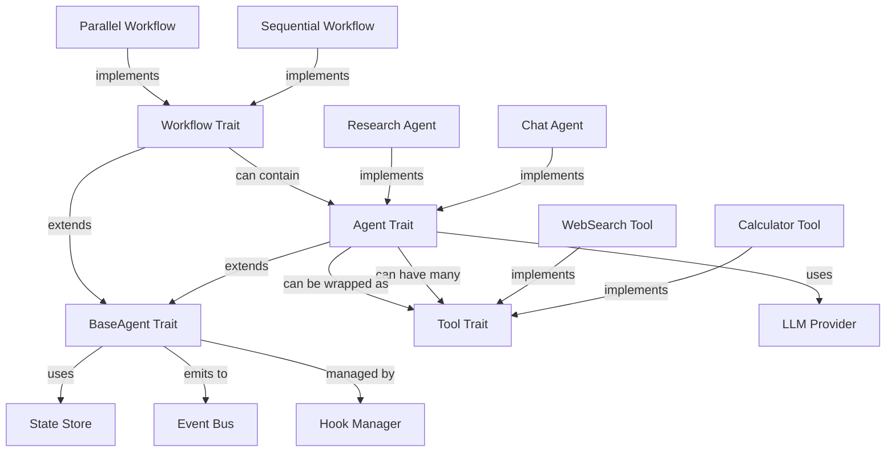

# Collated Architecture

## Overview

This document collates and organizes all architectural concepts from the research and design phases into a coherent, conflict-free architecture for rs-llmspell. It ensures consistency with go-llms/ADK patterns while adapting them for Rust and scripting environments.

## 1. Conflict Resolution

### 1.1 Identified Conflicts and Resolutions

#### BaseAgent vs Agent Hierarchy
**Conflict**: Initial designs had unclear separation between BaseAgent and Agent roles.
**Resolution**: 
- `BaseAgent`: Foundation trait for ANY component that can handle tools (agents, workflows, etc.)
- `Agent`: Specifically for LLM-powered components that extend BaseAgent
- This allows workflows and other non-LLM components to handle tools

#### Async Patterns Across Languages
**Conflict**: Lua coroutines vs JavaScript promises create API inconsistency.
**Resolution**: 
- Implement a unified `Promise` abstraction for Lua that wraps coroutines
- Provide consistent async patterns across both languages
- Use adapters to bridge language-specific implementations

#### State Management Scope
**Conflict**: Unclear boundaries between agent state, workflow state, and global state.
**Resolution**:
- Agent state: Local to each agent instance
- Workflow state: Managed by workflow, includes child agent states
- Global state: Accessed via SharedStateRepository with access control
- Clear ownership and lifecycle for each state type

#### Tool vs Agent Boundaries
**Conflict**: When should functionality be a Tool vs an Agent?
**Resolution**:
- Tools: Stateless, single-purpose functions with clear inputs/outputs
- Agents: Stateful, multi-step reasoning with LLM integration
- Tool-wrapped agents: Bridge pattern for using agents as tools

### 1.2 Design Decisions

1. **Bridge-First Philosophy**: All external integrations wrapped in traits
2. **Composition Over Inheritance**: Traits and composition for flexibility
3. **Explicit Over Implicit**: Clear configuration and behavior
4. **Safety First**: Type safety and error handling throughout

## 2. Consistent Terminology

### 2.1 Core Terms

| Term | Definition | Usage |
|------|------------|-------|
| **BaseAgent** | Foundation trait for tool-handling components | All agents and workflows implement this |
| **Agent** | LLM-powered component extending BaseAgent | Conversational AI components |
| **Tool** | Stateless function callable by LLMs | Single-purpose operations |
| **Workflow** | Deterministic execution pattern | Sequential, parallel, conditional flows |
| **Hook** | Lifecycle interception point | Modify behavior at specific points |
| **Event** | Asynchronous notification | Decouple components via pub/sub |
| **Provider** | LLM service abstraction | OpenAI, Anthropic, etc. |
| **Bridge** | Language binding layer | Rust ↔ Lua/JS communication |

### 2.2 Naming Conventions

```rust
// Traits: Verb or Adjective
trait Executable { }
trait Observable { }

// Structs: Noun
struct ChatAgent { }
struct SequentialWorkflow { }

// Enums: Noun (singular)
enum AgentStatus { }
enum HookPoint { }

// Functions: verb_phrase
fn execute_tool() { }
fn register_hook() { }

// Async functions: verb_phrase_async or just verb_phrase
async fn chat() { }  // Preferred for main operations
async fn fetch_data_async() { }  // When disambiguation needed
```

### 2.3 Script API Conventions

```lua
-- Lua: snake_case with colon syntax
agent:add_tool(tool)
agent:on_event("tool_called", handler)

-- Configuration: tables
local config = {
    system_prompt = "...",
    max_tokens = 1000
}
```

```javascript
// JavaScript: camelCase
agent.addTool(tool);
agent.onEvent("toolCalled", handler);

// Configuration: objects
const config = {
    systemPrompt: "...",
    maxTokens: 1000
};
```

## 3. Validation Against go-llms/ADK Patterns

### 3.1 Pattern Alignment

#### BaseAgent Pattern ✓
```go
// go-llms pattern
type BaseAgent interface {
    Run(ctx context.Context, input string) (string, error)
    AddTool(tool Tool) error
}
```

```rust
// rs-llmspell adaptation
#[async_trait]
trait BaseAgent {
    async fn execute(&mut self, input: AgentInput) -> Result<AgentOutput>;
    fn tools(&self) -> &[Box<dyn Tool>];
}
```
**Validation**: Core concept preserved, adapted for Rust's ownership model

#### Tool-Wrapped Agent Pattern ✓
```go
// go-llms pattern
func WrapAgentAsTool(agent BaseAgent) Tool {
    return &agentTool{agent: agent}
}
```

```rust
// rs-llmspell adaptation
impl<A: Agent> Tool for AgentAsTool<A> {
    async fn execute(&self, params: Value) -> Result<ToolOutput> {
        let response = self.agent.chat(&params).await?;
        Ok(ToolOutput::from(response))
    }
}
```
**Validation**: Pattern fully implemented with Rust generics

#### State-Driven Execution ✓
- Agents maintain state between calls
- State handoff via shared repository
- Workflows coordinate state transitions
**Validation**: Enhanced with Rust's type safety

### 3.2 ADK Compatibility

| ADK Concept | rs-llmspell Implementation | Status |
|-------------|---------------------------|---------|
| Agents | BaseAgent/Agent traits | ✓ Aligned |
| Tools | Tool trait with JSON schema | ✓ Aligned |
| Workflows | Workflow trait with types | ✓ Aligned |
| Hooks | Hook trait with points | ✓ Enhanced |
| Events | Event enum with bus | ✓ Enhanced |
| Context | AgentState + HookContext | ✓ Aligned |

## 4. Comprehensive Component Map

### 4.1 Core Architecture Layers

```
┌─────────────────────────────────────────────────────────────┐
│                    Script Layer (Lua/JS)                    │
├─────────────────────────────────────────────────────────────┤
│                    Bridge Layer (FFI)                       │
├─────────────────────────────────────────────────────────────┤
│                    API Layer (Traits)                       │
│  ┌─────────────┐  ┌─────────────┐  ┌─────────────┐        │
│  │  BaseAgent  │  │    Tool     │  │  Workflow   │        │
│  └─────────────┘  └─────────────┘  └─────────────┘        │
├─────────────────────────────────────────────────────────────┤
│                 Implementation Layer                        │
│  ┌─────────────┐  ┌─────────────┐  ┌─────────────┐        │
│  │   Agents    │  │   Tools     │  │  Workflows  │        │
│  └─────────────┘  └─────────────┘  └─────────────┘        │
├─────────────────────────────────────────────────────────────┤
│                 Infrastructure Layer                        │
│  ┌────────┐  ┌────────┐  ┌────────┐  ┌────────┐          │
│  │  LLM   │  │ State  │  │ Events │  │ Hooks  │          │
│  └────────┘  └────────┘  └────────┘  └────────┘          │
├─────────────────────────────────────────────────────────────┤
│                 External Dependencies                       │
│  ┌────────┐  ┌────────┐  ┌────────┐  ┌────────┐          │
│  │  rig   │  │  mlua  │  │  sled  │  │ tokio  │          │
│  └────────┘  └────────┘  └────────┘  └────────┘          │
└─────────────────────────────────────────────────────────────┘
```

### 4.2 Component Relationships



### 4.3 Data Flow

```
User Input (Script)
    ↓
Bridge Layer (Type Conversion)
    ↓
Agent/Workflow (Orchestration)
    ↓
LLM Provider (Completion)
    ↓
Tools (Execution)
    ↓
State Store (Persistence)
    ↓
Event Bus (Notification)
    ↓
Hooks (Interception)
    ↓
Bridge Layer (Result Conversion)
    ↓
User Output (Script)
```

## 5. Unified Type System

### 5.1 Core Types

```rust
// Unified value type for cross-language communication
#[derive(Debug, Clone, Serialize, Deserialize)]
pub enum ScriptValue {
    Null,
    Bool(bool),
    Number(f64),
    String(String),
    Array(Vec<ScriptValue>),
    Object(HashMap<String, ScriptValue>),
    Function(FunctionRef),
    Promise(PromiseRef),
}

// Agent input/output types
#[derive(Debug, Clone, Serialize, Deserialize)]
pub struct AgentInput {
    pub message: Option<String>,
    pub context: HashMap<String, ScriptValue>,
    pub tools: Vec<String>,  // Tool names to use
    pub config: AgentConfig,
}

#[derive(Debug, Clone, Serialize, Deserialize)]
pub struct AgentOutput {
    pub content: String,
    pub tool_calls: Vec<ToolCall>,
    pub metadata: OutputMetadata,
    pub state_updates: HashMap<String, ScriptValue>,
}

// Tool types
#[derive(Debug, Clone, Serialize, Deserialize)]
pub struct ToolCall {
    pub id: String,
    pub name: String,
    pub parameters: ScriptValue,
}

#[derive(Debug, Clone, Serialize, Deserialize)]
pub struct ToolOutput {
    pub content: ScriptValue,
    pub error: Option<String>,
    pub metadata: HashMap<String, ScriptValue>,
}
```

### 5.2 State Types

```rust
// Agent state hierarchy
#[derive(Debug, Clone, Serialize, Deserialize)]
pub struct AgentState {
    pub status: AgentStatus,
    pub context: StateContext,
    pub history: Vec<StateTransition>,
    pub checkpoints: Vec<StateCheckpoint>,
}

#[derive(Debug, Clone, Copy, PartialEq, Eq)]
pub enum AgentStatus {
    Created,
    Initializing,
    Ready,
    Executing,
    Waiting,
    Completed,
    Failed,
    Suspended,
}

// Workflow-specific state
#[derive(Debug, Clone, Serialize, Deserialize)]
pub struct WorkflowState {
    pub base: AgentState,
    pub current_step: usize,
    pub step_outputs: HashMap<String, ScriptValue>,
    pub branches_taken: Vec<String>,
}
```

## 6. Module Organization

### 6.1 Crate Structure

```
rs-llmspell/
├── llmspell-core/          # Core traits and types
│   ├── src/
│   │   ├── traits/         # BaseAgent, Agent, Tool, Workflow
│   │   ├── types/          # ScriptValue, AgentState, etc.
│   │   ├── error.rs        # Error types
│   │   └── lib.rs
│   └── Cargo.toml
│
├── llmspell-bridge/        # Language bindings
│   ├── src/
│   │   ├── lua/            # Lua bindings
│   │   ├── js/             # JavaScript bindings
│   │   ├── convert.rs      # Type conversions
│   │   └── lib.rs
│   └── Cargo.toml
│
├── llmspell-agents/        # Agent implementations
│   ├── src/
│   │   ├── chat.rs         # ChatAgent
│   │   ├── research.rs     # ResearchAgent
│   │   ├── code.rs         # CodeAgent
│   │   └── lib.rs
│   └── Cargo.toml
│
├── llmspell-tools/         # Built-in tools
│   ├── src/
│   │   ├── system/         # File, shell, env tools
│   │   ├── web/            # HTTP, scraping tools
│   │   ├── ai/             # Embedding, search tools
│   │   └── lib.rs
│   └── Cargo.toml
│
├── llmspell-workflows/     # Workflow implementations
│   ├── src/
│   │   ├── sequential.rs   # Sequential workflow
│   │   ├── parallel.rs     # Parallel workflow
│   │   ├── conditional.rs  # Conditional workflow
│   │   └── lib.rs
│   └── Cargo.toml
│
├── llmspell-infra/         # Infrastructure
│   ├── src/
│   │   ├── llm/            # LLM provider wrappers
│   │   ├── state/          # State storage
│   │   ├── events/         # Event system
│   │   ├── hooks/          # Hook system
│   │   └── lib.rs
│   └── Cargo.toml
│
└── llmspell/               # Main crate
    ├── src/
    │   ├── cli.rs          # CLI interface
    │   ├── config.rs       # Configuration
    │   └── main.rs
    └── Cargo.toml
```

### 6.2 Feature Flags

```toml
[features]
default = ["lua", "javascript", "all-tools", "all-agents"]

# Script engines
lua = ["llmspell-bridge/lua", "mlua"]
javascript = ["llmspell-bridge/js", "rquickjs"]

# Tool categories
tools-system = ["llmspell-tools/system"]
tools-web = ["llmspell-tools/web"]
tools-ai = ["llmspell-tools/ai"]
all-tools = ["tools-system", "tools-web", "tools-ai"]

# Agent types
agents-chat = ["llmspell-agents/chat"]
agents-research = ["llmspell-agents/research"]
agents-code = ["llmspell-agents/code"]
all-agents = ["agents-chat", "agents-research", "agents-code"]

# Storage backends
storage-sled = ["llmspell-infra/sled"]
storage-rocksdb = ["llmspell-infra/rocksdb"]

# Optional features
metrics = ["llmspell-infra/metrics"]
tracing = ["llmspell-infra/tracing"]
opentelemetry = ["llmspell-infra/opentelemetry"]
```

## 7. Integration Points

### 7.1 Extension Points

1. **Custom Providers**: Implement `LLMProvider` trait
2. **Custom Tools**: Implement `Tool` trait
3. **Custom Agents**: Extend `Agent` trait
4. **Custom Workflows**: Implement `Workflow` trait
5. **Custom Storage**: Implement `StateStore` trait
6. **Custom Hooks**: Implement `Hook` trait

### 7.2 Script Extension API

```lua
-- Lua extension example
local MyCustomTool = Tool:extend()

function MyCustomTool:init(config)
    self.name = "my_custom_tool"
    self.config = config
end

function MyCustomTool:execute(params)
    -- Implementation
end

-- Register globally
llmspell.register_tool("my_custom_tool", MyCustomTool)
```

```javascript
// JavaScript extension example
class MyCustomTool extends Tool {
    constructor(config) {
        super({
            name: "my_custom_tool",
            description: "My custom tool"
        });
        this.config = config;
    }
    
    async execute(params) {
        // Implementation
    }
}

// Register globally
llmspell.registerTool("my_custom_tool", MyCustomTool);
```

## 8. Lifecycle Management

### 8.1 Component Lifecycle

```
Creation → Initialization → Ready → Execution → Completion → Cleanup
    ↓           ↓            ↓         ↓            ↓           ↓
  Error      Error        Error     Error        Error       Error
    ↓           ↓            ↓         ↓            ↓           ↓
                        Failed State → Recovery → Resume
```

### 8.2 Resource Management

1. **Automatic Cleanup**: RAII pattern for Rust resources
2. **Script GC Integration**: Proper cleanup when script objects collected
3. **Connection Pooling**: Reuse LLM connections
4. **State Checkpointing**: Periodic state saves for recovery

## 9. Error Handling Strategy

### 9.1 Error Types

```rust
#[derive(Debug, thiserror::Error)]
pub enum LLMSpellError {
    #[error("Agent error: {0}")]
    Agent(#[from] AgentError),
    
    #[error("Tool error: {0}")]
    Tool(#[from] ToolError),
    
    #[error("Workflow error: {0}")]
    Workflow(#[from] WorkflowError),
    
    #[error("Bridge error: {0}")]
    Bridge(#[from] BridgeError),
    
    #[error("Provider error: {0}")]
    Provider(#[from] ProviderError),
}
```

### 9.2 Error Propagation

1. **Rust Side**: Result<T, E> with detailed error types
2. **Script Side**: Exceptions/errors with context
3. **Bridge Layer**: Automatic conversion with stack traces
4. **Recovery**: Hooks for error handling and retry

## 10. Performance Considerations

### 10.1 Optimization Points

1. **Lazy Loading**: Tools and agents loaded on demand
2. **Streaming**: All LLM responses streamed by default
3. **Caching**: Built-in caching for embeddings and completions
4. **Pooling**: Connection and thread pooling
5. **Zero-Copy**: Where possible in bridge layer

### 10.2 Benchmarks

Key metrics to track:
- Bridge overhead: < 1ms for typical calls
- State operations: < 10ms for read/write
- Event dispatch: < 0.1ms per handler
- Tool execution: Varies by tool
- Memory usage: < 100MB base overhead

## Conclusion

This collated architecture provides:
- Clear, conflict-free design aligned with go-llms/ADK
- Consistent terminology and patterns
- Comprehensive component organization
- Flexible extension points
- Production-ready error handling and performance

The architecture is ready for implementation with clear module boundaries and well-defined interfaces.