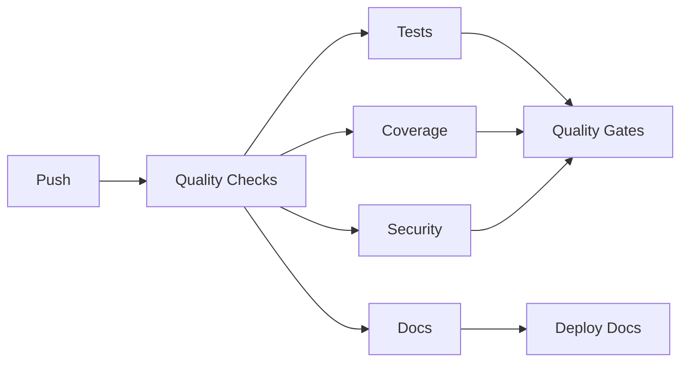

# Phase 1 Knowledge Transfer Session Guide

**Duration**: 2-3 hours recommended  
**Format**: Interactive walkthrough with Q&A  
**Participants**: Phase 0 team → Phase 1 team

---

## Session 1: Architecture Walkthrough (30 minutes)

### 1.1 Trait Hierarchy Deep Dive

#### BaseAgent - The Foundation
```rust
#[async_trait]
pub trait BaseAgent: Send + Sync + Debug {
    fn metadata(&self) -> &ComponentMetadata;
    async fn execute(&self, input: AgentInput, context: ExecutionContext) -> Result<AgentOutput>;
    async fn validate_input(&self, input: &AgentInput) -> Result<()>;
    async fn handle_error(&self, error: LLMSpellError) -> Result<AgentOutput>;
}
```

**Key Points**:
- All components implement BaseAgent
- Async execution for non-blocking operations
- Built-in error handling and validation
- Thread-safe (Send + Sync) for concurrent use

#### Agent - LLM Integration
```rust
#[async_trait]
pub trait Agent: BaseAgent {
    fn config(&self) -> &AgentConfig;
    async fn get_conversation(&self) -> Vec<ConversationMessage>;
    async fn add_message(&mut self, message: ConversationMessage) -> Result<()>;
    // ... conversation management methods
}
```

**Key Points**:
- Extends BaseAgent with LLM-specific features
- Conversation history management
- Configuration for model parameters
- State management for context

#### Tool - Functional Components
```rust
#[async_trait]
pub trait Tool: BaseAgent {
    fn schema(&self) -> ToolSchema;
    fn category(&self) -> ToolCategory;
    fn security_level(&self) -> SecurityLevel;
    async fn validate_parameters(&self, params: &Value) -> Result<()>;
}
```

**Key Points**:
- Schema-based parameter validation
- Security levels for sandboxing
- Category system for organization
- Can wrap agents (Agent-as-Tool pattern)

#### Workflow - Orchestration
```rust
#[async_trait]
pub trait Workflow: BaseAgent {
    fn config(&self) -> &WorkflowConfig;
    async fn add_step(&mut self, step: WorkflowStep) -> Result<()>;
    async fn plan_execution(&self) -> Result<Vec<ComponentId>>;
    // ... execution management
}
```

**Key Points**:
- Manages execution flow
- Dependency resolution
- Parallel/sequential execution
- Retry and error handling

### 1.2 Component Lifecycle

1. **Creation**: Use ComponentMetadata for identification
2. **Initialization**: Configure with specific parameters
3. **Execution**: Process inputs → outputs
4. **State Management**: Preserve state between calls
5. **Error Handling**: Graceful degradation
6. **Cleanup**: Resource management

### 1.3 State Management Patterns

```rust
// Pattern 1: Shared State via Context
let mut context = ExecutionContext::new();
context.set_state("key", value);

// Pattern 2: Agent Conversation State
agent.add_message(ConversationMessage::user("Hello"));
let history = agent.get_conversation().await;

// Pattern 3: Workflow Results
workflow.execute(input, context).await?;
let results = workflow.get_results().await;
```

---

## Session 2: Code Patterns and Conventions (30 minutes)

### 2.1 Error Handling Patterns

```rust
// Use error macros for consistency
component_error!("Component {} failed", component_id);
validation_error!("Invalid input: {}", reason);
tool_error!(category, "Tool execution failed");

// Error propagation with context
operation()
    .map_err(|e| LLMSpellError::Internal {
        message: format!("Operation failed in {}", self.metadata().id),
        source: Some(Box::new(e)),
    })?;

// Retryable error detection
if error.is_retryable() {
    // Implement retry logic
}
```

### 2.2 Async Patterns

```rust
// Timeout pattern
use tokio::time::{timeout, Duration};

timeout(Duration::from_secs(30), async_operation())
    .await
    .map_err(|_| timeout_error!("Operation timed out"))?

// Concurrent execution
use futures::future::join_all;

let futures = components.iter()
    .map(|c| c.execute(input.clone(), context.clone()));
let results = join_all(futures).await;

// Cancellation safety
tokio::select! {
    result = operation() => handle_result(result),
    _ = cancellation_token.cancelled() => handle_cancellation(),
}
```

### 2.3 Testing Patterns

```rust
// Mock setup
let mut mock = MockAgent::new();
mock.expect_execute()
    .times(1)
    .returning(|_, _| Ok(AgentOutput::default()));

// Property test
proptest! {
    #[test]
    fn test_component_id_stable(name in "[a-z]{5,20}") {
        let id1 = ComponentId::from_name(&name);
        let id2 = ComponentId::from_name(&name);
        prop_assert_eq!(id1, id2);
    }
}

// Async test
#[tokio::test]
async fn test_async_execution() {
    let agent = create_test_agent();
    let result = agent.execute(input, context).await;
    assert!(result.is_ok());
}
```

### 2.4 Documentation Standards

```rust
/// Brief description of the component.
/// 
/// Longer explanation of what this component does and how it works.
/// 
/// # Arguments
/// 
/// * `input` - Description of the input parameter
/// * `context` - Execution context with shared state
/// 
/// # Returns
/// 
/// Returns `Ok(AgentOutput)` on success, or an error if validation fails.
/// 
/// # Errors
/// 
/// Returns `LLMSpellError::Validation` if input validation fails.
/// Returns `LLMSpellError::Timeout` if execution exceeds timeout.
/// 
/// # Examples
/// 
/// ```
/// # use llmspell_core::prelude::*;
/// let agent = MyAgent::new();
/// let output = agent.execute(input, context).await?;
/// ```
pub async fn execute(&self, input: AgentInput, context: ExecutionContext) -> Result<AgentOutput> {
    // Implementation
}
```

---

## Session 3: Testing Strategy (30 minutes)

### 3.1 Test Organization

```
tests/
├── unit/           # Individual component tests
├── integration/    # Cross-component tests
├── property/       # Invariant testing
├── concurrency/    # Thread-safety tests
└── benchmarks/     # Performance tests
```

### 3.2 TDD Workflow

1. **Red**: Write failing test first
```rust
#[test]
fn test_new_feature() {
    let component = Component::new();
    assert_eq!(component.new_method(), expected_value()); // Fails
}
```

2. **Green**: Implement minimal code to pass
```rust
impl Component {
    fn new_method(&self) -> Value {
        expected_value() // Just enough to pass
    }
}
```

3. **Refactor**: Improve implementation
```rust
impl Component {
    fn new_method(&self) -> Value {
        // Proper implementation with error handling
        self.validate()?;
        self.calculate_result()
    }
}
```

### 3.3 Mock Usage

```rust
use llmspell_testing::mocks::*;

// Create mock with expectations
let mut mock_tool = MockTool::new();
mock_tool.expect_validate_parameters()
    .with(eq(params))
    .times(1)
    .returning(|_| Ok(()));

// Use in test
let workflow = Workflow::new();
workflow.add_tool(Box::new(mock_tool));
workflow.execute(input, context).await?;
```

### 3.4 Coverage Requirements

- **Line Coverage**: >90% enforced in CI
- **Branch Coverage**: Aim for >85%
- **Integration Coverage**: All public APIs
- **Error Path Coverage**: All error conditions

Run coverage locally:
```bash
cargo install cargo-tarpaulin
cargo tarpaulin --workspace --out Html
open tarpaulin-report.html
```

---

## Session 4: CI/CD Pipeline (20 minutes)

### 4.1 Pipeline Overview



### 4.2 Job Details

1. **Quality Checks** (2-3 min)
   - Format validation: `cargo fmt --check`
   - Linting: `cargo clippy -- -D warnings`
   - Doc build: `cargo doc --no-deps`

2. **Test Suite** (3-4 min)
   - Unit tests: `cargo test --lib`
   - Integration: `cargo test --test '*'`
   - Doc tests: `cargo test --doc`

3. **Coverage** (4-5 min)
   - Run with tarpaulin
   - Enforce >90% threshold
   - Upload to Codecov

4. **Security** (1-2 min)
   - Dependency audit
   - Vulnerability scanning

5. **Documentation** (2-3 min)
   - Build with warnings as errors
   - Link validation
   - Deploy to GitHub Pages

### 4.3 Local CI Simulation

```bash
# Run same checks as CI
./scripts/quality-check.sh

# Individual checks
cargo fmt --all -- --check
cargo clippy --workspace --all-features -- -D warnings
cargo test --workspace
cargo doc --workspace --no-deps
```

### 4.4 Debugging CI Failures

1. **Check job logs**: Expand failed step in GitHub Actions
2. **Reproduce locally**: Use exact commands from CI
3. **Common issues**:
   - Formatting: Run `cargo fmt --all`
   - Clippy: Fix warnings or add exceptions
   - Tests: Check for race conditions
   - Coverage: Add missing tests

---

## Session 5: Performance Baselines (20 minutes)

### 5.1 Benchmark Framework

```rust
use criterion::{criterion_group, criterion_main, Criterion};

fn benchmark_component_operation(c: &mut Criterion) {
    c.bench_function("component_operation", |b| {
        b.iter(|| {
            // Operation to benchmark
            component.operation()
        });
    });
}

criterion_group!(benches, benchmark_component_operation);
criterion_main!(benches);
```

### 5.2 Current Baselines

| Operation | Baseline | Target |
|-----------|----------|--------|
| ComponentId generation | 50ns | <100ns |
| Error creation | 100ns | <500ns |
| Small serialization | 1μs | <5μs |
| Agent execution | 10ms | <50ms |
| Workflow planning | 5ms | <20ms |

### 5.3 Performance Monitoring

```bash
# Run benchmarks
cargo bench --workspace

# Compare with baseline
cargo bench --workspace -- --baseline main

# Profile specific operation
cargo bench --bench core_benchmarks -- component_id
```

### 5.4 Optimization Guidelines

1. **Measure First**: Profile before optimizing
2. **Hot Path Focus**: Optimize frequently called code
3. **Allocation Awareness**: Minimize in loops
4. **Async Efficiency**: Avoid blocking operations
5. **Cache Wisely**: Balance memory vs computation

---

## Session 6: Q&A and Hands-On (20 minutes)

### Common Questions

**Q: How do I add a new agent type?**
A: Implement the Agent trait in llmspell-agents:
1. Create new module in `src/agents/`
2. Implement Agent trait
3. Add tests in same module
4. Export from lib.rs

**Q: How do I debug async execution?**
A: Use tokio-console or tracing:
```rust
#[instrument(skip(self))]
async fn execute(&self, input: AgentInput) -> Result<AgentOutput> {
    tracing::debug!("Executing with input: {:?}", input);
    // Implementation
}
```

**Q: How do I handle provider-specific errors?**
A: Wrap in LLMSpellError::Provider:
```rust
provider_operation()
    .map_err(|e| LLMSpellError::Provider {
        provider: "openai".to_string(),
        message: e.to_string(),
        retryable: e.is_retryable(),
    })?
```

**Q: How do I test workflow execution?**
A: Use mock components:
```rust
let mut workflow = TestWorkflow::new();
workflow.add_step(mock_step());
let plan = workflow.plan_execution().await?;
assert_eq!(plan.len(), expected_steps);
```

### Hands-On Exercise

Create a simple "Echo Agent" that returns its input:

```rust
// 1. Define the agent
pub struct EchoAgent {
    metadata: ComponentMetadata,
    config: AgentConfig,
}

// 2. Implement BaseAgent
#[async_trait]
impl BaseAgent for EchoAgent {
    fn metadata(&self) -> &ComponentMetadata {
        &self.metadata
    }
    
    async fn execute(&self, input: AgentInput, _context: ExecutionContext) -> Result<AgentOutput> {
        Ok(AgentOutput::success(input.content))
    }
    
    // ... other required methods
}

// 3. Implement Agent
#[async_trait]
impl Agent for EchoAgent {
    fn config(&self) -> &AgentConfig {
        &self.config
    }
    
    // ... other required methods
}

// 4. Write tests
#[cfg(test)]
mod tests {
    use super::*;
    
    #[tokio::test]
    async fn test_echo_agent() {
        let agent = EchoAgent::new();
        let input = AgentInput::new("Hello");
        let output = agent.execute(input, ExecutionContext::new()).await?;
        assert_eq!(output.content, Some("Hello".into()));
    }
}
```

---

## Additional Resources

### Documentation
- Architecture: `/docs/technical/rs-llmspell-final-architecture.md`
- Phase Plan: `/docs/in-progress/implementation-phases.md`
- API Docs: Run `cargo doc --open`

### Code Examples
- Unit Tests: `llmspell-core/src/**/*.rs` (test modules)
- Integration Tests: `llmspell-core/tests/`
- Fixtures: `llmspell-testing/src/fixtures.rs`

### Tools and Commands
- Quality Check: `./scripts/quality-check.sh`
- Documentation: `cargo doc --workspace --open`
- Benchmarks: `cargo bench --workspace`
- Coverage: `cargo tarpaulin --out Html`

### Getting Help
1. Check existing tests for patterns
2. Review architecture documentation
3. Use `cargo doc` for API details
4. Follow patterns in llmspell-core

---

## Knowledge Transfer Completion Checklist

- [ ] All participants understand trait hierarchy
- [ ] Error handling patterns are clear
- [ ] Testing strategy is understood
- [ ] CI/CD pipeline operation is clear
- [ ] Performance monitoring approach is known
- [ ] Hands-on exercise completed successfully
- [ ] Questions answered satisfactorily
- [ ] Phase 1 team confident to proceed

**Next Steps**: Phase 1 team begins implementation with Echo Agent as warm-up, then proceeds to planned agent implementations.