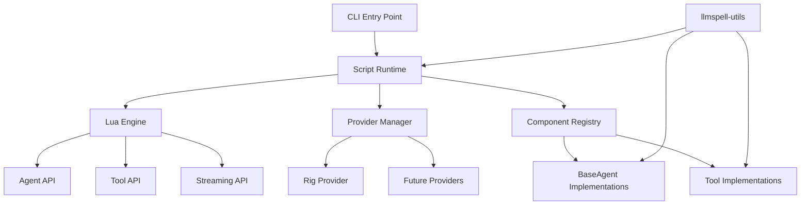

# Phase 1: Core Execution Runtime - Design Document

**Version**: 1.0  
**Date**: June 2025  
**Status**: Implementation Ready  
**Phase**: 1 (Core Execution Runtime)  
**Timeline**: Weeks 3-4  
**Priority**: CRITICAL (MVP Core)

> **📋 Detailed Implementation Guide**: This document provides complete specifications for implementing Phase 1 core execution runtime with streaming and multimodal support for rs-llmspell.

---

## Phase Overview

### Goal
Implement core execution engine with basic Lua scripting, streaming support, and multimodal content types as the functional foundation for all subsequent phases.

### Core Principles
- **Utility First**: Create shared utilities crate before implementing features
- **Streaming Native**: Design APIs with streaming as first-class citizen
- **Multimodal Ready**: Support multiple content types from the start
- **Test Everything**: Comprehensive testing for all new components

### Success Criteria
- [ ] `llmspell-utils` crate provides common utilities to all crates
- [ ] Can execute simple Lua scripts with Agent/Tool APIs
- [ ] LLM providers can be called from scripts
- [ ] Basic tool execution works
- [ ] Streaming methods defined and functional (stub implementation acceptable)
- [ ] Multimodal types compile and are accessible from scripts
- [ ] Error propagation from scripts to CLI
- [ ] Memory usage stays under 50MB for simple scripts

---

## 1. Implementation Specifications

### 1.1 New Crate: llmspell-utils

**Purpose**: Shared utilities for all crates to avoid code duplication

```toml
# llmspell-utils/Cargo.toml
[package]
name = "llmspell-utils"
version.workspace = true
edition.workspace = true

[dependencies]
tokio = { workspace = true }
tracing = { workspace = true }
anyhow = { workspace = true }
thiserror = { workspace = true }
serde = { workspace = true }
uuid = { workspace = true }
directories = "5.0"
chrono = "0.4"
once_cell = "1.19"
```

**Core Modules**:
```rust
// llmspell-utils/src/lib.rs
pub mod async_utils;    // Retry logic, timeout helpers
pub mod file_utils;     // Path normalization, safe file operations
pub mod string_utils;   // String manipulation, formatting
pub mod system_info;    // OS detection, environment helpers
pub mod error_builders; // Common error construction patterns
pub mod id_generator;   // UUID generation with prefixes
pub mod serialization;  // JSON/TOML helpers
```

### 1.2 Enhanced BaseAgent with Streaming

**Updates to llmspell-core/src/traits/base_agent.rs**:

```rust
use tokio::stream::Stream;
use std::pin::Pin;

// New streaming types
pub type AgentStream = Pin<Box<dyn Stream<Item = Result<AgentChunk, LLMSpellError>> + Send>>;

#[derive(Debug, Clone, Serialize, Deserialize)]
pub struct AgentChunk {
    pub stream_id: String,
    pub chunk_index: u64,
    pub content: ChunkContent,
    pub metadata: ChunkMetadata,
    pub timestamp: Instant,
}

#[derive(Debug, Clone, Serialize, Deserialize)]
pub enum ChunkContent {
    Text(String),
    ToolCallProgress { tool_id: String, partial_args: Value },
    ToolCallComplete { tool_id: String, result: ToolOutput },
    Media { media_type: MediaType, data: Vec<u8>, is_final: bool },
    Control(ControlMessage),
}

#[async_trait]
pub trait BaseAgent: Send + Sync + Debug {
    // Existing methods...
    
    // New streaming methods
    async fn stream_execute(&mut self, input: AgentInput) -> Result<AgentStream> {
        Err(LLMSpellError::NotImplemented("Streaming not supported by this agent".into()))
    }
    
    fn supports_streaming(&self) -> bool { false }
    fn supports_multimodal(&self) -> bool { false }
    fn supported_media_types(&self) -> Vec<MediaType> { vec![MediaType::Text] }
}
```

### 1.3 Multimodal Content Types

**New file: llmspell-core/src/types/media.rs**:

```rust
#[derive(Debug, Clone, Serialize, Deserialize)]
pub enum MediaContent {
    Text(String),
    Image { data: Vec<u8>, format: ImageFormat, metadata: ImageMetadata },
    Audio { data: Vec<u8>, format: AudioFormat, metadata: AudioMetadata },
    Video { data: Vec<u8>, format: VideoFormat, metadata: VideoMetadata },
    Binary { data: Vec<u8>, mime_type: String, filename: Option<String> },
}

#[derive(Debug, Clone, Copy, Serialize, Deserialize)]
pub enum ImageFormat {
    Png, Jpeg, Webp, Gif, Svg, Tiff,
}

#[derive(Debug, Clone, Serialize, Deserialize)]
pub struct ImageMetadata {
    pub width: u32,
    pub height: u32,
    pub color_space: ColorSpace,
    pub has_transparency: bool,
    pub dpi: Option<(u32, u32)>,
}

// Enhanced Agent I/O
#[derive(Debug, Clone, Serialize, Deserialize)]
pub struct AgentInput {
    pub text: String,
    pub media: Vec<MediaContent>,
    pub context: Option<ExecutionContext>,
    pub parameters: HashMap<String, Value>,
    pub output_modalities: Vec<MediaType>,
}

#[derive(Debug, Clone, Serialize, Deserialize)]
pub struct AgentOutput {
    pub text: String,
    pub media: Vec<MediaContent>,
    pub tool_calls: Vec<ToolCall>,
    pub metadata: OutputMetadata,
    pub transfer_to: Option<ComponentId>,
}
```

### 1.4 Script Runtime with Lua

**Core Runtime Implementation**:

```rust
// llmspell-bridge/src/runtime.rs
pub struct ScriptRuntime {
    lua: Arc<Mutex<Lua>>,
    registry: Arc<ComponentRegistry>,
    provider_manager: Arc<ProviderManager>,
    execution_context: Arc<RwLock<ExecutionContext>>,
}

impl ScriptRuntime {
    pub async fn new(config: RuntimeConfig) -> Result<Self> {
        let lua = Lua::new();
        
        // Enable Lua libraries
        lua.load_from_std_lib(StdLib::BASE | StdLib::STRING | StdLib::TABLE | StdLib::MATH)?;
        
        // Inject rs-llmspell APIs
        Self::inject_agent_api(&lua)?;
        Self::inject_tool_api(&lua)?;
        Self::inject_workflow_api(&lua)?;
        Self::inject_streaming_api(&lua)?;
        
        Ok(Self {
            lua: Arc::new(Mutex::new(lua)),
            registry: Arc::new(ComponentRegistry::new()),
            provider_manager: Arc::new(ProviderManager::new(config.providers)?),
            execution_context: Arc::new(RwLock::new(ExecutionContext::new())),
        })
    }
    
    pub async fn execute_script(&self, script: &str) -> Result<ScriptOutput> {
        let lua = self.lua.lock().await;
        
        // Set up execution context
        lua.globals().set("__context", self.execution_context.clone())?;
        
        // Execute script
        let result: Value = lua.load(script).eval()?;
        
        // Convert result
        Ok(ScriptOutput::from_lua_value(result)?)
    }
}
```

### 1.5 Lua Streaming Support

**Coroutine-based Streaming**:

```lua
-- Lua streaming API
function stream_agent_execution(agent, input)
    return coroutine.create(function()
        local stream = agent:stream_execute(input)
        
        while true do
            local chunk = stream:next()
            if not chunk then break end
            
            -- Yield each chunk to caller
            coroutine.yield(chunk)
            
            -- Process chunk
            if chunk.content.type == "text" then
                process_text_chunk(chunk.content.text)
            elseif chunk.content.type == "tool_call_progress" then
                update_tool_progress(chunk.content.tool_id)
            end
        end
    end)
end
```

**Rust-side Coroutine Support**:

```rust
// llmspell-bridge/src/lua/streaming.rs
pub fn inject_streaming_api(lua: &Lua) -> Result<()> {
    let stream_module = lua.create_table()?;
    
    // Create coroutine wrapper
    let create_stream = lua.create_function(|lua, agent: Table| {
        let stream_id = Uuid::new_v4().to_string();
        let coroutine = lua.create_thread(stream_handler)?;
        
        Ok(Table::from_lua_multi([
            ("id", stream_id),
            ("coroutine", coroutine),
            ("status", "ready"),
        ], lua)?)
    })?;
    
    stream_module.set("create", create_stream)?;
    lua.globals().set("Stream", stream_module)?;
    
    Ok(())
}
```

### 1.6 Provider Integration with Capability Detection

**Provider Abstraction Layer**:

```rust
// llmspell-providers/src/abstraction.rs
#[async_trait]
pub trait ProviderCapabilities {
    fn supports_streaming(&self) -> bool;
    fn supports_media_type(&self, media_type: &MediaType) -> bool;
    fn max_media_size(&self, media_type: &MediaType) -> Option<usize>;
    fn input_modalities(&self) -> Vec<MediaType>;
    fn output_modalities(&self) -> Vec<MediaType>;
}

pub struct ProviderManager {
    providers: HashMap<String, Box<dyn ProviderInstance>>,
    default_provider: String,
}

impl ProviderManager {
    pub fn new(config: ProvidersConfig) -> Result<Self> {
        let mut providers = HashMap::new();
        
        // Initialize rig provider (text-only)
        if let Some(rig_config) = config.rig {
            providers.insert(
                "rig".to_string(),
                Box::new(RigProvider::new(rig_config)?)
            );
        }
        
        // Prepare for future multimodal providers
        // if let Some(mistral_config) = config.mistral {
        //     providers.insert(
        //         "mistral".to_string(),
        //         Box::new(MistralProvider::new(mistral_config)?)
        //     );
        // }
        
        Ok(Self {
            providers,
            default_provider: config.default.unwrap_or_else(|| "rig".to_string()),
        })
    }
}
```

### 1.7 Basic CLI with Streaming Output

**CLI Entry Point Updates**:

```rust
// llmspell-cli/src/main.rs
use tokio::io::{AsyncBufReadExt, BufReader};

#[derive(Parser)]
struct Cli {
    #[command(subcommand)]
    command: Commands,
}

#[derive(Subcommand)]
enum Commands {
    /// Run a script file
    Run {
        /// Script file to execute
        script: PathBuf,
        
        /// Enable streaming output
        #[arg(long)]
        stream: bool,
    },
}

#[tokio::main]
async fn main() -> Result<()> {
    let cli = Cli::parse();
    
    // Initialize tracing
    tracing_subscriber::fmt()
        .with_env_filter(EnvFilter::from_default_env())
        .init();
    
    match cli.command {
        Commands::Run { script, stream } => {
            let runtime = ScriptRuntime::new(RuntimeConfig::default()).await?;
            
            if stream {
                run_with_streaming(&runtime, &script).await?;
            } else {
                run_standard(&runtime, &script).await?;
            }
        }
    }
    
    Ok(())
}

async fn run_with_streaming(runtime: &ScriptRuntime, script_path: &Path) -> Result<()> {
    let script = tokio::fs::read_to_string(script_path).await?;
    let mut stream = runtime.execute_script_streaming(&script).await?;
    
    // Display streaming output with progress
    let mut spinner = indicatif::ProgressBar::new_spinner();
    spinner.set_message("Processing...");
    
    while let Some(chunk) = stream.next().await {
        match chunk? {
            ScriptChunk::Output(text) => {
                spinner.suspend(|| println!("{}", text));
            }
            ScriptChunk::Progress(msg) => {
                spinner.set_message(msg);
            }
            ScriptChunk::Complete => {
                spinner.finish_with_message("Complete");
            }
        }
    }
    
    Ok(())
}
```

---

## 2. Testing Strategy

### 2.1 Unit Tests

**Utils Crate Tests**:
```rust
// llmspell-utils/src/async_utils.rs
#[cfg(test)]
mod tests {
    use super::*;
    
    #[tokio::test]
    async fn test_retry_logic() {
        let mut attempts = 0;
        let result = retry_async(|| async {
            attempts += 1;
            if attempts < 3 {
                Err(anyhow!("Not yet"))
            } else {
                Ok("Success")
            }
        }).await;
        
        assert_eq!(result.unwrap(), "Success");
        assert_eq!(attempts, 3);
    }
}
```

### 2.2 Integration Tests

**Script Execution Tests**:
```rust
// tests/integration/script_execution.rs
#[tokio::test]
async fn test_lua_agent_execution() {
    let runtime = create_test_runtime().await;
    
    let script = r#"
        local agent = Agent.create({
            name = "test_agent",
            model = "mock",
            prompt = "You are a helpful assistant"
        })
        
        local result = agent:execute({
            text = "Hello, world!"
        })
        
        return result.text
    "#;
    
    let output = runtime.execute_script(script).await.unwrap();
    assert!(output.as_string().unwrap().contains("Hello"));
}
```

### 2.3 Streaming Tests

```rust
#[tokio::test]
async fn test_streaming_execution() {
    let runtime = create_test_runtime().await;
    
    let script = r#"
        local agent = Agent.create({ name = "streamer", streaming = true })
        local chunks = {}
        
        for chunk in agent:stream_execute({ text = "Count to 5" }) do
            table.insert(chunks, chunk)
        end
        
        return #chunks
    "#;
    
    let output = runtime.execute_script(script).await.unwrap();
    assert!(output.as_number().unwrap() > 1);
}
```

---

## 3. Performance Benchmarks

### 3.1 Memory Usage Benchmark

```rust
// benches/memory_usage.rs
use criterion::{criterion_group, criterion_main, Criterion};

fn benchmark_simple_script_memory(c: &mut Criterion) {
    c.bench_function("simple_script_memory", |b| {
        b.iter(|| {
            let runtime = tokio::runtime::Runtime::new().unwrap();
            runtime.block_on(async {
                let script_runtime = ScriptRuntime::new(RuntimeConfig::default()).await.unwrap();
                let _result = script_runtime.execute_script("return 'Hello'").await.unwrap();
                
                // Measure memory
                let memory = get_current_memory_usage();
                assert!(memory < 50 * 1024 * 1024); // 50MB limit
            });
        });
    });
}
```

---

## 4. Security Considerations

### 4.1 Lua Sandboxing

- Restricted standard library access
- No file system access by default
- Network access only through approved tools
- Memory limits enforced
- CPU time limits for script execution

### 4.2 Media Content Validation

- Size limits for each media type
- Format validation before processing
- Sanitization of metadata fields
- Memory-mapped files for large media

---

## 5. Error Handling

### 5.1 Script Errors

```rust
#[derive(Debug, thiserror::Error)]
pub enum ScriptError {
    #[error("Lua execution error: {0}")]
    LuaError(#[from] mlua::Error),
    
    #[error("Component not found: {0}")]
    ComponentNotFound(String),
    
    #[error("Streaming not supported by component: {0}")]
    StreamingNotSupported(String),
    
    #[error("Invalid media content: {0}")]
    InvalidMediaContent(String),
}
```

### 5.2 Error Propagation

- Lua errors wrapped with context
- Stack traces preserved
- User-friendly error messages
- Suggestions for common mistakes

---

## 6. Configuration

### 6.1 Runtime Configuration

```toml
# Default configuration
[runtime]
script_timeout_ms = 30000
max_memory_mb = 50
enable_streaming = true

[providers]
default = "rig"

[providers.rig]
api_key_env = "OPENAI_API_KEY"
model = "gpt-3.5-turbo"
max_tokens = 1000

[security]
sandbox_mode = true
allowed_tools = ["file_reader", "web_search"]
```

---

## 7. Documentation Requirements

### 7.1 API Documentation

- All public types must have rustdoc
- Examples for streaming usage
- Multimodal content examples
- Common patterns documented

### 7.2 User Guide Topics

1. Getting Started with Lua Scripts
2. Using Streaming APIs
3. Working with Multimodal Content
4. Error Handling Best Practices
5. Performance Optimization Tips

---

## 8. Deliverables

### 8.1 Code Deliverables

1. `llmspell-utils` crate with all utility modules
2. Enhanced `BaseAgent` trait with streaming
3. Multimodal content types in core
4. Basic `ScriptRuntime` with Lua support
5. CLI with streaming output support
6. Comprehensive test suite

### 8.2 Documentation Deliverables

1. API documentation (rustdoc)
2. Streaming usage examples
3. Multimodal content guide
4. Migration notes from Phase 0

### 8.3 Quality Metrics

- Zero compiler warnings
- >80% test coverage
- All tests passing
- Memory usage <50MB for simple scripts
- Documentation builds without warnings

---

## 9. Risk Mitigation

### 9.1 Technical Risks

1. **Streaming Complexity**: Start with simple implementation, refine later
2. **Memory Usage**: Implement monitoring early, optimize as needed
3. **Lua Integration**: Use well-tested mlua crate, avoid custom bindings
4. **Multimodal Types**: Keep initial implementation simple, extend later

### 9.2 Schedule Risks

1. **Utils Crate Scope**: Define clear boundaries, avoid scope creep
2. **Testing Time**: Allocate sufficient time for integration tests
3. **Documentation**: Write docs alongside code, not after

---

## 10. Success Validation

### 10.1 Acceptance Tests

```lua
-- example_script.lua
-- This script should execute successfully as validation

local agent = Agent.create({
    name = "assistant",
    model = "gpt-3.5-turbo",
    prompt = "You are a helpful assistant"
})

local result = agent:execute({
    text = "What is 2+2?",
    parameters = { temperature = 0.7 }
})

print("Response:", result.text)

-- Test streaming
if agent:supports_streaming() then
    local stream = agent:stream_execute({ text = "Count to 5" })
    for chunk in stream do
        print("Chunk:", chunk.content.text)
    end
end

return "Success"
```

### 10.2 Performance Validation

- Script execution time <100ms for simple scripts
- Memory usage <50MB during execution
- Streaming chunks delivered <50ms apart
- No memory leaks after 1000 executions

---

## Appendix A: Phase 1 Architecture Diagrams



---

## Appendix B: Example Test Output

```
running 25 tests
test utils::async_utils::tests::test_retry_logic ... ok
test utils::file_utils::tests::test_path_normalization ... ok
test core::types::media::tests::test_media_content_serialization ... ok
test core::traits::base_agent::tests::test_streaming_support ... ok
test bridge::lua::tests::test_agent_creation ... ok
test bridge::lua::tests::test_streaming_coroutines ... ok
test integration::test_simple_script_execution ... ok
test integration::test_streaming_output ... ok
test integration::test_multimodal_types ... ok
...

test result: ok. 25 passed; 0 failed; 0 ignored; 0 measured
```