# Phase 9: Interactive REPL and Debugging Infrastructure - Design Document

**Version**: 2.0  
**Date**: December 2025  
**Status**: Design Ready  
**Phase**: 9 (Interactive REPL and Debugging Infrastructure)  
**Timeline**: Weeks 30-31 (15 working days)  
**Priority**: HIGH (Developer Experience Foundation)  
**Dependencies**: Phase 8 Vector Storage and RAG Foundation ✅  
**Research Archive**: `phase-9-debugging-infrastructure-proposal.md`  
**Crate Structure**: `llmspell-repl` (kernel service), `llmspell-debug` (debugging protocols), CLI/Web/IDE clients  
**Architecture Pattern**: Jupyter-inspired kernel service with DAP/LSP protocol integration

> **📋 Interactive Computing Service**: This phase establishes a production-ready REPL kernel as a standalone service following Jupyter's multi-client architecture, with standardized debugging protocols (DAP-inspired) for IDE integration. The kernel serves multiple simultaneous clients (CLI, web, IDE) through message-based protocols, providing comprehensive debugging, hot reload, and development experience capabilities.

---

## Phase Overview

### Goal
Implement a **REPL kernel service** following Jupyter's proven multi-client architecture, where a single LLMSpell kernel can simultaneously serve CLI terminals, web interfaces, and IDE debuggers through standardized message protocols. Establish debugging protocols inspired by VS Code's Debug Adapter Protocol (DAP) to enable rich IDE integration while providing comprehensive development experience improvements.

### Core Principles
- **Kernel-as-Service**: Standalone REPL kernel process that multiple clients connect to simultaneously  
- **Message-Based Protocols**: JSON-RPC communication following LSP/DAP patterns, not direct method calls
- **Multi-Client Architecture**: One kernel serves CLI, web, and IDE clients concurrently with shared state
- **Protocol Standardization**: Define LLMSpell Debug Protocol (LDP) and REPL Protocol (LRP) for IDE integration
- **Service Discovery**: Connection files and network protocols for client-kernel discovery
- **Resource Isolation**: Per-client security boundaries with shared computational environment
- **Bridge-First Integration**: Kernel wraps existing `llmspell-bridge` runtime, not replacing it
- **Hook-Observable**: All operations emit events through Phase 4 hook system for monitoring
- **State-Persistent**: Integration with Phase 5 state and Phase 7 sessions for continuity
- **Performance-Conscious**: <100ms kernel startup, <50ms message handling, multi-client scaling
- **Cloud-Ready**: Architecture supports containerization and distributed deployment

### Implementation Decisions

**Kernel Service Architecture**: Inspired by Jupyter's proven patterns:
- **LLMSpell Kernel**: Standalone service process wrapping `llmspell-bridge` ScriptRuntime
- **Five Communication Channels**: Shell, IOPub, Stdin, Control, Heartbeat (Jupyter-style)
- **Connection Discovery**: JSON connection files for client-kernel discovery and authentication
- **Multi-Client State**: Shared script environment with per-client UI state isolation
- **Message Protocols**: JSON-based LLMSpell REPL Protocol (LRP) and Debug Protocol (LDP)

**Protocol Design Decisions**:
1. **LLMSpell REPL Protocol (LRP)**: JSON-RPC for script execution, completion, introspection
2. **LLMSpell Debug Protocol (LDP)**: DAP-inspired protocol for breakpoints, stepping, inspection
3. **Transport Layer**: TCP sockets with WebSocket upgrade capability for web clients
4. **Message Routing**: Request-reply for execution, pub-sub for output/events, control for interrupts
5. **Security Model**: Client authentication, resource limits, sandboxed execution contexts

### Success Criteria
- [ ] LLMSpell kernel starts as standalone service process in <100ms
- [ ] Multiple clients (CLI, web, IDE) can connect to same kernel simultaneously
- [ ] Message handling achieves <50ms response time for script execution
- [ ] LRP and LDP protocols enable rich IDE integration (VS Code extension)
- [ ] Connection discovery works via JSON files and network protocols
- [ ] Breakpoints, stepping, and variable inspection work through LDP protocol
- [ ] Hot reload preserves kernel state while updating script files
- [ ] Enhanced error reporting provides Rust-quality suggestions and context
- [ ] Session recording captures complete multi-client debugging workflows
- [ ] Hook system integration provides observability for all kernel operations
- [ ] Phase 5 state and Phase 7 sessions integrate seamlessly with kernel lifecycle
- [ ] Resource limits prevent runaway scripts from consuming excessive resources
- [ ] Zero impact on existing `llmspell` CLI script execution performance

### Deferred to Future Phases
- Full Debug Adapter Protocol (DAP) compliance for universal IDE support (Phase 11+)
- Language Server Protocol (LSP) implementation for completions and diagnostics (Phase 12+)
- Multi-kernel cluster deployment with load balancing (Phase 13+)
- Visual debugging UI with flamegraphs and call trees (Phase 14+)
- Collaborative multi-user debugging sessions (Phase 15+)
- Cloud-native kernel orchestration with Kubernetes (Phase 16+)

---

## 1. LLMSpell Kernel Service Architecture

### 1.1 Kernel-as-Service Model

Following Jupyter's proven architecture, LLMSpell implements a kernel service that can serve multiple clients simultaneously. Each kernel is a standalone process that wraps the existing `llmspell-bridge` ScriptRuntime with multi-client message-based communication:

```rust
// llmspell-repl/src/kernel.rs - Main kernel service
use std::sync::{Arc, RwLock};
use tokio::sync::{mpsc, Mutex};
use tokio::net::{TcpListener, TcpStream};
use serde::{Deserialize, Serialize};
use llmspell_bridge::ScriptRuntime;

/// LLMSpell kernel service - the core computational engine
pub struct LLMSpellKernel {
    /// Unique kernel identifier  
    kernel_id: String,
    
    /// Script runtime from existing bridge
    runtime: Arc<ScriptRuntime>,
    
    /// Connected clients (CLI, web, IDE, etc.)
    clients: Arc<RwLock<HashMap<String, ConnectedClient>>>,
    
    /// Five communication channels (Jupyter pattern)
    shell_channel: Arc<ShellChannel>,      // Request-reply for execution
    iopub_channel: Arc<IOPubChannel>,      // Broadcast output/events
    stdin_channel: Arc<StdinChannel>,      // Input requests
    control_channel: Arc<ControlChannel>,  // System control (shutdown, interrupt)
    heartbeat_channel: Arc<HeartbeatChannel>, // Health monitoring
    
    /// Kernel state and configuration
    execution_state: Arc<RwLock<KernelState>>,
    config: KernelConfig,
    
    /// Integration with LLMSpell ecosystem
    hook_manager: Arc<HookManager>,        // Phase 4 hooks
    state_manager: Arc<StateManager>,      // Phase 5 state  
    session_manager: Arc<SessionManager>,  // Phase 7 sessions
    
    /// Resource management
    resource_monitor: Arc<ResourceMonitor>,
    security_context: Arc<SecurityContext>,
}

impl LLMSpellKernel {
    /// Start kernel service on specified ports
    pub async fn start(config: KernelConfig) -> Result<Self> {
        let kernel_id = uuid::Uuid::new_v4().to_string();
        
        // Initialize script runtime with existing bridge
        let runtime = Arc::new(ScriptRuntime::new_with_lua(config.runtime_config).await?);
        
        // Create communication channels
        let shell_channel = Arc::new(ShellChannel::bind(config.shell_port).await?);
        let iopub_channel = Arc::new(IOPubChannel::bind(config.iopub_port).await?);
        let stdin_channel = Arc::new(StdinChannel::bind(config.stdin_port).await?);
        let control_channel = Arc::new(ControlChannel::bind(config.control_port).await?);
        let heartbeat_channel = Arc::new(HeartbeatChannel::bind(config.hb_port).await?);
        
        // Integration setup
        let hook_manager = Arc::new(HookManager::new());
        let state_manager = Arc::new(StateManager::new(config.state_config.clone()).await?);
        let session_manager = Arc::new(SessionManager::new(config.session_config.clone()).await?);
        
        let kernel = Self {
            kernel_id: kernel_id.clone(),
            runtime,
            clients: Arc::new(RwLock::new(HashMap::new())),
            shell_channel,
            iopub_channel, 
            stdin_channel,
            control_channel,
            heartbeat_channel,
            execution_state: Arc::new(RwLock::new(KernelState::Idle)),
            config,
            hook_manager,
            state_manager,
            session_manager,
            resource_monitor: Arc::new(ResourceMonitor::new()),
            security_context: Arc::new(SecurityContext::new()),
        };
        
        // Write connection file for client discovery
        kernel.write_connection_file().await?;
        
        // Start channel listeners
        kernel.start_channel_listeners().await?;
        
        println!("🚀 LLMSpell kernel started: {}", kernel_id);
        println!("📁 Connection file: {}", kernel.get_connection_file_path());
        
        Ok(kernel)
    }
    
    /// Write connection file for client discovery (Jupyter pattern)
    async fn write_connection_file(&self) -> Result<()> {
        let connection_info = ConnectionInfo {
            kernel_id: self.kernel_id.clone(),
            transport: "tcp".to_string(),
            ip: self.config.ip.clone(),
            shell_port: self.config.shell_port,
            iopub_port: self.config.iopub_port,
            stdin_port: self.config.stdin_port,
            control_port: self.config.control_port,
            hb_port: self.config.hb_port,
            signature_scheme: "hmac-sha256".to_string(),
            key: self.config.key.clone(),
        };
        
        let connection_file_path = self.get_connection_file_path();
        let connection_json = serde_json::to_string_pretty(&connection_info)?;
        tokio::fs::write(connection_file_path, connection_json).await?;
        
        Ok(())
    }
    
    /// Start listeners for all communication channels
    async fn start_channel_listeners(&self) -> Result<()> {
        // Start shell channel (execution requests)
        let shell_handler = ShellHandler::new(
            self.runtime.clone(),
            self.iopub_channel.clone(),
            self.execution_state.clone(),
            self.hook_manager.clone(),
        );
        tokio::spawn(self.shell_channel.listen(shell_handler));
        
        // Start control channel (kernel management)
        let control_handler = ControlHandler::new(
            self.execution_state.clone(),
            self.clients.clone(),
        );
        tokio::spawn(self.control_channel.listen(control_handler));
        
        // Start heartbeat channel (health monitoring)
        tokio::spawn(self.heartbeat_channel.listen());
        
        // Start stdin channel (input requests)
        let stdin_handler = StdinHandler::new();
        tokio::spawn(self.stdin_channel.listen(stdin_handler));
        
        Ok(())
    }
}

/// Connection information for client discovery
#[derive(Debug, Clone, Serialize, Deserialize)]
pub struct ConnectionInfo {
    pub kernel_id: String,
    pub transport: String,
    pub ip: String,
    pub shell_port: u16,
    pub iopub_port: u16,
    pub stdin_port: u16,
    pub control_port: u16,
    pub hb_port: u16,
    pub signature_scheme: String,
    pub key: String,
}

/// Kernel execution state
#[derive(Debug, Clone, PartialEq)]
pub enum KernelState {
    Idle,
    Busy,
    Starting,
    Restarting,
    Dead,
}

/// Connected client information
#[derive(Debug, Clone)]
pub struct ConnectedClient {
    pub client_id: String,
    pub client_type: ClientType,
    pub connection_time: std::time::SystemTime,
    pub last_activity: std::time::SystemTime,
}

#[derive(Debug, Clone)]
pub enum ClientType {
    CLI,
    Web,
    IDE,
    Notebook,
}
```

### 1.2 Five-Channel Communication Architecture

Following Jupyter's proven message architecture, LLMSpell kernel uses five specialized communication channels:

```rust
// llmspell-repl/src/channels/shell.rs - Shell channel for execution requests
use tokio::net::{TcpListener, TcpStream};
use tokio_tungstenite::{accept_async, tungstenite::Message};

/// Shell channel handles execution requests and replies
pub struct ShellChannel {
    listener: TcpListener,
    port: u16,
}

impl ShellChannel {
    pub async fn bind(port: u16) -> Result<Self> {
        let listener = TcpListener::bind(format!("127.0.0.1:{}", port)).await?;
        Ok(Self { listener, port })
    }
    
    pub async fn listen<H>(&self, handler: H) 
    where 
        H: ShellHandler + Clone + Send + 'static 
    {
        println!("🐚 Shell channel listening on port {}", self.port);
        
        while let Ok((stream, addr)) = self.listener.accept().await {
            println!("📞 Shell client connected: {}", addr);
            
            let handler = handler.clone();
            tokio::spawn(async move {
                if let Err(e) = Self::handle_shell_connection(stream, handler).await {
                    eprintln!("Shell connection error: {}", e);
                }
            });
        }
    }
    
    async fn handle_shell_connection<H>(
        stream: TcpStream,
        handler: H
    ) -> Result<()> 
    where 
        H: ShellHandler
    {
        // Upgrade to WebSocket for web clients, or use raw TCP for others
        let websocket = accept_async(stream).await?;
        let (mut ws_sender, mut ws_receiver) = websocket.split();
        
        while let Some(msg) = ws_receiver.next().await {
            match msg? {
                Message::Text(text) => {
                    // Parse LRP (LLMSpell REPL Protocol) message
                    let request: LRPRequest = serde_json::from_str(&text)?;
                    let response = handler.handle_shell_request(request).await?;
                    let response_json = serde_json::to_string(&response)?;
                    ws_sender.send(Message::Text(response_json)).await?;
                }
                Message::Close(_) => break,
                _ => {} // Handle other message types
            }
        }
        
        Ok(())
    }
}

/// Shell message handler
#[async_trait]
pub trait ShellHandler: Send + Sync {
    async fn handle_shell_request(&self, request: LRPRequest) -> Result<LRPResponse>;
}

/// LLMSpell REPL Protocol Request
#[derive(Debug, Clone, Serialize, Deserialize)]
#[serde(tag = "msg_type")]
pub enum LRPRequest {
    ExecuteRequest {
        msg_id: String,
        code: String,
        silent: bool,
        store_history: bool,
        user_expressions: HashMap<String, String>,
        allow_stdin: bool,
    },
    CompleteRequest {
        msg_id: String,
        code: String,
        cursor_pos: usize,
    },
    InspectRequest {
        msg_id: String,
        code: String,
        cursor_pos: usize,
        detail_level: u32,
    },
    HistoryRequest {
        msg_id: String,
        output: bool,
        raw: bool,
        hist_access_type: String,
        session: Option<i32>,
        start: Option<i32>,
        stop: Option<i32>,
        n: Option<i32>,
        pattern: Option<String>,
        unique: bool,
    },
    IsCompleteRequest {
        msg_id: String,
        code: String,
    },
    KernelInfoRequest {
        msg_id: String,
    },
}

/// LLMSpell REPL Protocol Response
#[derive(Debug, Clone, Serialize, Deserialize)]
#[serde(tag = "msg_type")]
pub enum LRPResponse {
    ExecuteReply {
        msg_id: String,
        status: ExecutionStatus,
        execution_count: u32,
        payload: Vec<serde_json::Value>,
        user_expressions: HashMap<String, serde_json::Value>,
    },
    CompleteReply {
        msg_id: String,
        matches: Vec<String>,
        cursor_start: usize,
        cursor_end: usize,
        metadata: HashMap<String, serde_json::Value>,
        status: String,
    },
    InspectReply {
        msg_id: String,
        found: bool,
        data: HashMap<String, String>,
        metadata: HashMap<String, serde_json::Value>,
        status: String,
    },
    // ... other response types
}

#[derive(Debug, Clone, Serialize, Deserialize)]
pub enum ExecutionStatus {
    #[serde(rename = "ok")]
    Ok,
    #[serde(rename = "error")]
    Error,
    #[serde(rename = "abort")]
    Abort,
}
```

### 1.3 IOPub Channel for Broadcast Communication

```rust
// llmspell-repl/src/channels/iopub.rs - Broadcast channel for output and events
use tokio::sync::broadcast;

/// IOPub channel broadcasts output, errors, and status to all connected clients
pub struct IOPubChannel {
    broadcaster: broadcast::Sender<IOPubMessage>,
    listener: TcpListener,
    port: u16,
}

impl IOPubChannel {
    pub async fn bind(port: u16) -> Result<Self> {
        let listener = TcpListener::bind(format!("127.0.0.1:{}", port)).await?;
        let (broadcaster, _) = broadcast::channel(1000);
        
        Ok(Self {
            broadcaster,
            listener,
            port,
        })
    }
    
    /// Broadcast message to all connected clients
    pub async fn broadcast(&self, message: IOPubMessage) -> Result<()> {
        let _ = self.broadcaster.send(message);
        Ok(())
    }
    
    /// Listen for client connections and stream messages
    pub async fn listen(&self) {
        println!("📢 IOPub channel listening on port {}", self.port);
        
        while let Ok((stream, addr)) = self.listener.accept().await {
            println!("📡 IOPub client connected: {}", addr);
            
            let mut receiver = self.broadcaster.subscribe();
            tokio::spawn(async move {
                let websocket = accept_async(stream).await.unwrap();
                let (mut ws_sender, _ws_receiver) = websocket.split();
                
                while let Ok(message) = receiver.recv().await {
                    let json = serde_json::to_string(&message).unwrap();
                    if ws_sender.send(Message::Text(json)).await.is_err() {
                        break; // Client disconnected
                    }
                }
            });
        }
    }
}

/// IOPub broadcast messages
#[derive(Debug, Clone, Serialize, Deserialize)]
#[serde(tag = "msg_type")]
pub enum IOPubMessage {
    Stream {
        name: String,      // stdout, stderr
        text: String,
    },
    DisplayData {
        data: HashMap<String, serde_json::Value>,
        metadata: HashMap<String, serde_json::Value>,
        transient: HashMap<String, serde_json::Value>,
    },
    ExecuteInput {
        code: String,
        execution_count: u32,
    },
    ExecuteResult {
        execution_count: u32,
        data: HashMap<String, serde_json::Value>,
        metadata: HashMap<String, serde_json::Value>,
    },
    Error {
        ename: String,
        evalue: String,
        traceback: Vec<String>,
    },
    Status {
        execution_state: String, // starting, idle, busy
    },
    // LLMSpell-specific extensions
    HookEvent {
        hook_name: String,
        event_type: String,
        timestamp: u64,
        payload: serde_json::Value,
    },
    DebugEvent {
        event_type: String, // breakpoint_hit, step_complete, etc.
        payload: serde_json::Value,
    },
}
```

---

## 2. LLMSpell Debug Protocol (LDP)

### 2.1 Debug Adapter Protocol Integration

Inspired by VS Code's Debug Adapter Protocol, LLMSpell implements its own debugging protocol for rich IDE integration:

```rust
// llmspell-debug/src/protocol.rs - LLMSpell Debug Protocol (LDP)
use serde::{Deserialize, Serialize};

/// LLMSpell Debug Protocol - inspired by DAP but tailored for LLMSpell
#[derive(Debug, Clone, Serialize, Deserialize)]
#[serde(tag = "command")]
pub enum LDPRequest {
    Initialize {
        seq: u32,
        arguments: InitializeArguments,
    },
    Launch {
        seq: u32,
        arguments: LaunchArguments,
    },
    SetBreakpoints {
        seq: u32,
        arguments: SetBreakpointsArguments,
    },
    Continue {
        seq: u32,
        arguments: ContinueArguments,
    },
    Next {
        seq: u32,
        arguments: NextArguments,
    },
    StepIn {
        seq: u32,
        arguments: StepInArguments,
    },
    StepOut {
        seq: u32,
        arguments: StepOutArguments,
    },
    Pause {
        seq: u32,
        arguments: PauseArguments,
    },
    StackTrace {
        seq: u32,
        arguments: StackTraceArguments,
    },
    Scopes {
        seq: u32,
        arguments: ScopesArguments,
    },
    Variables {
        seq: u32,
        arguments: VariablesArguments,
    },
    Evaluate {
        seq: u32,
        arguments: EvaluateArguments,
    },
    Disconnect {
        seq: u32,
        arguments: Option<DisconnectArguments>,
    },
    // LLMSpell-specific extensions
    InspectHooks {
        seq: u32,
        arguments: InspectHooksArguments,
    },
    ProfileStart {
        seq: u32,
        arguments: ProfileStartArguments,
    },
    ProfileStop {
        seq: u32,
        arguments: ProfileStopArguments,
    },
}

#[derive(Debug, Clone, Serialize, Deserialize)]
pub struct InitializeArguments {
    pub client_id: Option<String>,
    pub client_name: Option<String>,
    pub adapter_id: String,
    pub locale: Option<String>,
    pub lines_start_at1: Option<bool>,
    pub columns_start_at1: Option<bool>,
    pub path_format: Option<String>,
    pub supports_variable_type: Option<bool>,
    pub supports_variable_paging: Option<bool>,
    pub supports_run_in_terminal_request: Option<bool>,
    pub supports_memory_references: Option<bool>,
    pub supports_progress_reporting: Option<bool>,
    pub supports_invalidated_event: Option<bool>,
}

#[derive(Debug, Clone, Serialize, Deserialize)]
pub struct LaunchArguments {
    pub program: String,
    pub args: Option<Vec<String>>,
    pub cwd: Option<String>,
    pub env: Option<HashMap<String, String>>,
    pub console: Option<String>,
    pub internal_console_options: Option<String>,
    pub stop_on_entry: Option<bool>,
    // LLMSpell-specific
    pub llmspell_config: Option<String>,
    pub enable_hooks: Option<bool>,
    pub enable_state_persistence: Option<bool>,
}

/// Debug adapter for LLMSpell kernel integration
pub struct LLMSpellDebugAdapter {
    kernel_connection: Arc<KernelConnection>,
    debug_session: Arc<RwLock<Option<DebugSession>>>,
    breakpoints: Arc<RwLock<HashMap<String, Vec<Breakpoint>>>>,
    stack_frames: Arc<RwLock<Vec<StackFrame>>>,
    variables: Arc<RwLock<HashMap<u32, Variable>>>,
    sequence_counter: Arc<AtomicU32>,
}

impl LLMSpellDebugAdapter {
    pub async fn new(kernel_connection: Arc<KernelConnection>) -> Self {
        Self {
            kernel_connection,
            debug_session: Arc::new(RwLock::new(None)),
            breakpoints: Arc::new(RwLock::new(HashMap::new())),
            stack_frames: Arc::new(RwLock::new(Vec::new())),
            variables: Arc::new(RwLock::new(HashMap::new())),
            sequence_counter: Arc::new(AtomicU32::new(1)),
        }
    }
    
    /// Handle LDP request from IDE
    pub async fn handle_request(&self, request: LDPRequest) -> Result<LDPResponse> {
        match request {
            LDPRequest::Initialize { seq, arguments } => {
                self.handle_initialize(seq, arguments).await
            }
            LDPRequest::Launch { seq, arguments } => {
                self.handle_launch(seq, arguments).await
            }
            LDPRequest::SetBreakpoints { seq, arguments } => {
                self.handle_set_breakpoints(seq, arguments).await
            }
            LDPRequest::Continue { seq, arguments } => {
                self.handle_continue(seq, arguments).await
            }
            LDPRequest::StackTrace { seq, arguments } => {
                self.handle_stack_trace(seq, arguments).await
            }
            LDPRequest::Variables { seq, arguments } => {
                self.handle_variables(seq, arguments).await
            }
            // ... other request handlers
            _ => {
                Err(LDPError::NotImplemented(format!("Request not implemented: {:?}", request)))
            }
        }
    }
    
    async fn handle_initialize(&self, seq: u32, _args: InitializeArguments) -> Result<LDPResponse> {
        Ok(LDPResponse::Initialize {
            seq,
            body: InitializeResponseBody {
                supports_configuration_done_request: Some(true),
                supports_function_breakpoints: Some(false),
                supports_conditional_breakpoints: Some(true),
                supports_hit_conditional_breakpoints: Some(true),
                supports_evaluate_for_hovers: Some(true),
                supports_step_back: Some(false),
                supports_set_variable: Some(true),
                supports_restart_frame: Some(false),
                supports_goto_targets_request: Some(false),
                supports_step_in_targets_request: Some(false),
                supports_completions_request: Some(true),
                supports_modules_request: Some(false),
                supports_restart_request: Some(false),
                supports_exception_options: Some(false),
                supports_value_formatting_options: Some(true),
                supports_exception_info_request: Some(false),
                supports_terminate_debuggee: Some(true),
                supports_delayed_stack_trace_loading: Some(true),
                supports_loaded_sources_request: Some(false),
                supports_log_points: Some(true),
                supports_terminate_threads_request: Some(false),
                supports_set_expression: Some(true),
                supports_terminate_request: Some(true),
                supports_data_breakpoints: Some(false),
                supports_read_memory_request: Some(false),
                supports_disassemble_request: Some(false),
                supports_cancel_request: Some(true),
                supports_breakpoint_locations_request: Some(false),
                supports_clipboard_context: Some(false),
                // LLMSpell-specific capabilities
                supports_hook_introspection: Some(true),
                supports_state_inspection: Some(true),
                supports_hot_reload: Some(true),
            },
        })
    }
    
    async fn handle_set_breakpoints(
        &self, 
        seq: u32, 
        args: SetBreakpointsArguments
    ) -> Result<LDPResponse> {
        let mut breakpoints_map = self.breakpoints.write().await;
        let source_path = args.source.path.clone();
        
        let mut breakpoints = Vec::new();
        for bp_args in args.breakpoints {
            let breakpoint = Breakpoint {
                id: Some(self.sequence_counter.fetch_add(1, Ordering::Relaxed)),
                verified: true,
                line: Some(bp_args.line),
                column: bp_args.column,
                source: Some(args.source.clone()),
                condition: bp_args.condition,
                hit_condition: bp_args.hit_condition,
                log_message: bp_args.log_message,
            };
            breakpoints.push(breakpoint);
        }
        
        // Send breakpoints to kernel
        let kernel_message = KernelDebugMessage::SetBreakpoints {
            file: source_path.clone(),
            breakpoints: breakpoints.clone(),
        };
        self.kernel_connection.send_debug_message(kernel_message).await?;
        
        // Store breakpoints
        breakpoints_map.insert(source_path, breakpoints.clone());
        
        Ok(LDPResponse::SetBreakpoints {
            seq,
            body: SetBreakpointsResponseBody { breakpoints },
        })
    }
}
```

### 2.2 Enhanced Error Reporting Integration

```rust
// llmspell-debug/src/error_enhancement.rs - Enhanced error reporting for LDP
use std::collections::HashMap;

pub struct LLMSpellErrorEnhancer {
    suggestion_engine: SuggestionEngine,
    context_analyzer: ContextAnalyzer,
    documentation_linker: DocumentationLinker,
}

impl LLMSpellErrorEnhancer {
    pub fn new() -> Self {
        Self {
            suggestion_engine: SuggestionEngine::new(),
            context_analyzer: ContextAnalyzer::new(),
            documentation_linker: DocumentationLinker::new(),
        }
    }
    
    /// Enhance Lua error for debugging protocol
    pub async fn enhance_error(
        &self,
        error: &mlua::Error,
        context: &ExecutionContext,
        source_code: &str,
    ) -> Result<EnhancedError> {
        let mut enhanced = EnhancedError {
            error_code: self.classify_error(error),
            original_message: error.to_string(),
            rust_style_format: String::new(),
            location: None,
            suggestions: Vec::new(),
            related_docs: Vec::new(),
            context_lines: Vec::new(),
            fix_actions: Vec::new(),
        };
        
        // Extract location information
        enhanced.location = self.extract_location_from_error(error, source_code);
        
        // Generate Rust-style error formatting  
        enhanced.rust_style_format = self.format_rust_style(&enhanced, source_code);
        
        // Add context lines
        if let Some(location) = &enhanced.location {
            enhanced.context_lines = self.get_context_lines(
                source_code,
                location.line,
                5, // 5 lines before/after
            );
        }
        
        // Generate suggestions
        enhanced.suggestions = self.suggestion_engine
            .generate_suggestions(error, context, source_code)
            .await?;
        
        // Link to documentation
        enhanced.related_docs = self.documentation_linker
            .find_related_docs(&enhanced.error_code)
            .await?;
        
        // Generate fix actions for IDE
        enhanced.fix_actions = self.generate_fix_actions(&enhanced, source_code);
        
        Ok(enhanced)
    }
    
    fn format_rust_style(&self, enhanced: &EnhancedError, source_code: &str) -> String {
        let location = enhanced.location.as_ref();
        
        format!(
            "error[{}]: {}\n\
             {} {}:{}:{}\n\
             {}\n\
             {} | {}\n\
             {} | {}{}\n",
            enhanced.error_code,
            enhanced.original_message,
            "-->".blue().bold(),
            location.map(|l| l.file.as_deref().unwrap_or("script")).unwrap_or("script"),
            location.map(|l| l.line).unwrap_or(1),
            location.map(|l| l.column).unwrap_or(1),
            " |".blue().bold(),
            location.map(|l| l.line).unwrap_or(1).to_string().blue().bold(),
            self.get_source_line(source_code, location.map(|l| l.line).unwrap_or(1)),
            " |".blue().bold(),
            " ".repeat(location.map(|l| l.column.saturating_sub(1)).unwrap_or(0)),
            "^".repeat(location.map(|l| l.span_length).unwrap_or(1)).red().bold()
        )
    }
    
    /// Generate IDE fix actions
    fn generate_fix_actions(&self, enhanced: &EnhancedError, source_code: &str) -> Vec<FixAction> {
        let mut actions = Vec::new();
        
        // Example: Missing 'end' keyword
        if enhanced.error_code == "E0001" && enhanced.original_message.contains("'end'") {
            if let Some(location) = &enhanced.location {
                actions.push(FixAction {
                    title: "Add missing 'end' keyword".to_string(),
                    kind: FixActionKind::QuickFix,
                    edit: TextEdit {
                        range: Range {
                            start: Position { line: location.line, character: 0 },
                            end: Position { line: location.line, character: 0 },
                        },
                        new_text: "end\n".to_string(),
                    },
                });
            }
        }
        
        // Example: Undefined variable suggestion
        if enhanced.error_code == "E0002" {
            for suggestion in &enhanced.suggestions {
                if suggestion.starts_with("Did you mean") {
                    if let Some(suggested_var) = self.extract_suggestion_variable(suggestion) {
                        actions.push(FixAction {
                            title: format!("Replace with '{}'", suggested_var),
                            kind: FixActionKind::QuickFix,
                            edit: self.create_replace_edit(enhanced, &suggested_var),
                        });
                    }
                }
            }
        }
        
        actions
    }
}

#[derive(Debug, Clone, Serialize, Deserialize)]
pub struct EnhancedError {
    pub error_code: String,
    pub original_message: String,
    pub rust_style_format: String,
    pub location: Option<ErrorLocation>,
    pub suggestions: Vec<String>,
    pub related_docs: Vec<String>,
    pub context_lines: Vec<ContextLine>,
    pub fix_actions: Vec<FixAction>,
}

#[derive(Debug, Clone, Serialize, Deserialize)]
pub struct FixAction {
    pub title: String,
    pub kind: FixActionKind,
    pub edit: TextEdit,
}

#[derive(Debug, Clone, Serialize, Deserialize)]
pub enum FixActionKind {
    QuickFix,
    Refactor,
    SourceAction,
}

#[derive(Debug, Clone, Serialize, Deserialize)]
pub struct TextEdit {
    pub range: Range,
    pub new_text: String,
}
```

---

## 3. Enhanced Debugging Infrastructure

### 3.1 Interactive Debugging System

The debugging system provides comprehensive interactive debugging capabilities integrated with the kernel service:

```rust
// llmspell-debug/src/debugger.rs - Interactive debugging capabilities
use std::collections::{HashMap, HashSet};
use tokio::sync::{Mutex, RwLock};

/// Conditional breakpoint with hit counts and conditions
#[derive(Debug, Clone)]
pub struct ConditionalBreakpoint {
    pub line: u32,
    pub condition: Option<String>,
    pub hit_count: u32,        // Break after N hits
    pub ignore_count: u32,      // Ignore first N hits
    pub current_hits: u32,      // Current hit counter
    pub enabled: bool,          // Can be disabled without removal
}

pub struct Debugger {
    /// Active breakpoints mapped by file and line numbers with conditions
    breakpoints: Arc<RwLock<HashMap<String, HashMap<u32, ConditionalBreakpoint>>>>,
    
    /// Current debugging session state
    current_session: Arc<Mutex<Option<DebugSession>>>,
    
    /// Variable inspector for deep inspection
    variable_inspector: Arc<VariableInspector>,
    
    /// Breakpoint persistence for session continuity
    persistence: BreakpointPersistence,
    
    /// Step execution controller for debugging flow
    step_controller: StepController,
}

impl Debugger {
    pub async fn new() -> Result<Self> {
        Ok(Self {
            breakpoints: Arc::new(RwLock::new(HashMap::new())),
            current_session: Arc::new(Mutex::new(None)),
            variable_inspector: Arc::new(VariableInspector::new()),
            persistence: BreakpointPersistence::new().await?,
            step_controller: StepController::new(),
        })
    }
    
    /// Set breakpoint with optional conditions
    pub async fn set_breakpoint(
        &self, 
        file: &str, 
        line: u32,
        condition: Option<String>,
        hit_count: Option<u32>,
        ignore_count: Option<u32>,
    ) -> Result<()> {
        let mut breakpoints = self.breakpoints.write().await;
        let bp = ConditionalBreakpoint {
            line,
            condition,
            hit_count: hit_count.unwrap_or(0),
            ignore_count: ignore_count.unwrap_or(0),
            current_hits: 0,
            enabled: true,
        };
        
        breakpoints.entry(file.to_string())
            .or_insert_with(HashMap::new)
            .insert(line, bp);
        
        // Persist breakpoint for session continuity
        self.persistence.save_breakpoint(file, line).await?;
        
        // Embed breakpoint marker in source if file exists
        if let Ok(mut content) = tokio::fs::read_to_string(file).await {
            if !self.has_embedded_breakpoint(&content, line) {
                content = self.embed_breakpoint_comment(content, line);
                tokio::fs::write(file, content).await?;
            }
        }
        
        Ok(())
    }
    
    /// Enter debug mode at breakpoint
    pub async fn enter_debug_mode(
        &self, 
        context: DebugContext,
        runtime: Arc<ScriptRuntime>
    ) -> Result<DebugSession> {
        let session = DebugSession {
            context,
            runtime,
            state: DebugState::AtBreakpoint,
            call_stack: self.capture_call_stack().await?,
            local_variables: self.capture_local_variables().await?,
            watch_expressions: HashMap::new(),
        };
        
        *self.current_session.lock().await = Some(session.clone());
        Ok(session)
    }
    
    /// Step over current line
    pub async fn step_over(&self) -> Result<DebugStepResult> {
        let mut session_guard = self.current_session.lock().await;
        let session = session_guard.as_mut()
            .ok_or(LDPError::NoActiveDebugSession)?;
        
        self.step_controller.step_over(&mut *session).await
    }
    
    /// Step into function call
    pub async fn step_into(&self) -> Result<DebugStepResult> {
        let mut session_guard = self.current_session.lock().await;
        let session = session_guard.as_mut()
            .ok_or(LDPError::NoActiveDebugSession)?;
        
        self.step_controller.step_into(&mut *session).await
    }
    
    /// Continue execution until next breakpoint
    pub async fn continue_execution(&self) -> Result<DebugContinueResult> {
        let mut session_guard = self.current_session.lock().await;
        let session = session_guard.as_mut()
            .ok_or(LDPError::NoActiveDebugSession)?;
        
        session.state = DebugState::Running;
        
        // Resume execution in script runtime
        let result = session.runtime.continue_execution().await?;
        
        if result.hit_breakpoint {
            session.state = DebugState::AtBreakpoint;
            session.context = result.context;
        } else {
            session.state = DebugState::Completed;
        }
        
        Ok(result)
    }
    
    /// Inspect variable at current scope
    pub async fn inspect_variable(&self, name: &str) -> Result<VariableInspection> {
        let session_guard = self.current_session.lock().await;
        let session = session_guard.as_ref()
            .ok_or(LDPError::NoActiveDebugSession)?;
        
        self.variable_inspector.inspect_variable(name, &session.runtime).await
    }
}

#[derive(Debug, Clone)]
pub struct DebugSession {
    pub context: DebugContext,
    pub runtime: Arc<ScriptRuntime>,
    pub state: DebugState,
    pub call_stack: Vec<StackFrame>,
    pub local_variables: HashMap<String, VariableValue>,
    pub watch_expressions: HashMap<String, VariableValue>,
}

#[derive(Debug, Clone)]
pub enum DebugState {
    Running,
    AtBreakpoint,
    Stepping,
    Completed,
    Error(String),
}
```

### 3.2 Variable Inspection System

Deep variable inspection with lazy expansion for complex data structures:

```rust
// llmspell-debug/src/variable_inspector.rs - Deep variable inspection
use mlua::{Value, Table, UserData};

pub struct VariableInspector {
    max_depth: usize,
    max_items_per_level: usize,
}

impl VariableInspector {
    pub fn new() -> Self {
        Self {
            max_depth: 5,
            max_items_per_level: 50,
        }
    }
    
    /// Inspect variable with lazy expansion
    pub async fn inspect_variable(
        &self, 
        name: &str, 
        runtime: &ScriptRuntime
    ) -> Result<VariableInspection> {
        let lua = runtime.get_lua().await?;
        
        // Get variable value from Lua environment
        let value = lua.globals().get::<_, Value>(name)?;
        
        // Create inspection tree with lazy loading
        let inspection = self.create_inspection(&value, 0)?;
        
        Ok(VariableInspection {
            name: name.to_string(),
            type_name: self.get_type_name(&value),
            value: inspection,
            is_expandable: self.is_expandable(&value),
            size_hint: self.get_size_hint(&value),
        })
    }
    
    /// Create inspection tree with depth limits
    fn create_inspection(&self, value: &Value, depth: usize) -> Result<InspectionValue> {
        if depth >= self.max_depth {
            return Ok(InspectionValue::TooDeep {
                type_name: self.get_type_name(value),
                expandable: self.is_expandable(value),
            });
        }
        
        match value {
            Value::Nil => Ok(InspectionValue::Nil),
            Value::Boolean(b) => Ok(InspectionValue::Boolean(*b)),
            Value::Integer(i) => Ok(InspectionValue::Integer(*i)),
            Value::Number(n) => Ok(InspectionValue::Number(*n)),
            Value::String(s) => Ok(InspectionValue::String(s.to_str()?.to_string())),
            Value::Table(table) => self.inspect_table(table, depth),
            Value::Function(_) => Ok(InspectionValue::Function {
                name: self.get_function_name(value)?,
                signature: self.get_function_signature(value)?,
            }),
            Value::UserData(ud) => self.inspect_userdata(ud, depth),
            _ => Ok(InspectionValue::Other {
                type_name: self.get_type_name(value),
                string_repr: format!("{:?}", value),
            }),
        }
    }
    
    /// Inspect table with size limits
    fn inspect_table(&self, table: &Table, depth: usize) -> Result<InspectionValue> {
        let mut entries = HashMap::new();
        let mut count = 0;
        let mut truncated = false;
        
        // Iterate over table pairs with limit
        for pair in table.pairs::<Value, Value>() {
            if count >= self.max_items_per_level {
                truncated = true;
                break;
            }
            
            let (key, value) = pair?;
            let key_string = self.value_to_key_string(&key)?;
            let value_inspection = self.create_inspection(&value, depth + 1)?;
            
            entries.insert(key_string, value_inspection);
            count += 1;
        }
        
        Ok(InspectionValue::Table {
            entries,
            truncated,
            total_size: self.get_table_size(table)?,
        })
    }
    
    /// Lazy expansion for large structures
    pub async fn expand_variable(
        &self,
        name: &str,
        path: &[String],
        runtime: &ScriptRuntime
    ) -> Result<VariableExpansion> {
        let lua = runtime.get_lua().await?;
        
        // Navigate to the specific path in the variable
        let mut current_value = lua.globals().get::<_, Value>(name)?;
        
        for path_component in path {
            if let Value::Table(table) = current_value {
                current_value = table.get::<_, Value>(path_component.clone())?;
            } else {
                return Err(LDPError::InvalidVariablePath(path.join(".")));
            }
        }
        
        // Expand this level with more detail
        let expanded = self.create_inspection(&current_value, 0)?;
        
        Ok(VariableExpansion {
            path: path.to_vec(),
            expanded_value: expanded,
            can_expand_further: self.is_expandable(&current_value),
        })
    }
}

#[derive(Debug, Clone, Serialize, Deserialize)]
pub struct VariableInspection {
    pub name: String,
    pub type_name: String,
    pub value: InspectionValue,
    pub is_expandable: bool,
    pub size_hint: Option<usize>,
}

#[derive(Debug, Clone, Serialize, Deserialize)]
pub enum InspectionValue {
    Nil,
    Boolean(bool),
    Integer(i64),
    Number(f64),
    String(String),
    Table {
        entries: HashMap<String, InspectionValue>,
        truncated: bool,
        total_size: usize,
    },
    Function {
        name: Option<String>,
        signature: Option<String>,
    },
    UserData {
        type_name: String,
        metadata: HashMap<String, String>,
    },
    TooDeep {
        type_name: String,
        expandable: bool,
    },
    Other {
        type_name: String,
        string_repr: String,
    },
}
```

### 3.3 Enhanced Error Reporting System

Rust-quality error messages with actionable suggestions and comprehensive error pattern database:

```rust
// llmspell-debug/src/error_enhancement.rs - Rust-quality error messages
use std::collections::HashMap;
use regex::Regex;

pub struct ErrorEnhancer {
    suggestion_rules: Vec<SuggestionRule>,
    lua_patterns: HashMap<String, ErrorPattern>,
    error_pattern_database: ErrorPatternDatabase,
}

impl ErrorEnhancer {
    pub fn new() -> Self {
        let mut enhancer = Self {
            suggestion_rules: Vec::new(),
            lua_patterns: HashMap::new(),
        };
        
        enhancer.load_lua_error_patterns();
        enhancer.load_suggestion_rules();
        enhancer
    }
    
    pub async fn enhance_error(
        &self, 
        error: &LLMSpellError, 
        command: &str,
        context: &KernelContext
    ) -> Result<EnhancedError> {
        let mut enhanced = EnhancedError {
            original_error: error.clone(),
            error_code: self.classify_error(error),
            rust_style_format: String::new(),
            location: None,
            context_lines: Vec::new(),
            suggestions: Vec::new(),
            related_docs: Vec::new(),
        };
        
        // Generate Rust-style error formatting
        enhanced.rust_style_format = self.format_rust_style(
            &enhanced.error_code, 
            error, 
            command
        );
        
        // Extract location information
        enhanced.location = self.extract_location(error, command);
        
        // Add context lines around error
        if let Some(location) = &enhanced.location {
            enhanced.context_lines = self.get_context_lines(
                command, 
                location.line, 
                3 // 3 lines before/after
            );
        }
        
        // Generate intelligent suggestions
        enhanced.suggestions = self.generate_suggestions(error, command, context).await?;
        
        // Find related documentation
        enhanced.related_docs = self.find_related_docs(&enhanced.error_code);
        
        Ok(enhanced)
    }
    
    fn format_rust_style(&self, error_code: &str, error: &LLMSpellError, command: &str) -> String {
        format!(
            "error[{}]: {}\n\
             --> command:{}:{}\n\
             |\n\
             {} | {}\n\
             |{}^\n\
             |\n\
             = help: {}",
            error_code,
            error,
            self.get_line_number(command),
            self.get_column_number(error),
            self.get_line_number(command),
            command,
            " ".repeat(self.get_error_column(error)),
            self.get_primary_suggestion(error)
        )
    }
    
    async fn generate_suggestions(
        &self, 
        error: &LLMSpellError, 
        command: &str,
        context: &KernelContext
    ) -> Result<Vec<String>> {
        let mut suggestions = Vec::new();
        
        // Check for common syntax errors
        if let Some(syntax_suggestion) = self.check_syntax_errors(command) {
            suggestions.push(syntax_suggestion);
        }
        
        // Check for API usage errors
        if let Some(api_suggestion) = self.check_api_usage(command, context).await? {
            suggestions.push(api_suggestion);
        }
        
        // Check for undefined variables
        if let Some(var_suggestion) = self.check_undefined_variables(command, context) {
            suggestions.push(var_suggestion);
        }
        
        // Check for type mismatches
        if let Some(type_suggestion) = self.check_type_errors(error, command) {
            suggestions.push(type_suggestion);
        }
        
        Ok(suggestions)
    }
    
    async fn check_api_usage(&self, command: &str, context: &KernelContext) -> Result<Option<String>> {
        // Check for common API misuse patterns
        if command.contains("Tool.invoke") {
            if !command.contains("tool_name") || !command.contains("{") {
                return Ok(Some(
                    "Tool.invoke requires format: Tool.invoke('tool_name', {parameters})".to_string()
                ));
            }
        }
        
        if command.contains("Agent.create") && !command.contains("name") {
            return Ok(Some(
                "Agent.create requires 'name' parameter: Agent.create({name = 'my_agent'})".to_string()
            ));
        }
        
        // Check against available APIs in context
        let available_apis = context.get_available_apis().await?;
        if let Some(typo_suggestion) = self.suggest_api_typo_fix(command, &available_apis) {
            return Ok(Some(typo_suggestion));
        }
        
        Ok(None)
    }
    
    fn analyze_error_with_database(&self, error: &str, context: &KernelContext) -> Vec<String> {
        let mut suggestions = Vec::new();
        
        // Common Lua error patterns with intelligent suggestions
        if error.contains("attempt to index a nil value") {
            suggestions.push("The variable might not be initialized. Check if it exists.");
            suggestions.push("Use 'if variable then ... end' to check before accessing.");
            
            // Extract variable name and find similar ones
            if let Some(var_name) = self.extract_nil_variable(error) {
                let similar = self.find_similar_variables(var_name, context);
                if !similar.is_empty() {
                    suggestions.push(format!("Did you mean one of these variables?"));
                    for var in similar {
                        suggestions.push(format!("  • {}", var));
                    }
                }
            }
        }
        
        if error.contains("attempt to call a nil value") {
            if let Some(func_name) = self.extract_function_name(error) {
                suggestions.push(format!("Function '{}' doesn't exist.", func_name));
                
                // Find similar function names in scope
                let similar_funcs = self.find_similar_functions(func_name, context);
                if !similar_funcs.is_empty() {
                    suggestions.push("Did you mean:");
                    for func in similar_funcs {
                        suggestions.push(format!("  • {}", func));
                    }
                }
            }
        }
        
        if error.contains("bad argument") {
            suggestions.push("Check the function documentation for correct parameter types.");
            suggestions.push("Use Debug.dump() to inspect the value you're passing.");
            
            // Extract function and parameter info
            if let Some(param_info) = self.extract_parameter_info(error) {
                if let Some(expected_type) = self.get_expected_type(&param_info) {
                    suggestions.push(format!("Expected type: {}", expected_type));
                }
            }
        }
        
        if error.contains("table index is nil") {
            suggestions.push("Cannot use nil as a table key.");
            suggestions.push("Check that your key variable is initialized.");
        }
        
        if error.contains("stack overflow") {
            suggestions.push("Possible infinite recursion detected.");
            suggestions.push("Check for recursive function calls without base case.");
            suggestions.push("Consider increasing stack size if recursion is intentional.");
        }
        
        suggestions
    }
}

/// Comprehensive error pattern database
pub struct ErrorPatternDatabase {
    patterns: Vec<ErrorPattern>,
    common_mistakes: HashMap<String, Vec<String>>,
    api_signatures: HashMap<String, FunctionSignature>,
}

impl ErrorPatternDatabase {
    pub fn new() -> Self {
        let mut db = Self {
            patterns: Vec::new(),
            common_mistakes: HashMap::new(),
            api_signatures: HashMap::new(),
        };
        
        // Load common Lua mistakes
        db.common_mistakes.insert(
            "nil_concatenation".to_string(),
            vec![
                "Cannot concatenate nil values. Use tostring() to convert.".to_string(),
                "Check if variable exists before concatenation.".to_string(),
            ]
        );
        
        db.common_mistakes.insert(
            "global_typo".to_string(),
            vec![
                "Undefined global variable might be a typo.".to_string(),
                "Did you forget 'local' keyword?".to_string(),
            ]
        );
        
        // Load LLMSpell API signatures
        db.api_signatures.insert(
            "Agent.create".to_string(),
            FunctionSignature {
                params: vec![("config", "table")],
                returns: "Agent",
                required_fields: vec!["name"],
            }
        );
        
        db.api_signatures.insert(
            "Tool.invoke".to_string(),
            FunctionSignature {
                params: vec![("tool_name", "string"), ("params", "table")],
                returns: "ToolResult",
                required_fields: vec![],
            }
        );
        
        db
    }
}
```

### 3.4 Async/Await Context Preservation

Complete context preservation across async boundaries for debugging complex agent/tool interactions:

```rust
// llmspell-debug/src/async_context.rs - Async execution context tracking
use std::sync::Arc;
use tokio::sync::RwLock;
use uuid::Uuid;

pub struct AsyncExecutionContext {
    /// Lua stack frames at async call point
    lua_stack: Vec<LuaStackFrame>,
    
    /// Rust stack frames for correlation
    rust_stack: Vec<RustStackFrame>,
    
    /// Unique correlation ID for tracking
    correlation_id: Uuid,
    
    /// Timing information
    start_time: std::time::Instant,
    
    /// Events during async execution
    events: Vec<DebugEvent>,
    
    /// Parent context for nested async calls
    parent_context: Option<Box<AsyncExecutionContext>>,
}

#[derive(Debug, Clone)]
pub struct LuaStackFrame {
    pub function_name: Option<String>,
    pub source_location: SourceLocation,
    pub locals: HashMap<String, String>,
    pub timestamp: std::time::Instant,
}

#[derive(Debug, Clone)]
pub struct RustStackFrame {
    pub function_name: String,
    pub module_path: String,
    pub line_number: usize,
    pub is_async: bool,
}

impl AsyncExecutionContext {
    /// Create context capturing current execution state
    pub fn capture(lua: &Lua, runtime: &ScriptRuntime) -> Result<Self> {
        let correlation_id = Uuid::new_v4();
        
        // Capture Lua stack
        let lua_stack = Self::capture_lua_stack(lua)?;
        
        // Capture Rust backtrace
        let rust_stack = Self::capture_rust_stack();
        
        Ok(Self {
            lua_stack,
            rust_stack,
            correlation_id,
            start_time: std::time::Instant::now(),
            events: Vec::new(),
            parent_context: runtime.get_current_context().map(Box::new),
        })
    }
    
    /// Enhanced block_on with full context preservation
    pub async fn execute_with_context<F, R>(
        &mut self,
        lua: &Lua,
        async_fn: F,
    ) -> Result<R>
    where
        F: Future<Output = Result<R>>,
    {
        // Install panic hook to capture context on panic
        let context_clone = self.clone();
        let prev_hook = std::panic::take_hook();
        std::panic::set_hook(Box::new(move |info| {
            eprintln!("🔴 Panic in async context: {:?}", info);
            eprintln!("📍 Correlation ID: {}", context_clone.correlation_id);
            eprintln!("📚 Lua stack at panic:");
            for (i, frame) in context_clone.lua_stack.iter().enumerate() {
                eprintln!("  #{} - {} at {}:{}", 
                    i, 
                    frame.function_name.as_ref().unwrap_or(&"<anonymous>".to_string()),
                    frame.source_location.file,
                    frame.source_location.line
                );
            }
        }));
        
        // Add event for async call start
        self.events.push(DebugEvent::AsyncCallStart {
            timestamp: std::time::Instant::now(),
            correlation_id: self.correlation_id,
        });
        
        // Execute with timeout and context tracking
        let result = tokio::select! {
            result = async_fn => {
                self.events.push(DebugEvent::AsyncCallComplete {
                    timestamp: std::time::Instant::now(),
                    correlation_id: self.correlation_id,
                    success: result.is_ok(),
                });
                result
            }
            _ = tokio::time::sleep(Duration::from_secs(30)) => {
                self.events.push(DebugEvent::AsyncCallTimeout {
                    timestamp: std::time::Instant::now(),
                    correlation_id: self.correlation_id,
                });
                Err(LLMSpellError::AsyncTimeout {
                    context: self.clone(),
                })
            }
        };
        
        // Restore panic hook
        std::panic::set_hook(prev_hook);
        
        // Enhance error with full context if failed
        result.map_err(|e| self.enhance_error_with_context(e))
    }
    
    fn enhance_error_with_context(&self, error: LLMSpellError) -> LLMSpellError {
        LLMSpellError::WithAsyncContext {
            original: Box::new(error),
            correlation_id: self.correlation_id,
            lua_stack: self.lua_stack.clone(),
            rust_stack: self.rust_stack.clone(),
            events: self.events.clone(),
            duration: self.start_time.elapsed(),
        }
    }
}
```

### 3.5 Distributed Tracing Integration

OpenTelemetry-based distributed tracing for production observability:

```rust
// llmspell-debug/src/distributed_tracing.rs - Production tracing
use opentelemetry::{
    trace::{Tracer, TracerProvider, Span, StatusCode},
    KeyValue,
    global,
};
use opentelemetry_otlp::WithExportConfig;

pub struct DistributedTracer {
    tracer: Box<dyn Tracer>,
    kernel_id: String,
}

impl DistributedTracer {
    pub fn new(kernel_id: String, endpoint: Option<String>) -> Result<Self> {
        let tracer = if let Some(endpoint) = endpoint {
            // Configure OTLP exporter
            let provider = opentelemetry_otlp::new_pipeline()
                .tracing()
                .with_exporter(
                    opentelemetry_otlp::new_exporter()
                        .tonic()
                        .with_endpoint(endpoint)
                )
                .with_trace_config(
                    opentelemetry::sdk::trace::config()
                        .with_resource(opentelemetry::sdk::Resource::new(vec![
                            KeyValue::new("service.name", "llmspell-kernel"),
                            KeyValue::new("kernel.id", kernel_id.clone()),
                        ]))
                )
                .install_batch(opentelemetry::runtime::Tokio)?;
            
            provider.tracer("llmspell-kernel")
        } else {
            // Noop tracer if no endpoint configured
            global::tracer("llmspell-kernel-noop")
        };
        
        Ok(Self {
            tracer: Box::new(tracer),
            kernel_id,
        })
    }
    
    /// Trace script execution with full context
    pub fn trace_script_execution(&self, script: &str, client_id: &str) -> Span {
        let mut span = self.tracer
            .span_builder("script.execute")
            .with_attributes(vec![
                KeyValue::new("kernel.id", self.kernel_id.clone()),
                KeyValue::new("client.id", client_id.to_string()),
                KeyValue::new("script.hash", format!("{:x}", md5::compute(script))),
                KeyValue::new("script.length", script.len() as i64),
            ])
            .start(&self.tracer);
        
        span
    }
    
    /// Trace tool invocation
    pub fn trace_tool_invocation(&self, tool_name: &str, params: &Value) -> Span {
        self.tracer
            .span_builder("tool.invoke")
            .with_attributes(vec![
                KeyValue::new("tool.name", tool_name.to_string()),
                KeyValue::new("params.size", serde_json::to_string(params).unwrap().len() as i64),
            ])
            .with_kind(opentelemetry::trace::SpanKind::Client)
            .start(&self.tracer)
    }
    
    /// Trace agent execution
    pub fn trace_agent_execution(&self, agent_id: &str, agent_type: &str) -> Span {
        self.tracer
            .span_builder("agent.execute")
            .with_attributes(vec![
                KeyValue::new("agent.id", agent_id.to_string()),
                KeyValue::new("agent.type", agent_type.to_string()),
            ])
            .with_kind(opentelemetry::trace::SpanKind::Internal)
            .start(&self.tracer)
    }
    
    /// Trace breakpoint hit
    pub fn trace_breakpoint_hit(&self, file: &str, line: u32) -> Span {
        self.tracer
            .span_builder("debug.breakpoint")
            .with_attributes(vec![
                KeyValue::new("file", file.to_string()),
                KeyValue::new("line", line as i64),
            ])
            .with_kind(opentelemetry::trace::SpanKind::Internal)
            .start(&self.tracer)
    }
}
```

---

## 4. Development Experience Features

### 4.1 Hot Reload System

File watching and hot reload with state preservation:

```rust
// llmspell-debug/src/hot_reload.rs - File watching and hot reload
use notify::{Watcher, RecursiveMode, Event, EventKind};
use tokio::sync::{mpsc, RwLock};
use std::path::{Path, PathBuf};

pub struct HotReloadManager {
    /// File watcher for detecting changes
    watcher: notify::RecommendedWatcher,
    
    /// Event receiver for file changes
    event_receiver: mpsc::Receiver<notify::Result<Event>>,
    
    /// Watched files and their configurations
    watched_files: Arc<RwLock<HashMap<PathBuf, FileWatchConfig>>>,
    
    /// State snapshots for rollback on error
    state_snapshots: Arc<RwLock<HashMap<PathBuf, StateSnapshot>>>,
    
    /// Script validation engine
    validator: ScriptValidator,
    
    /// Reload strategy configuration
    strategy: ReloadStrategy,
}

impl HotReloadManager {
    pub async fn new() -> Result<Self> {
        let (event_sender, event_receiver) = mpsc::channel(100);
        
        let watcher = notify::recommended_watcher(move |res| {
            if let Err(e) = event_sender.blocking_send(res) {
                eprintln!("Failed to send file event: {}", e);
            }
        })?;
        
        Ok(Self {
            watcher,
            event_receiver,
            watched_files: Arc::new(RwLock::new(HashMap::new())),
            state_snapshots: Arc::new(RwLock::new(HashMap::new())),
            validator: ScriptValidator::new(),
            strategy: ReloadStrategy::ValidateFirst,
        })
    }
    
    /// Start watching a file for changes
    pub async fn watch_file(&mut self, path: &Path, config: FileWatchConfig) -> Result<()> {
        // Add to watcher
        self.watcher.watch(path, RecursiveMode::NonRecursive)?;
        
        // Store configuration
        let mut watched_files = self.watched_files.write().await;
        watched_files.insert(path.to_path_buf(), config);
        
        Ok(())
    }
    
    /// Handle file change with validation and state preservation
    async fn handle_file_change(
        &self,
        path: &Path,
        config: &FileWatchConfig,
        kernel: &Arc<LLMSpellKernel>
    ) -> Result<()> {
        // Read new file content
        let new_content = tokio::fs::read_to_string(path).await?;
        
        // Validate before reloading
        if let Err(validation_error) = self.validator.validate_script(&new_content) {
            // Send validation error to all clients but don't reload
            kernel.broadcast_validation_error(validation_error).await?;
            return Ok(());
        }
        
        // Create state snapshot before reload
        let snapshot = self.create_state_snapshot(kernel).await?;
        self.save_state_snapshot(path, snapshot).await?;
        
        // Perform reload based on strategy
        match self.strategy {
            ReloadStrategy::ValidateFirst => {
                self.reload_with_validation(path, &new_content, kernel).await?;
            }
            ReloadStrategy::ImmediateReload => {
                self.reload_immediately(path, &new_content, kernel).await?;
            }
            ReloadStrategy::ManualConfirm => {
                self.request_reload_confirmation(path, &new_content, kernel).await?;
            }
        }
        
        Ok(())
    }
    
    /// Create state snapshot for rollback
    async fn create_state_snapshot(
        &self, 
        kernel: &Arc<LLMSpellKernel>
    ) -> Result<StateSnapshot> {
        let runtime = &kernel.runtime;
        let execution_state = kernel.execution_state.read().await;
        
        Ok(StateSnapshot {
            timestamp: std::time::SystemTime::now(),
            global_variables: self.capture_global_variables(runtime).await?,
            loaded_modules: self.capture_loaded_modules(runtime).await?,
            execution_context: execution_state.clone(),
        })
    }
}

#[derive(Debug, Clone)]
pub enum ReloadStrategy {
    ValidateFirst,      // Validate, then reload if valid
    ImmediateReload,    // Reload immediately, show errors after
    ManualConfirm,      // Ask user before reloading
}

#[derive(Debug, Clone)]
pub struct StateSnapshot {
    pub timestamp: std::time::SystemTime,
    pub global_variables: HashMap<String, SerializedValue>,
    pub loaded_modules: Vec<String>,
    pub execution_context: KernelState,
}
```

### 4.2 Script Validation System

Comprehensive validation with performance and security checks:

```rust
// llmspell-debug/src/validation.rs - Comprehensive script validation
use mlua::{Lua, Error as LuaError};
use regex::Regex;

pub struct ScriptValidator {
    lua_checker: Lua,
    api_definitions: ApiDefinitions,
    syntax_patterns: Vec<SyntaxPattern>,
    security_rules: Vec<SecurityRule>,
}

impl ScriptValidator {
    pub fn new() -> Self {
        let lua_checker = Lua::new();
        
        Self {
            lua_checker,
            api_definitions: ApiDefinitions::load(),
            syntax_patterns: Self::load_syntax_patterns(),
            security_rules: Self::load_security_rules(),
        }
    }
    
    /// Validate script syntax and semantics
    pub fn validate_script(&self, script: &str) -> Result<ValidationReport, ValidationError> {
        let mut report = ValidationReport::new();
        
        // 1. Syntax validation
        if let Err(syntax_error) = self.validate_syntax(script) {
            report.add_error(ValidationErrorKind::Syntax(syntax_error));
            return Ok(report); // Don't continue if syntax is invalid
        }
        
        // 2. API usage validation
        let api_issues = self.validate_api_usage(script)?;
        for issue in api_issues {
            report.add_warning(ValidationWarningKind::ApiUsage(issue));
        }
        
        // 3. Security validation
        let security_issues = self.validate_security(script)?;
        for issue in security_issues {
            if issue.severity == SecuritySeverity::Error {
                report.add_error(ValidationErrorKind::Security(issue));
            } else {
                report.add_warning(ValidationWarningKind::Security(issue));
            }
        }
        
        // 4. Performance hints
        let performance_hints = self.check_performance_patterns(script)?;
        for hint in performance_hints {
            report.add_hint(ValidationHint::Performance(hint));
        }
        
        // 5. Best practice suggestions
        let style_suggestions = self.check_coding_style(script)?;
        for suggestion in style_suggestions {
            report.add_hint(ValidationHint::Style(suggestion));
        }
        
        Ok(report)
    }
    
    /// Check for performance anti-patterns
    fn check_performance_patterns(&self, script: &str) -> Result<Vec<PerformanceHint>, ValidationError> {
        let mut hints = Vec::new();
        
        // Check for expensive operations in loops
        for (line_num, line) in script.lines().enumerate() {
            if line.contains("for") || line.contains("while") {
                if line.contains("Tool.invoke") {
                    hints.push(PerformanceHint {
                        line: line_num + 1,
                        category: PerformanceCategory::ExpensiveLoop,
                        description: "Tool invocation inside loop - consider batching".to_string(),
                        suggestion: "Move Tool.invoke outside loop or use batch operations".to_string(),
                    });
                }
                
                if line.contains("Agent.create") {
                    hints.push(PerformanceHint {
                        line: line_num + 1,
                        category: PerformanceCategory::ExpensiveLoop,
                        description: "Agent creation inside loop".to_string(),
                        suggestion: "Create agent outside loop and reuse".to_string(),
                    });
                }
            }
        }
        
        Ok(hints)
    }
}
```

### 4.3 Performance Profiling Infrastructure

Comprehensive performance profiling with flamegraph generation and memory tracking:

```rust
// llmspell-debug/src/performance_profiler.rs - Performance profiling
use pprof::{ProfilerGuard, Report, flamegraph};
use std::fs::File;
use std::time::{Duration, Instant};

pub struct PerformanceProfiler {
    cpu_profiler: Option<ProfilerGuard<'static>>,
    memory_tracker: MemoryTracker,
    execution_times: HashMap<String, Vec<Duration>>,
    flamegraph_path: PathBuf,
}

impl PerformanceProfiler {
    pub fn new(output_dir: PathBuf) -> Self {
        Self {
            cpu_profiler: None,
            memory_tracker: MemoryTracker::new(),
            execution_times: HashMap::new(),
            flamegraph_path: output_dir.join("flamegraph.svg"),
        }
    }
    
    /// Start CPU profiling
    pub fn start_cpu_profiling(&mut self, frequency: i32) -> Result<()> {
        self.cpu_profiler = Some(pprof::ProfilerGuard::new(frequency)?);
        Ok(())
    }
    
    /// Stop CPU profiling and generate flamegraph
    pub fn stop_cpu_profiling(&mut self) -> Result<PathBuf> {
        if let Some(guard) = self.cpu_profiler.take() {
            let report = guard.report().build()?;
            
            // Generate flamegraph
            let file = File::create(&self.flamegraph_path)?;
            report.flamegraph(file)?;
            
            // Also generate pprof format for detailed analysis
            let pprof_path = self.flamegraph_path.with_extension("pb");
            let pprof_file = File::create(&pprof_path)?;
            let profile = report.pprof()?;
            profile.encode(&mut pprof_file)?;
            
            Ok(self.flamegraph_path.clone())
        } else {
            Err(LLMSpellError::ProfilingNotActive)
        }
    }
    
    /// Track function execution time
    pub fn track_function_time(&mut self, func_name: &str, duration: Duration) {
        self.execution_times
            .entry(func_name.to_string())
            .or_insert_with(Vec::new)
            .push(duration);
    }
    
    /// Get execution time analysis
    pub fn analyze_execution_times(&self) -> ExecutionAnalysis {
        let mut analysis = ExecutionAnalysis::default();
        
        for (func_name, times) in &self.execution_times {
            let total: Duration = times.iter().sum();
            let avg = total / times.len() as u32;
            let min = times.iter().min().copied().unwrap_or_default();
            let max = times.iter().max().copied().unwrap_or_default();
            
            analysis.functions.push(FunctionProfile {
                name: func_name.clone(),
                call_count: times.len(),
                total_time: total,
                average_time: avg,
                min_time: min,
                max_time: max,
            });
        }
        
        // Sort by total time descending
        analysis.functions.sort_by_key(|f| std::cmp::Reverse(f.total_time));
        
        analysis
    }
}

/// Memory tracking for profiling
pub struct MemoryTracker {
    snapshots: Vec<MemorySnapshot>,
    allocation_tracker: AllocationTracker,
}

impl MemoryTracker {
    pub fn new() -> Self {
        Self {
            snapshots: Vec::new(),
            allocation_tracker: AllocationTracker::new(),
        }
    }
    
    /// Take memory snapshot
    pub fn snapshot(&mut self, label: &str) {
        let snapshot = MemorySnapshot {
            timestamp: Instant::now(),
            label: label.to_string(),
            heap_size: self.get_heap_size(),
            resident_size: self.get_resident_size(),
            allocations: self.allocation_tracker.get_current_allocations(),
        };
        
        self.snapshots.push(snapshot);
    }
    
    /// Analyze memory usage patterns
    pub fn analyze(&self) -> MemoryAnalysis {
        MemoryAnalysis {
            peak_heap: self.snapshots.iter().map(|s| s.heap_size).max().unwrap_or(0),
            peak_resident: self.snapshots.iter().map(|s| s.resident_size).max().unwrap_or(0),
            snapshots: self.snapshots.clone(),
            leaks: self.detect_potential_leaks(),
        }
    }
    
    fn detect_potential_leaks(&self) -> Vec<PotentialLeak> {
        // Detect monotonically increasing memory usage
        let mut leaks = Vec::new();
        
        for window in self.snapshots.windows(3) {
            if window[0].heap_size < window[1].heap_size 
                && window[1].heap_size < window[2].heap_size {
                leaks.push(PotentialLeak {
                    start_label: window[0].label.clone(),
                    end_label: window[2].label.clone(),
                    growth: window[2].heap_size - window[0].heap_size,
                });
            }
        }
        
        leaks
    }
}
```

### 4.4 Hook Introspection Integration

Integration with Phase 4 hook system for observability and circuit breaker monitoring:

```rust
// llmspell-debug/src/hook_inspector.rs - Integration with Phase 4 hooks
use llmspell_hooks::{HookManager, HookEvent, HookExecutionTrace};

pub struct HookInspector {
    hook_manager: Option<Arc<HookManager>>,
    execution_traces: Arc<RwLock<Vec<HookExecutionTrace>>>,
    active_hooks: Arc<RwLock<HashMap<String, HookInfo>>>,
    performance_metrics: Arc<Mutex<HookPerformanceMetrics>>,
}

impl HookInspector {
    pub fn new() -> Self {
        Self {
            hook_manager: None,
            execution_traces: Arc::new(RwLock::new(Vec::new())),
            active_hooks: Arc::new(RwLock::new(HashMap::new())),
            performance_metrics: Arc::new(Mutex::new(HookPerformanceMetrics::new())),
        }
    }
    
    /// Connect to hook manager for introspection
    pub async fn connect_to_hook_manager(&mut self, hook_manager: Arc<HookManager>) -> Result<()> {
        self.hook_manager = Some(hook_manager.clone());
        
        // Register introspection hooks
        self.register_introspection_hooks(&hook_manager).await?;
        
        // Populate active hooks list
        self.refresh_active_hooks().await?;
        
        Ok(())
    }
    
    /// List all currently active hooks
    pub async fn list_hooks(&self) -> Result<Vec<HookInfo>> {
        let active_hooks = self.active_hooks.read().await;
        Ok(active_hooks.values().cloned().collect())
    }
    
    /// Get detailed information about a specific hook
    pub async fn get_hook_details(&self, hook_name: &str) -> Result<HookDetails> {
        let hook_manager = self.hook_manager.as_ref()
            .ok_or(LDPError::HookManagerNotConnected)?;
        
        let hook_info = hook_manager.get_hook_info(hook_name).await?;
        let execution_history = self.get_hook_execution_history(hook_name).await?;
        let performance_stats = self.get_hook_performance_stats(hook_name).await?;
        
        Ok(HookDetails {
            info: hook_info,
            execution_history,
            performance_stats,
            current_state: self.get_hook_current_state(hook_name).await?,
        })
    }
    
    /// Start tracing hook execution
    pub async fn start_tracing(&self) -> Result<String> {
        let trace_id = uuid::Uuid::new_v4().to_string();
        
        if let Some(hook_manager) = &self.hook_manager {
            hook_manager.enable_execution_tracing(&trace_id).await?;
        }
        
        Ok(trace_id)
    }
    
    /// Monitor circuit breaker status
    pub async fn get_circuit_breaker_status(&self) -> Result<Vec<CircuitBreakerStatus>> {
        let hook_manager = self.hook_manager.as_ref()
            .ok_or(LDPError::HookManagerNotConnected)?;
        
        let mut statuses = Vec::new();
        
        for hook_name in hook_manager.list_hooks().await? {
            let status = hook_manager.get_circuit_breaker_status(&hook_name).await?;
            statuses.push(CircuitBreakerStatus {
                hook_name: hook_name.clone(),
                state: status.state,
                failure_count: status.failure_count,
                success_count: status.success_count,
                last_failure: status.last_failure,
                next_retry: status.next_retry,
            });
        }
        
        Ok(statuses)
    }
    
    /// Real-time circuit breaker monitoring
    pub async fn monitor_circuit_breakers(&self) -> Result<CircuitBreakerMonitor> {
        let hook_manager = self.hook_manager.as_ref()
            .ok_or(LDPError::HookManagerNotConnected)?;
        
        let monitor = CircuitBreakerMonitor::new(hook_manager.clone());
        monitor.start_monitoring().await?;
        
        Ok(monitor)
    }
}

/// Circuit breaker monitoring
pub struct CircuitBreakerMonitor {
    hook_manager: Arc<HookManager>,
    status_stream: mpsc::Receiver<CircuitBreakerEvent>,
    monitoring: Arc<AtomicBool>,
}

impl CircuitBreakerMonitor {
    pub async fn start_monitoring(&self) -> Result<()> {
        self.monitoring.store(true, Ordering::SeqCst);
        
        while self.monitoring.load(Ordering::SeqCst) {
            // Check all circuit breakers
            for hook_name in self.hook_manager.list_hooks().await? {
                let status = self.hook_manager.get_circuit_breaker_status(&hook_name).await?;
                
                // Emit events for state changes
                if status.state_changed {
                    self.emit_event(CircuitBreakerEvent {
                        hook_name: hook_name.clone(),
                        old_state: status.previous_state,
                        new_state: status.state,
                        timestamp: std::time::SystemTime::now(),
                    }).await?;
                }
            }
            
            // Check every 100ms
            tokio::time::sleep(Duration::from_millis(100)).await;
        }
        
        Ok(())
    }
}
```

### 4.4 Session Recording Foundation

Complete session recording for debugging and replay:

```rust
// llmspell-debug/src/session_recorder.rs - Session recording for replay
use serde::{Deserialize, Serialize};
use tokio::fs::File;
use tokio::io::{AsyncWriteExt, BufWriter};

pub struct SessionRecorder {
    output_file: BufWriter<File>,
    session_id: String,
    start_time: std::time::SystemTime,
    event_count: u64,
    max_file_size_mb: Option<u64>,
    current_file_size: u64,
}

impl SessionRecorder {
    pub async fn new(session_file: &Path) -> Result<Self> {
        let file = File::create(session_file).await?;
        let mut output_file = BufWriter::new(file);
        
        let session_id = uuid::Uuid::new_v4().to_string();
        let start_time = std::time::SystemTime::now();
        
        // Write session header
        let header = SessionHeader {
            version: "1.0".to_string(),
            session_id: session_id.clone(),
            start_time,
            llmspell_version: env!("CARGO_PKG_VERSION").to_string(),
            lua_version: "5.4".to_string(),
            environment: std::env::consts::OS.to_string(),
        };
        
        let header_json = serde_json::to_string(&SessionEvent::Header(header))?;
        output_file.write_all(header_json.as_bytes()).await?;
        output_file.write_all(b"\n").await?;
        output_file.flush().await?;
        
        Ok(Self {
            output_file,
            session_id,
            start_time,
            event_count: 0,
            max_file_size_mb: Some(100), // 100MB default limit
            current_file_size: header_json.len() as u64,
        })
    }
    
    /// Record a command execution
    pub async fn record_command(&mut self, command: &str) -> Result<()> {
        let event = SessionEvent::Command(CommandEvent {
            timestamp: self.get_relative_timestamp(),
            sequence: self.event_count,
            command: command.to_string(),
        });
        
        self.write_event(event).await
    }
    
    /// Record command output
    pub async fn record_output(&mut self, output: &str, output_type: OutputType) -> Result<()> {
        let event = SessionEvent::Output(OutputEvent {
            timestamp: self.get_relative_timestamp(),
            sequence: self.event_count,
            output: output.to_string(),
            output_type,
        });
        
        self.write_event(event).await
    }
    
    /// Record breakpoint hit
    pub async fn record_breakpoint(&mut self, location: &str, variables: HashMap<String, String>) -> Result<()> {
        let event = SessionEvent::Breakpoint(BreakpointEvent {
            timestamp: self.get_relative_timestamp(),
            sequence: self.event_count,
            location: location.to_string(),
            local_variables: variables,
        });
        
        self.write_event(event).await
    }
    
    /// Record variable change for detailed replay
    pub async fn record_variable_change(&mut self, name: &str, old_value: &str, new_value: &str) -> Result<()> {
        let event = SessionEvent::VariableChange(VariableChangeEvent {
            timestamp: self.get_relative_timestamp(),
            sequence: self.event_count,
            variable_name: name.to_string(),
            old_value: old_value.to_string(),
            new_value: new_value.to_string(),
        });
        
        self.write_event(event).await
    }
    
    /// Record tool invocation for replay
    pub async fn record_tool_invocation(&mut self, tool: &str, input: &Value) -> Result<()> {
        let event = SessionEvent::ToolInvocation(ToolInvocationEvent {
            timestamp: self.get_relative_timestamp(),
            sequence: self.event_count,
            tool_name: tool.to_string(),
            input: input.clone(),
        });
        
        self.write_event(event).await
    }
}

/// Session events for JSON-based recording with complete debug information
#[derive(Debug, Clone, Serialize, Deserialize)]
#[serde(tag = "type")]
pub enum SessionEvent {
    Header(SessionHeader),
    Command(CommandEvent),
    Output(OutputEvent),
    Error(ErrorEvent),
    Breakpoint(BreakpointEvent),
    StateChange(StateChangeEvent),
    HotReload(HotReloadEvent),
    SizeLimit(SizeLimitEvent),
    Footer(SessionFooter),
    // Additional detailed events for comprehensive replay
    ScriptStart { timestamp: Duration, script_hash: String },
    VariableChange(VariableChangeEvent),
    FunctionCall { name: String, args: Vec<Value>, timestamp: Duration },
    FunctionReturn { value: Value, timestamp: Duration },
    ToolInvocation(ToolInvocationEvent),
    ToolResult { tool: String, output: Value, timestamp: Duration },
    AgentExecution { agent_id: String, input: Value, timestamp: Duration },
}

#[derive(Debug, Clone, Serialize, Deserialize)]
pub struct VariableChangeEvent {
    pub timestamp: Duration,
    pub sequence: u64,
    pub variable_name: String,
    pub old_value: String,
    pub new_value: String,
}

#[derive(Debug, Clone, Serialize, Deserialize)]
pub struct ToolInvocationEvent {
    pub timestamp: Duration,
    pub sequence: u64,
    pub tool_name: String,
    pub input: Value,
}

/// Session replayer with interactive stepping
pub struct DebugReplayer {
    session: RecordedSession,
    current_event: usize,
    runtime: Arc<ScriptRuntime>,
    pause_points: Vec<usize>,  // Event indices to pause at
}

impl DebugReplayer {
    pub fn load(path: &Path) -> Result<Self> {
        let file = File::open(path)?;
        let session: RecordedSession = serde_json::from_reader(file)?;
        Ok(Self { 
            session, 
            current_event: 0,
            runtime: Arc::new(ScriptRuntime::new()),
            pause_points: Vec::new(),
        })
    }
    
    pub async fn replay(&mut self) -> Result<()> {
        // Restore environment from recording
        for (key, value) in &self.session.environment {
            std::env::set_var(key, value);
        }
        
        // Replay events with interactive control
        for (idx, event) in self.session.events.iter().enumerate() {
            self.current_event = idx;
            
            // Check if we should pause at this event
            if self.pause_points.contains(&idx) || self.should_auto_pause(event) {
                self.enter_replay_repl().await?;
            }
            
            // Replay the event
            self.replay_event(event).await?;
        }
        
        Ok(())
    }
    
    async fn enter_replay_repl(&mut self) -> Result<()> {
        println!("⏸️  Replay paused at event #{}", self.current_event);
        println!("Commands: (c)ontinue, (s)tep, (i)nspect, (q)uit");
        
        loop {
            let input = read_line().await?;
            match input.trim() {
                "c" | "continue" => break,
                "s" | "step" => {
                    self.replay_single_event().await?;
                }
                "i" | "inspect" => {
                    self.inspect_current_state().await?;
                }
                "q" | "quit" => return Ok(()),
                _ => println!("Unknown command"),
            }
        }
        Ok(())
    }
}
```

---

## 5. Multi-Client Architecture Implementation

### 5.1 Client Connection Management

```rust
// llmspell-repl/src/client_manager.rs - Multi-client connection management
use std::sync::{Arc, RwLock};
use tokio::sync::mpsc;

/// Manages multiple simultaneous client connections to the kernel
pub struct ClientManager {
    kernel: Arc<LLMSpellKernel>,
    active_clients: Arc<RwLock<HashMap<String, ClientConnection>>>,
    client_counter: Arc<AtomicU32>,
}

impl ClientManager {
    pub fn new(kernel: Arc<LLMSpellKernel>) -> Self {
        Self {
            kernel,
            active_clients: Arc::new(RwLock::new(HashMap::new())),
            client_counter: Arc::new(AtomicU32::new(1)),
        }
    }
    
    /// Accept new client connection
    pub async fn accept_client(
        &self,
        client_type: ClientType,
        transport: ClientTransport,
    ) -> Result<String> {
        let client_id = format!("client_{}", self.client_counter.fetch_add(1, Ordering::Relaxed));
        
        let connection = ClientConnection {
            client_id: client_id.clone(),
            client_type,
            transport,
            connection_time: std::time::SystemTime::now(),
            last_activity: std::time::SystemTime::now(),
            subscriptions: HashSet::new(),
        };
        
        // Register client
        let mut clients = self.active_clients.write().await;
        clients.insert(client_id.clone(), connection);
        drop(clients);
        
        // Notify kernel of new client
        self.kernel.notify_client_connected(&client_id).await?;
        
        println!("👋 Client connected: {} ({})", client_id, client_type.as_str());
        
        Ok(client_id)
    }
    
    /// Remove client connection
    pub async fn disconnect_client(&self, client_id: &str) -> Result<()> {
        let mut clients = self.active_clients.write().await;
        if let Some(connection) = clients.remove(client_id) {
            drop(clients);
            
            // Cleanup client resources
            connection.transport.close().await?;
            
            // Notify kernel
            self.kernel.notify_client_disconnected(client_id).await?;
            
            println!("👋 Client disconnected: {} ({})", client_id, connection.client_type.as_str());
        }
        
        Ok(())
    }
    
    /// Broadcast message to all connected clients
    pub async fn broadcast_to_all(&self, message: IOPubMessage) -> Result<()> {
        let clients = self.active_clients.read().await;
        
        for (client_id, connection) in clients.iter() {
            if let Err(e) = connection.transport.send_iopub_message(&message).await {
                eprintln!("Failed to send to client {}: {}", client_id, e);
                // Mark client for disconnection
            }
        }
        
        Ok(())
    }
    
    /// Send message to specific client
    pub async fn send_to_client(
        &self,
        client_id: &str,
        message: ClientMessage,
    ) -> Result<()> {
        let clients = self.active_clients.read().await;
        
        if let Some(connection) = clients.get(client_id) {
            connection.transport.send_message(message).await?;
            
            // Update last activity
            let mut clients_mut = self.active_clients.write().await;
            if let Some(conn) = clients_mut.get_mut(client_id) {
                conn.last_activity = std::time::SystemTime::now();
            }
        }
        
        Ok(())
    }
    
    /// Get list of active clients
    pub async fn get_active_clients(&self) -> Vec<ClientInfo> {
        let clients = self.active_clients.read().await;
        
        clients.values().map(|conn| ClientInfo {
            client_id: conn.client_id.clone(),
            client_type: conn.client_type.clone(),
            connection_time: conn.connection_time,
            last_activity: conn.last_activity,
            is_active: conn.is_active(),
        }).collect()
    }
}

/// Client connection information
#[derive(Debug, Clone)]
pub struct ClientConnection {
    pub client_id: String,
    pub client_type: ClientType,
    pub transport: ClientTransport,
    pub connection_time: std::time::SystemTime,
    pub last_activity: std::time::SystemTime,
    pub subscriptions: HashSet<String>,
}

impl ClientConnection {
    fn is_active(&self) -> bool {
        self.last_activity.elapsed().unwrap_or_default().as_secs() < 300 // 5 minutes
    }
}

/// Client transport abstraction
#[async_trait]
pub trait ClientTransport: Send + Sync {
    async fn send_message(&self, message: ClientMessage) -> Result<()>;
    async fn send_iopub_message(&self, message: &IOPubMessage) -> Result<()>;
    async fn close(&self) -> Result<()>;
    fn client_type(&self) -> ClientType;
}

/// CLI client transport implementation
pub struct CLITransport {
    stdin_sender: mpsc::UnboundedSender<String>,
    stdout_receiver: mpsc::UnboundedReceiver<ClientMessage>,
}

#[async_trait]
impl ClientTransport for CLITransport {
    async fn send_message(&self, message: ClientMessage) -> Result<()> {
        match message {
            ClientMessage::Output(text) => {
                println!("{}", text);
            }
            ClientMessage::Error(error) => {
                eprintln!("Error: {}", error);
            }
            ClientMessage::Prompt(prompt) => {
                print!("{}", prompt);
                std::io::Write::flush(&mut std::io::stdout())?;
            }
        }
        Ok(())
    }
    
    async fn send_iopub_message(&self, message: &IOPubMessage) -> Result<()> {
        match message {
            IOPubMessage::Stream { name, text } => {
                if name == "stdout" {
                    print!("{}", text);
                } else if name == "stderr" {
                    eprint!("{}", text);
                }
                std::io::Write::flush(&mut std::io::stdout())?;
            }
            IOPubMessage::DisplayData { data, .. } => {
                if let Some(text) = data.get("text/plain") {
                    println!("{}", text);
                }
            }
            IOPubMessage::Error { ename, evalue, traceback } => {
                eprintln!("Error: {}: {}", ename, evalue);
                for line in traceback {
                    eprintln!("  {}", line);
                }
            }
            IOPubMessage::Status { execution_state } => {
                // Could show status in prompt
            }
            _ => {} // Handle other message types as needed
        }
        Ok(())
    }
    
    async fn close(&self) -> Result<()> {
        // CLI transport cleanup
        Ok(())
    }
    
    fn client_type(&self) -> ClientType {
        ClientType::CLI
    }
}
```

### 5.2 Comprehensive CLI Integration

The CLI client provides a rich terminal interface for the kernel service with enhanced user experience:

```rust
// llmspell-cli/src/commands/repl.rs - Enhanced CLI wrapper for kernel service
use llmspell_repl::{
    KernelConnection, ConnectionInfo, ClientType,
    transports::{CliTransport, CliTransportConfig}
};
use llmspell_config::LLMSpellConfig;
use rustyline::{Editor, Helper};
use std::path::{Path, PathBuf};

/// Start REPL by connecting to kernel service
pub async fn start_repl(
    engine: ScriptEngine,
    runtime_config: LLMSpellConfig,
    history_file: Option<PathBuf>,
) -> Result<()> {
    println!("🚀 Connecting to LLMSpell kernel...");
    
    // Option 1: Connect to existing kernel
    if let Ok(connection_info) = find_existing_kernel().await {
        println!("📞 Found existing kernel: {}", connection_info.kernel_id);
        connect_to_kernel(connection_info, history_file).await
    } 
    // Option 2: Start new kernel
    else {
        println!("🆕 Starting new kernel...");
        let kernel_connection_info = start_new_kernel(runtime_config).await?;
        connect_to_kernel(kernel_connection_info, history_file).await
    }
}

/// Find existing kernel via connection files
async fn find_existing_kernel() -> Result<ConnectionInfo> {
    // Look for connection files in standard locations
    let kernel_dir = dirs::runtime_dir()
        .unwrap_or_else(|| std::env::temp_dir())
        .join("llmspell")
        .join("kernels");
    
    if kernel_dir.exists() {
        for entry in std::fs::read_dir(kernel_dir)? {
            let entry = entry?;
            if entry.path().extension() == Some(std::ffi::OsStr::new("json")) {
                let content = tokio::fs::read_to_string(entry.path()).await?;
                if let Ok(connection_info) = serde_json::from_str::<ConnectionInfo>(&content) {
                    // Test if kernel is still alive
                    if test_kernel_connection(&connection_info).await.is_ok() {
                        return Ok(connection_info);
                    }
                }
            }
        }
    }
    
    Err(anyhow::anyhow!("No active kernels found"))
}

/// Start new kernel process
async fn start_new_kernel(runtime_config: LLMSpellConfig) -> Result<ConnectionInfo> {
    use tokio::process::Command;
    
    // Start kernel as separate process
    let mut cmd = Command::new("llmspell-kernel");
    cmd.args(&[
        "--config", &serde_json::to_string(&runtime_config)?,
        "--shell-port", "0",  // Auto-assign ports
        "--iopub-port", "0",
        "--stdin-port", "0", 
        "--control-port", "0",
        "--hb-port", "0",
    ]);
    
    let child = cmd.spawn()?;
    let kernel_pid = child.id().expect("Failed to get kernel PID");
    
    // Wait for connection file to be created
    let connection_file_path = format!("/tmp/llmspell-kernel-{}.json", kernel_pid);
    
    // Wait up to 10 seconds for kernel to start
    for _ in 0..100 {
        if Path::new(&connection_file_path).exists() {
            let content = tokio::fs::read_to_string(&connection_file_path).await?;
            let connection_info = serde_json::from_str::<ConnectionInfo>(&content)?;
            return Ok(connection_info);
        }
        tokio::time::sleep(std::time::Duration::from_millis(100)).await;
    }
    
    Err(anyhow::anyhow!("Kernel failed to start within timeout"))
}

/// Connect to kernel and start interactive session
async fn connect_to_kernel(
    connection_info: ConnectionInfo,
    history_file: Option<PathBuf>,
) -> Result<()> {
    println!("🔌 Connecting to kernel: {}", connection_info.kernel_id);
    
    // Create kernel connection
    let kernel_connection = KernelConnection::new(connection_info).await?;
    
    // Register as CLI client
    let client_id = kernel_connection.register_client(ClientType::CLI).await?;
    println!("✅ Connected as client: {}", client_id);
    
    // Create CLI REPL interface
    let mut repl = CLIReplInterface::new(kernel_connection, history_file).await?;
    
    // Show welcome message
    repl.show_welcome().await?;
    
    // Start REPL loop
    repl.run_interactive_loop().await?;
    
    println!("👋 REPL session ended");
    Ok(())
}

/// CLI REPL interface that connects to kernel service
pub struct CLIReplInterface {
    kernel_connection: Arc<KernelConnection>,
    editor: Editor<ReplHelper, rustyline::history::FileHistory>,
    execution_count: u32,
}

impl CLIReplInterface {
    pub async fn new(
        kernel_connection: Arc<KernelConnection>,
        history_file: Option<PathBuf>,
    ) -> Result<Self> {
        let mut editor = Editor::new()?;
        
        // Configure rustyline
        editor.set_helper(Some(ReplHelper::new()));
        
        if let Some(history_path) = &history_file {
            let _ = editor.load_history(history_path);
        }
        
        Ok(Self {
            kernel_connection,
            editor,
            execution_count: 1,
        })
    }
    
    pub async fn show_welcome(&self) -> Result<()> {
        // Get kernel info
        let kernel_info = self.kernel_connection.get_kernel_info().await?;
        
        println!(
            "┌─ LLMSpell Interactive REPL ─────────────────────────────────────┐\n\
             │ 🔧 Kernel: {} (v{})                                  │\n\
             │ 🚀 Engine: {}                                            │\n\
             │ 🔍 Debug Protocol: Enabled                                     │\n\
             │ 📡 Multi-client: Enabled                                       │\n\
             │                                                                 │\n\
             │ 💡 Try:                                                        │\n\
             │   Agent.create({{name='test'}})  - Create an AI agent           │\n\
             │   Tool.invoke('calculator', {{}}) - Use a tool                  │\n\
             │   .debug on                    - Enable debug mode             │\n\
             │   .clients                     - Show connected clients        │\n\
             │                                                                 │\n\
             └─────────────────────────────────────────────────────────────────┘",
            kernel_info.kernel_name,
            kernel_info.version,
            kernel_info.language_info.name
        );
        
        Ok(())
    }
    
    pub async fn run_interactive_loop(&mut self) -> Result<()> {
        loop {
            // Create dynamic prompt
            let prompt = self.create_prompt().await?;
            
            match self.editor.readline(&prompt) {
                Ok(line) => {
                    let trimmed = line.trim();
                    
                    if trimmed.is_empty() {
                        continue;
                    }
                    
                    // Add to history
                    self.editor.add_history_entry(&line)?;
                    
                    // Handle REPL commands
                    if trimmed.starts_with('.') {
                        if let Err(e) = self.handle_repl_command(trimmed).await {
                            eprintln!("Command error: {}", e);
                        }
                        continue;
                    }
                    
                    // Handle exit commands
                    if trimmed == "exit" || trimmed == "quit" {
                        break;
                    }
                    
                    // Execute code through kernel
                    if let Err(e) = self.execute_code(&line).await {
                        eprintln!("Execution error: {}", e);
                    }
                    
                    self.execution_count += 1;
                }
                Err(rustyline::error::ReadlineError::Interrupted) => {
                    println!("^C");
                    continue;
                }
                Err(rustyline::error::ReadlineError::Eof) => {
                    break;
                }
                Err(err) => {
                    eprintln!("Input error: {}", err);
                    break;
                }
            }
        }
        
        Ok(())
    }
    
    async fn create_prompt(&self) -> Result<String> {
        // Get kernel status for dynamic prompt
        let status = self.kernel_connection.get_status().await.unwrap_or_default();
        
        let mut prompt = String::new();
        
        // Add status indicators
        match status.as_str() {
            "busy" => prompt.push_str("⏳ "),
            "idle" => prompt.push_str("✅ "),
            _ => prompt.push_str("❓ "),
        }
        
        // Add execution count
        prompt.push_str(&format!("In [{}]: ", self.execution_count));
        
        Ok(prompt)
    }
    
    async fn execute_code(&self, code: &str) -> Result<()> {
        // Send execute request to kernel
        let request = LRPRequest::ExecuteRequest {
            msg_id: uuid::Uuid::new_v4().to_string(),
            code: code.to_string(),
            silent: false,
            store_history: true,
            user_expressions: HashMap::new(),
            allow_stdin: true,
        };
        
        let response = self.kernel_connection.send_shell_request(request).await?;
        
        // Handle response (output is streamed via IOPub)
        match response {
            LRPResponse::ExecuteReply { status, .. } => {
                match status {
                    ExecutionStatus::Ok => {
                        // Success - output already streamed
                    }
                    ExecutionStatus::Error => {
                        // Error details already streamed
                    }
                    ExecutionStatus::Abort => {
                        println!("Execution aborted");
                    }
                }
            }
            _ => {
                eprintln!("Unexpected response type");
            }
        }
        
        Ok(())
    }
    
    async fn handle_repl_command(&self, command: &str) -> Result<()> {
        match command {
            ".help" => {
                println!(
                    "REPL Commands:\n\
                     .help              - Show this help\n\
                     .debug on/off      - Enable/disable debug mode\n\
                     .clients           - Show connected clients\n\
                     .kernel            - Show kernel information\n\
                     .clear             - Clear screen\n\
                     .exit              - Exit REPL\n\
                     \n\
                     Debug Commands:\n\
                     .break file:line   - Set breakpoint at file:line\n\
                     .break list        - List all breakpoints\n\
                     .break clear       - Clear all breakpoints\n\
                     .step              - Step into next statement\n\
                     .next              - Step over next statement\n\
                     .continue          - Continue execution\n\
                     .up                - Move up call stack\n\
                     .down              - Move down call stack\n\
                     .locals            - Show local variables\n\
                     .watch expr        - Add watch expression\n\
                     .print var         - Inspect variable value\n\
                     \n\
                     Development Commands:\n\
                     .save file         - Save session state to file\n\
                     .load file         - Load session state from file\n\
                     .validate          - Validate current script\n\
                     .profile start/stop - Start/stop performance profiling\n\
                     .hooks list        - List active hooks\n\
                     .hooks trace       - Trace hook execution\n\
                     .circuit-breakers  - Show circuit breaker status"
                );
            }
            ".clients" => {
                let clients = self.kernel_connection.get_connected_clients().await?;
                println!("Connected clients:");
                for client in clients {
                    println!("  {} ({}): connected {:.1}s ago", 
                            client.client_id, 
                            client.client_type.as_str(),
                            client.connection_time.elapsed().unwrap_or_default().as_secs_f64());
                }
            }
            ".kernel" => {
                let info = self.kernel_connection.get_kernel_info().await?;
                println!("Kernel Information:\n{:#?}", info);
            }
            ".clear" => {
                print!("\x1B[2J\x1B[1;1H"); // Clear screen
            }
            cmd if cmd.starts_with(".break ") => {
                let args = cmd.strip_prefix(".break ").unwrap();
                if args == "list" {
                    self.list_breakpoints().await?;
                } else if args == "clear" {
                    self.clear_breakpoints().await?;
                } else if args.contains(':') {
                    // Parse file:line format
                    let parts: Vec<&str> = args.split(':').collect();
                    if parts.len() == 2 {
                        let file = parts[0];
                        if let Ok(line) = parts[1].parse::<u32>() {
                            self.set_breakpoint(file, line).await?;
                            println!("Breakpoint set at {}:{}", file, line);
                        }
                    }
                }
            }
            ".step" => {
                self.kernel_connection.send_debug_command(DebugCommand::Step).await?;
            }
            ".next" => {
                self.kernel_connection.send_debug_command(DebugCommand::Next).await?;
            }
            ".continue" => {
                self.kernel_connection.send_debug_command(DebugCommand::Continue).await?;
            }
            ".up" => {
                self.kernel_connection.send_debug_command(DebugCommand::StackUp).await?;
            }
            ".down" => {
                self.kernel_connection.send_debug_command(DebugCommand::StackDown).await?;
            }
            ".locals" => {
                let locals = self.kernel_connection.get_local_variables().await?;
                println!("Local variables:");
                for (name, value) in locals {
                    println!("  {} = {}", name, value);
                }
            }
            cmd if cmd.starts_with(".watch ") => {
                let expr = cmd.strip_prefix(".watch ").unwrap();
                self.add_watch_expression(expr).await?;
            }
            cmd if cmd.starts_with(".print ") => {
                let var = cmd.strip_prefix(".print ").unwrap();
                let value = self.inspect_variable(var).await?;
                println!("{} = {:#?}", var, value);
            }
            cmd if cmd.starts_with(".save ") => {
                let file = cmd.strip_prefix(".save ").unwrap();
                self.save_session_state(file).await?;
                println!("Session saved to {}", file);
            }
            cmd if cmd.starts_with(".load ") => {
                let file = cmd.strip_prefix(".load ").unwrap();
                self.load_session_state(file).await?;
                println!("Session loaded from {}", file);
            }
            ".validate" => {
                let validation = self.validate_current_script().await?;
                self.display_validation_results(validation);
            }
            cmd if cmd.starts_with(".profile ") => {
                let action = cmd.strip_prefix(".profile ").unwrap();
                match action {
                    "start" => {
                        self.start_profiling().await?;
                        println!("Profiling started");
                    }
                    "stop" => {
                        let report = self.stop_profiling().await?;
                        println!("Profiling stopped. Report saved to: {}", report);
                    }
                    _ => println!("Usage: .profile start|stop"),
                }
            }
            ".hooks list" => {
                let hooks = self.kernel_connection.list_hooks().await?;
                println!("Active hooks:");
                for hook in hooks {
                    println!("  • {}", hook);
                }
            }
            ".hooks trace" => {
                self.start_hook_tracing().await?;
                println!("Hook tracing enabled");
            }
            ".circuit-breakers" => {
                let statuses = self.get_circuit_breaker_status().await?;
                println!("Circuit breaker status:");
                for status in statuses {
                    println!("  {} - State: {:?}, Failures: {}, Successes: {}", 
                        status.hook_name, status.state, 
                        status.failure_count, status.success_count);
                }
            }
            _ => {
                println!("Unknown command: {}. Type .help for available commands.", command);
            }
        }
        Ok(())
    }
}

/// Enhanced CLI transport with better UX
pub struct CliTransport {
    editor: Editor<ReplHelper, FileHistory>,
    output_writer: Box<dyn Write + Send + Sync>,
    config: CliTransportConfig,
}

impl CliTransport {
    /// Display enhanced errors with Rust-style formatting
    pub async fn display_enhanced_error(&mut self, error: &EnhancedError) -> Result<()> {
        // Display Rust-style error format
        println!("{}", error.rust_style_format);
        
        // Show context lines around error
        if !error.context_lines.is_empty() {
            println!("\nContext:");
            for line in &error.context_lines {
                if line.is_error_line {
                    println!("  > {}: {}", line.line_number, line.content);
                } else {
                    println!("    {}: {}", line.line_number, line.content);
                }
            }
        }
        
        // Show suggestions with clear formatting
        if !error.suggestions.is_empty() {
            println!("\n💡 Suggestions:");
            for suggestion in &error.suggestions {
                println!("   • {}", suggestion);
            }
        }
        
        // Show related documentation links
        if !error.related_docs.is_empty() {
            println!("\n📚 Related documentation:");
            for doc in &error.related_docs {
                println!("   • {}", doc);
            }
        }
        
        Ok(())
    }
    
    /// Handle debugging workflow in CLI
    pub async fn handle_debug_break(&mut self, debug_info: &DebugInfo) -> Result<()> {
        println!("\n🐛 Breakpoint hit at {}:{}", debug_info.file, debug_info.line);
        println!("Current function: {}", debug_info.function_name);
        
        // Show local variables
        if !debug_info.local_variables.is_empty() {
            println!("\nLocal variables:");
            for (name, value) in &debug_info.local_variables {
                println!("  {} = {}", name, value);
            }
        }
        
        // Show call stack
        if !debug_info.call_stack.is_empty() {
            println!("\nCall stack:");
            for (i, frame) in debug_info.call_stack.iter().enumerate() {
                println!("  #{} - {} at {}:{}", 
                    i, frame.function, frame.file, frame.line);
            }
        }
        
        println!("\nDebug commands: (s)tep, (n)ext, (c)ontinue, (i)nspect <var>, (q)uit");
        
        Ok(())
    }
}
```

---

## 6. Testing Strategy

### 6.1 Comprehensive Test Coverage

```rust
// llmspell-repl/tests/kernel_integration_tests.rs
#[cfg(test)]
mod kernel_tests {
    use super::*;
    use llmspell_testing::*;
    
    #[tokio::test]
    async fn test_kernel_lifecycle() {
        let config = create_test_kernel_config();
        
        // Start kernel
        let kernel = LLMSpellKernel::start(config).await.unwrap();
        
        // Verify connection file exists
        let connection_file = kernel.get_connection_file_path();
        assert!(tokio::fs::metadata(&connection_file).await.is_ok());
        
        // Parse connection info
        let connection_json = tokio::fs::read_to_string(&connection_file).await.unwrap();
        let connection_info: ConnectionInfo = serde_json::from_str(&connection_json).unwrap();
        
        assert_eq!(connection_info.kernel_id, kernel.kernel_id);
        assert_eq!(connection_info.transport, "tcp");
        
        // Shutdown kernel
        kernel.shutdown().await.unwrap();
        
        // Verify clean shutdown
        assert!(!tokio::fs::metadata(&connection_file).await.is_ok());
    }
    
    #[tokio::test]
    async fn test_multi_client_connections() {
        let kernel = create_test_kernel().await;
        let connection_info = kernel.get_connection_info().await.unwrap();
        
        // Connect multiple clients
        let client1 = TestClient::connect(&connection_info, ClientType::CLI).await.unwrap();
        let client2 = TestClient::connect(&connection_info, ClientType::Web).await.unwrap();
        let client3 = TestClient::connect(&connection_info, ClientType::IDE).await.unwrap();
        
        // Verify all clients can execute commands
        let result1 = client1.execute("return 1 + 1").await.unwrap();
        let result2 = client2.execute("return 2 + 2").await.unwrap();
        let result3 = client3.execute("return 3 + 3").await.unwrap();
        
        assert_eq!(result1.output, "2");
        assert_eq!(result2.output, "4");
        assert_eq!(result3.output, "6");
        
        // Verify shared state
        client1.execute("shared_var = 42").await.unwrap();
        let shared_result = client2.execute("return shared_var").await.unwrap();
        assert_eq!(shared_result.output, "42");
        
        kernel.shutdown().await.unwrap();
    }
    
    #[tokio::test]
    async fn test_debugging_workflow() {
        let kernel = create_test_kernel_with_debugging().await;
        let client = TestClient::connect_with_debug(&kernel).await.unwrap();
        
        // Set breakpoint
        client.set_breakpoint("test.lua", 10).await.unwrap();
        
        // Execute code that hits breakpoint
        let result = client.execute_file("test.lua").await.unwrap();
        assert!(result.hit_breakpoint);
        assert_eq!(result.breakpoint_line, 10);
        
        // Inspect variables at breakpoint
        let variables = client.get_local_variables().await.unwrap();
        assert!(variables.contains_key("test_var"));
        
        // Step over
        let step_result = client.step_over().await.unwrap();
        assert_eq!(step_result.current_line, 11);
        
        // Continue execution
        let continue_result = client.continue_execution().await.unwrap();
        assert!(continue_result.completed);
    }
    
    #[tokio::test]
    async fn test_hot_reload_functionality() {
        let temp_dir = TempDir::new().unwrap();
        let script_file = temp_dir.path().join("hot_reload.lua");
        
        // Initial version
        tokio::fs::write(&script_file, "test_value = 42").await.unwrap();
        
        let kernel = create_test_kernel_with_hot_reload().await;
        let client = TestClient::connect(&kernel).await.unwrap();
        
        // Load and watch file
        client.execute(&format!("dofile('{}')", script_file.display())).await.unwrap();
        kernel.watch_file(&script_file).await.unwrap();
        
        // Verify initial value
        let result = client.execute("return test_value").await.unwrap();
        assert_eq!(result.output, "42");
        
        // Modify file
        tokio::fs::write(&script_file, "test_value = 99").await.unwrap();
        
        // Wait for hot reload
        tokio::time::sleep(Duration::from_millis(100)).await;
        
        // Verify updated value
        let updated = client.execute("return test_value").await.unwrap();
        assert_eq!(updated.output, "99");
    }
    
    #[tokio::test]
    async fn test_enhanced_error_reporting() {
        let kernel = create_test_kernel().await;
        let client = TestClient::connect(&kernel).await.unwrap();
        
        // Test syntax error enhancement
        let result = client.execute("function test() return end").await;
        assert!(result.is_err());
        
        let error = result.unwrap_err();
        assert!(error.suggestions.len() > 0);
        assert!(error.rust_style_format.contains("error["));
        
        // Test API usage error
        let api_result = client.execute("Tool.invoke()").await;
        assert!(api_result.is_err());
        
        let api_error = api_result.unwrap_err();
        assert!(api_error.suggestions.iter().any(|s| s.contains("parameters")));
    }
    
    #[tokio::test]
    async fn test_performance_requirements() {
        let start = std::time::Instant::now();
        
        // Kernel startup should be <100ms
        let kernel = LLMSpellKernel::start(create_test_kernel_config()).await.unwrap();
        let startup_time = start.elapsed();
        assert!(startup_time < Duration::from_millis(100), 
                "Kernel startup took {:?}, should be <100ms", startup_time);
        
        // Message handling should be <50ms
        let client = TestClient::connect(&kernel).await.unwrap();
        
        let msg_start = std::time::Instant::now();
        client.execute("return 2 + 2").await.unwrap();
        let msg_time = msg_start.elapsed();
        assert!(msg_time < Duration::from_millis(50),
                "Message handling took {:?}, should be <50ms", msg_time);
        
        kernel.shutdown().await.unwrap();
    }
}
```

---

## 7. Performance Metrics and Validation

### 7.1 Performance Targets
- **Kernel startup time**: <100ms from process start to connection file creation
- **Message handling**: <50ms for LRP execution requests
- **Tab completion**: <100ms for API and variable completions
- **Breakpoint checking**: <1ms per line execution
- **Hot reload**: <500ms from file save to reload completion
- **Memory overhead**: <50MB for kernel session with debugging enabled
- **Multi-client scaling**: Support 10+ simultaneous clients without degradation

### 7.2 Quality Metrics
- **Test coverage**: >90% across all kernel, protocol, and debugging components
- **Documentation coverage**: 100% of public APIs with protocol specifications
- **Zero critical bugs**: All error paths handled gracefully with proper error codes
- **Debug overhead**: <5ms per command when debugging disabled

### 7.3 Developer Experience Metrics
- **80% reduction in debug time**: Compared to print-statement debugging
- **90% of errors show actionable suggestions**: Enhanced error reporting quality
- **95% of users can debug without documentation**: Intuitive commands and UI
- **IDE integration**: Full VS Code extension with complete debugging capabilities

---

## 8. Configuration System

Complete configuration system for debugging and REPL behavior:

```toml
# llmspell.toml - Debug configuration
[debug]
enabled = true
level = "debug"
interactive = true
modules = "+workflow.*,-test.*"

[debug.breakpoints]
# Files to auto-set breakpoints
files = ["main.lua", "lib/*.lua"]
on_error = true  # Break on any error
on_function = ["process_data", "handle_error"]  # Break on specific functions

[debug.remote]
enabled = true
server = "0.0.0.0:9230"
auth_required = true
auth_token = "${LLMSPELL_DEBUG_TOKEN}"
tls_enabled = true
tls_cert = "/path/to/cert.pem"

[debug.recording]
enabled = true
auto_save = true
output_dir = "/tmp/llmspell-sessions"
max_sessions = 10
retention_days = 7
compress = true

[debug.profiling]
auto_profile = false
flamegraph_output = "/tmp/llmspell-flamegraphs"
memory_tracking = true
cpu_tracking = true

[debug.tracing]
enabled = true
endpoint = "http://jaeger:4317"
sample_rate = 1.0
export_timeout = 30

[repl]
history_file = "~/.llmspell_history"
history_size = 10000
auto_save_interval = 60  # seconds
startup_script = "~/.llmspellrc.lua"
color_output = true
syntax_highlighting = true

[repl.completion]
enabled = true
fuzzy_matching = true
show_documentation = true
max_suggestions = 20

[repl.media]
image_display = "inline"  # inline, external, none
max_image_size_mb = 10
audio_player = "default"
video_player = "default"
```

---

## 9. Advanced Protocol Features

### 9.1 Media and Streaming Support

Enhanced protocols for media handling and streaming:

```rust
// Extended LRP messages for media support
#[derive(Debug, Clone, Serialize, Deserialize)]
#[serde(tag = "msg_type")]
pub enum LRPMediaMessage {
    DisplayData {
        msg_id: String,
        data: HashMap<String, MediaContent>,
        metadata: HashMap<String, Value>,
    },
    StreamStart {
        stream_id: String,
        stream_type: StreamType,
        metadata: StreamMetadata,
    },
    StreamData {
        stream_id: String,
        data: Vec<u8>,
        sequence: u64,
    },
    StreamEnd {
        stream_id: String,
        final_sequence: u64,
    },
}

#[derive(Debug, Clone, Serialize, Deserialize)]
pub struct MediaContent {
    pub mime_type: String,
    pub data: MediaData,
}

#[derive(Debug, Clone, Serialize, Deserialize)]
#[serde(untagged)]
pub enum MediaData {
    Base64(String),
    Url(String),
    Path(PathBuf),
    Inline(Vec<u8>),
}

#[derive(Debug, Clone, Serialize, Deserialize)]
pub enum StreamType {
    Audio,
    Video,
    LargeFile,
    RealtimeLog,
    ProgressUpdates,
}
```

### 9.2 LSP Implementation Details

Complete Language Server Protocol implementation:

```rust
// llmspell-lsp/src/server.rs - LSP server implementation
use tower_lsp::jsonrpc::Result;
use tower_lsp::lsp_types::*;
use tower_lsp::{Client, LanguageServer, LspService, Server};

#[derive(Debug)]
pub struct LLMSpellLanguageServer {
    client: Client,
    kernel_connection: Arc<KernelConnection>,
    document_cache: Arc<RwLock<HashMap<Url, String>>>,
}

#[tower_lsp::async_trait]
impl LanguageServer for LLMSpellLanguageServer {
    async fn initialize(&self, params: InitializeParams) -> Result<InitializeResult> {
        Ok(InitializeResult {
            capabilities: ServerCapabilities {
                text_document_sync: Some(TextDocumentSyncCapability::Kind(
                    TextDocumentSyncKind::INCREMENTAL,
                )),
                completion_provider: Some(CompletionOptions {
                    resolve_provider: Some(true),
                    trigger_characters: Some(vec![".".to_string(), ":".to_string()]),
                    ..Default::default()
                }),
                hover_provider: Some(HoverProviderCapability::Simple(true)),
                definition_provider: Some(OneOf::Left(true)),
                diagnostic_provider: Some(DiagnosticServerCapabilities::Options(
                    DiagnosticOptions {
                        inter_file_dependencies: false,
                        workspace_diagnostics: false,
                        ..Default::default()
                    },
                )),
                code_action_provider: Some(CodeActionProviderCapability::Simple(true)),
                document_formatting_provider: Some(OneOf::Left(true)),
                signature_help_provider: Some(SignatureHelpOptions {
                    trigger_characters: Some(vec!["(".to_string(), ",".to_string()]),
                    ..Default::default()
                }),
                ..Default::default()
            },
            ..Default::default()
        })
    }
    
    async fn completion(&self, params: CompletionParams) -> Result<Option<CompletionResponse>> {
        let document = self.document_cache.read().await
            .get(&params.text_document_position.text_document.uri)
            .cloned();
        
        if let Some(doc) = document {
            let completions = self.get_completions(&doc, params.text_document_position.position).await?;
            Ok(Some(CompletionResponse::Array(completions)))
        } else {
            Ok(None)
        }
    }
    
    async fn hover(&self, params: HoverParams) -> Result<Option<Hover>> {
        let variable_info = self.kernel_connection
            .inspect_at_position(
                &params.text_document_position_params.text_document.uri,
                params.text_document_position_params.position,
            )
            .await?;
        
        if let Some(info) = variable_info {
            Ok(Some(Hover {
                contents: HoverContents::Markup(MarkupContent {
                    kind: MarkupKind::Markdown,
                    value: format!("**{}**\n\nType: `{}`\n\nValue: `{}`", 
                        info.name, info.type_name, info.value),
                }),
                range: None,
            }))
        } else {
            Ok(None)
        }
    }
    
    async fn did_open(&self, params: DidOpenTextDocumentParams) {
        self.document_cache.write().await.insert(
            params.text_document.uri.clone(),
            params.text_document.text.clone(),
        );
        
        // Trigger initial diagnostics
        self.publish_diagnostics(params.text_document.uri).await;
    }
    
    async fn did_change(&self, params: DidChangeTextDocumentParams) {
        // Apply incremental changes
        let mut cache = self.document_cache.write().await;
        if let Some(doc) = cache.get_mut(&params.text_document.uri) {
            for change in params.content_changes {
                if let Some(range) = change.range {
                    // Apply incremental change
                    apply_text_change(doc, range, &change.text);
                } else {
                    // Full document update
                    *doc = change.text;
                }
            }
        }
        
        // Re-validate and publish diagnostics
        self.publish_diagnostics(params.text_document.uri).await;
    }
    
    async fn code_action(&self, params: CodeActionParams) -> Result<Option<CodeActionResponse>> {
        let mut actions = Vec::new();
        
        // Quick fixes for diagnostics
        for diagnostic in &params.context.diagnostics {
            if diagnostic.code == Some(NumberOrString::String("undefined_global".to_string())) {
                actions.push(CodeActionOrCommand::CodeAction(CodeAction {
                    title: "Add local declaration".to_string(),
                    kind: Some(CodeActionKind::QUICKFIX),
                    edit: Some(create_local_declaration_edit(&diagnostic)),
                    ..Default::default()
                }));
            }
        }
        
        Ok(Some(actions))
    }
}
```

### 9.3 VS Code Extension Integration

VS Code extension manifest and debug adapter:

```json
// vscode-llmspell/package.json
{
  "name": "llmspell",
  "displayName": "LLMSpell",
  "description": "LLMSpell scripting support with debugging",
  "version": "0.1.0",
  "engines": {
    "vscode": "^1.74.0"
  },
  "categories": ["Programming Languages", "Debuggers"],
  "activationEvents": [
    "onLanguage:lua",
    "onDebug"
  ],
  "main": "./out/extension.js",
  "contributes": {
    "languages": [{
      "id": "llmspell-lua",
      "aliases": ["LLMSpell Lua", "llmspell"],
      "extensions": [".lua"],
      "configuration": "./language-configuration.json"
    }],
    "grammars": [{
      "language": "llmspell-lua",
      "scopeName": "source.llmspell.lua",
      "path": "./syntaxes/llmspell.tmLanguage.json"
    }],
    "debuggers": [{
      "type": "llmspell",
      "label": "LLMSpell Debug",
      "program": "./out/debugAdapter.js",
      "runtime": "node",
      "configurationAttributes": {
        "launch": {
          "properties": {
            "script": {
              "type": "string",
              "description": "Path to Lua script"
            },
            "kernel": {
              "type": "string",
              "description": "Kernel connection file path"
            }
          }
        }
      }
    }],
    "configuration": {
      "title": "LLMSpell",
      "properties": {
        "llmspell.kernel.autoStart": {
          "type": "boolean",
          "default": true,
          "description": "Automatically start kernel on activation"
        },
        "llmspell.debug.showAsyncContext": {
          "type": "boolean",
          "default": true,
          "description": "Show async execution context in debug view"
        }
      }
    },
    "commands": [{
      "command": "llmspell.startKernel",
      "title": "Start LLMSpell Kernel"
    }, {
      "command": "llmspell.connectKernel",
      "title": "Connect to LLMSpell Kernel"
    }, {
      "command": "llmspell.runScript",
      "title": "Run LLMSpell Script"
    }],
    "snippets": [{
      "language": "llmspell-lua",
      "path": "./snippets/llmspell.json"
    }]
  }
}
```

### 9.4 Remote Debugging Security

Security model for remote debugging:

```rust
// llmspell-debug/src/security.rs - Remote debugging security
use ring::hmac;
use rustls::{Certificate, PrivateKey, ServerConfig};

pub struct RemoteDebugSecurity {
    auth_tokens: Arc<RwLock<HashMap<String, AuthToken>>>,
    tls_config: Option<Arc<ServerConfig>>,
    audit_log: Arc<Mutex<AuditLog>>,
}

impl RemoteDebugSecurity {
    pub async fn authenticate_client(&self, token: &str) -> Result<ClientAuth> {
        // Validate token
        let tokens = self.auth_tokens.read().await;
        if let Some(auth_token) = tokens.get(token) {
            if auth_token.is_expired() {
                self.audit_log.lock().await.log_failed_auth(token, "Token expired");
                return Err(SecurityError::TokenExpired);
            }
            
            // Log successful auth
            self.audit_log.lock().await.log_successful_auth(token, &auth_token.client_id);
            
            Ok(ClientAuth {
                client_id: auth_token.client_id.clone(),
                permissions: auth_token.permissions.clone(),
                session_id: Uuid::new_v4(),
            })
        } else {
            self.audit_log.lock().await.log_failed_auth(token, "Invalid token");
            Err(SecurityError::InvalidToken)
        }
    }
    
    pub fn create_tls_config(&self, cert_path: &Path, key_path: &Path) -> Result<ServerConfig> {
        let cert = load_cert(cert_path)?;
        let key = load_private_key(key_path)?;
        
        let config = ServerConfig::builder()
            .with_safe_defaults()
            .with_no_client_auth()
            .with_single_cert(vec![cert], key)?;
        
        Ok(config)
    }
    
    pub async fn authorize_operation(&self, client: &ClientAuth, operation: &DebugOperation) -> Result<()> {
        // Check permissions
        let required_permission = match operation {
            DebugOperation::SetBreakpoint => Permission::Debug,
            DebugOperation::InspectVariable => Permission::Read,
            DebugOperation::ExecuteCode => Permission::Execute,
            DebugOperation::ModifyState => Permission::Write,
        };
        
        if !client.permissions.contains(&required_permission) {
            self.audit_log.lock().await.log_unauthorized_operation(
                &client.client_id,
                operation,
            );
            return Err(SecurityError::Unauthorized);
        }
        
        Ok(())
    }
}

pub struct AuditLog {
    entries: Vec<AuditEntry>,
    output_file: Option<PathBuf>,
}

impl AuditLog {
    pub async fn log_entry(&mut self, entry: AuditEntry) {
        self.entries.push(entry.clone());
        
        if let Some(file) = &self.output_file {
            let json = serde_json::to_string(&entry).unwrap();
            tokio::fs::write(file, format!("{}\n", json)).await.ok();
        }
    }
}
```

### 9.5 CLI Debug Commands

Complete CLI debug command specifications:

```bash
# Core debugging commands
llmspell debug script.lua                    # Start debugging session
llmspell debug --break main.lua:42          # Set initial breakpoint
llmspell debug --watch "user.name" script.lua # Watch expression
llmspell debug --profile script.lua         # Debug with profiling

# Remote debugging
llmspell debug-server --port 9230 --auth    # Start debug server
llmspell debug-attach localhost:9230        # Attach to debug server
llmspell debug-attach --token $TOKEN host:port # Secure attachment

# Session recording/replay
llmspell record script.lua --output session.json
llmspell replay session.json --interactive  # Interactive replay
llmspell replay --step session.json         # Step through replay

# Script validation
llmspell validate script.lua                # Basic validation
llmspell validate --strict *.lua            # Strict mode with type checking

# Performance profiling
llmspell profile script.lua --output flame.svg
llmspell profile --cpu --duration 30 script.lua
llmspell profile --memory --interval 100ms script.lua
llmspell profile --trace script.lua         # With distributed tracing
```

### 9.6 Command History Search

Enhanced command history with reverse search:

```rust
// llmspell-cli/src/repl/history.rs - Command history with search
use rustyline::history::{History, SearchDirection};
use fuzzy_matcher::FuzzyMatcher;

pub struct EnhancedHistory {
    history: History,
    search_cache: Vec<String>,
    fuzzy_matcher: SkimMatcherV2,
}

impl EnhancedHistory {
    pub fn reverse_search(&self, pattern: &str) -> Vec<HistoryMatch> {
        let mut matches = Vec::new();
        
        for (idx, entry) in self.history.iter().enumerate() {
            if let Some(score) = self.fuzzy_matcher.fuzzy_match(&entry, pattern) {
                matches.push(HistoryMatch {
                    index: idx,
                    command: entry.clone(),
                    score,
                    highlights: self.get_match_highlights(&entry, pattern),
                });
            }
        }
        
        // Sort by score descending
        matches.sort_by_key(|m| std::cmp::Reverse(m.score));
        matches
    }
    
    pub fn interactive_search(&mut self) -> Result<Option<String>> {
        println!("(reverse-i-search)`': ");
        let mut search_term = String::new();
        
        loop {
            let ch = read_char()?;
            match ch {
                '\x12' => { // Ctrl+R - cycle through matches
                    let matches = self.reverse_search(&search_term);
                    if !matches.is_empty() {
                        return Ok(Some(matches[0].command.clone()));
                    }
                }
                '\x1b' => { // ESC - cancel search
                    return Ok(None);
                }
                '\n' => { // Enter - accept current match
                    let matches = self.reverse_search(&search_term);
                    if !matches.is_empty() {
                        return Ok(Some(matches[0].command.clone()));
                    }
                }
                ch if ch.is_ascii_graphic() || ch == ' ' => {
                    search_term.push(ch);
                    self.display_search_preview(&search_term)?;
                }
                _ => {}
            }
        }
    }
}
```

---

## 10. Implementation Roadmap

### 8.1 Phase 9 Implementation Steps

1. **Kernel Service Foundation** (Days 1-3)
   - Implement `llmspell-repl` crate with kernel service
   - Create five communication channels (Shell, IOPub, Stdin, Control, Heartbeat)
   - Implement connection discovery with JSON files
   - Integrate with existing `llmspell-bridge` runtime

2. **Protocol Implementation** (Days 4-6)
   - Define and implement LLMSpell REPL Protocol (LRP)
   - Define and implement LLMSpell Debug Protocol (LDP)
   - Create message routing and handling infrastructure
   - Implement protocol validation and error handling

3. **Debugging Infrastructure** (Days 7-9)
   - Implement interactive debugger with breakpoints and stepping
   - Create variable inspector with lazy expansion
   - Develop enhanced error reporting with Rust-style formatting
   - Integrate with existing Phase 4 hook system

4. **Development Experience Features** (Days 10-11)
   - Implement hot reload system with file watching
   - Create script validation with performance and security checks
   - Develop session recording for debugging replay
   - Add hook introspection capabilities

5. **CLI Client Implementation** (Days 12-13)
   - Update `llmspell-cli` to connect to kernel service
   - Implement enhanced CLI transport with superior UX
   - Add debugging workflow support in terminal
   - Create comprehensive REPL commands

6. **Testing and Validation** (Days 14-15)
   - Write comprehensive integration tests
   - Performance benchmarking and optimization
   - Documentation and protocol specifications
   - VS Code extension prototype

### 8.2 Integration Points

- **Phase 4 Hooks**: Full integration for observability
- **Phase 5 State**: Persistence across kernel restarts
- **Phase 7 Sessions**: Session management and artifacts
- **Phase 8 RAG**: Future integration for context-aware debugging

```rust
// llmspell-repl/tests/kernel_service_tests.rs
#[cfg(test)]
mod kernel_service_tests {
    use super::*;
    use llmspell_testing::*;
    
    #[tokio::test]
    async fn test_kernel_startup_and_connection_file() {
        let config = create_test_kernel_config();
        let kernel = LLMSpellKernel::start(config).await.unwrap();
        
        // Verify kernel started
        assert!(kernel.is_running());
        
        // Verify connection file exists
        let connection_file_path = kernel.get_connection_file_path();
        assert!(tokio::fs::metadata(&connection_file_path).await.is_ok());
        
        // Parse connection file
        let connection_content = tokio::fs::read_to_string(&connection_file_path).await.unwrap();
        let connection_info: ConnectionInfo = serde_json::from_str(&connection_content).unwrap();
        
        assert_eq!(connection_info.kernel_id, kernel.kernel_id);
        assert!(connection_info.shell_port > 0);
        assert!(connection_info.iopub_port > 0);
        
        kernel.shutdown().await.unwrap();
    }
    
    #[tokio::test]
    async fn test_multi_client_connections() {
        let kernel = create_test_kernel().await;
        let connection_info = kernel.get_connection_info().await.unwrap();
        
        // Connect multiple clients
        let client1 = TestClient::connect(&connection_info, ClientType::CLI).await.unwrap();
        let client2 = TestClient::connect(&connection_info, ClientType::Web).await.unwrap();
        let client3 = TestClient::connect(&connection_info, ClientType::IDE).await.unwrap();
        
        // Verify all clients can execute commands
        let result1 = client1.execute("return 1 + 1").await.unwrap();
        let result2 = client2.execute("return 2 + 2").await.unwrap();
        let result3 = client3.execute("return 3 + 3").await.unwrap();
        
        assert_eq!(result1.output, "2");
        assert_eq!(result2.output, "4");
        assert_eq!(result3.output, "6");
        
        // Verify shared state
        client1.execute("shared_var = 42").await.unwrap();
        let shared_result = client2.execute("return shared_var").await.unwrap();
        assert_eq!(shared_result.output, "42");
        
        // Cleanup
        client1.disconnect().await.unwrap();
        client2.disconnect().await.unwrap();
        client3.disconnect().await.unwrap();
        kernel.shutdown().await.unwrap();
    }
    
    #[tokio::test]
    async fn test_message_broadcasting() {
        let kernel = create_test_kernel().await;
        let connection_info = kernel.get_connection_info().await.unwrap();
        
        // Connect multiple clients
        let client1 = TestClient::connect(&connection_info, ClientType::CLI).await.unwrap();
        let client2 = TestClient::connect(&connection_info, ClientType::Web).await.unwrap();
        
        // Execute command from client1
        client1.execute("print('broadcast test')").await.unwrap();
        
        // Both clients should receive IOPub message
        let msg1 = client1.wait_for_iopub_message(Duration::from_millis(500)).await.unwrap();
        let msg2 = client2.wait_for_iopub_message(Duration::from_millis(500)).await.unwrap();
        
        assert!(matches!(msg1, IOPubMessage::Stream { text, .. } if text.contains("broadcast test")));
        assert!(matches!(msg2, IOPubMessage::Stream { text, .. } if text.contains("broadcast test")));
        
        kernel.shutdown().await.unwrap();
    }
    
    #[tokio::test]
    async fn test_debug_protocol_integration() {
        let kernel = create_test_kernel_with_debug().await;
        let debug_adapter = LLMSpellDebugAdapter::new(kernel.get_connection()).await;
        
        // Initialize debug adapter
        let init_request = LDPRequest::Initialize {
            seq: 1,
            arguments: InitializeArguments {
                client_id: Some("test_client".to_string()),
                adapter_id: "llmspell".to_string(),
                ..Default::default()
            },
        };
        
        let response = debug_adapter.handle_request(init_request).await.unwrap();
        assert!(matches!(response, LDPResponse::Initialize { .. }));
        
        // Set breakpoint
        let breakpoint_request = LDPRequest::SetBreakpoints {
            seq: 2,
            arguments: SetBreakpointsArguments {
                source: Source {
                    path: Some("test.lua".to_string()),
                    ..Default::default()
                },
                breakpoints: vec![SourceBreakpoint {
                    line: 5,
                    condition: None,
                    hit_condition: None,
                    log_message: None,
                }],
                ..Default::default()
            },
        };
        
        let bp_response = debug_adapter.handle_request(breakpoint_request).await.unwrap();
        if let LDPResponse::SetBreakpoints { body, .. } = bp_response {
            assert_eq!(body.breakpoints.len(), 1);
            assert!(body.breakpoints[0].verified);
        } else {
            panic!("Expected SetBreakpoints response");
        }
        
        kernel.shutdown().await.unwrap();
    }
    
    #[tokio::test]
    async fn test_performance_requirements() {
        let start_time = std::time::Instant::now();
        
        // Kernel startup should be <100ms
        let kernel = LLMSpellKernel::start(create_test_kernel_config()).await.unwrap();
        let startup_time = start_time.elapsed();
        assert!(startup_time < Duration::from_millis(100),
                "Kernel startup took {:?}, should be <100ms", startup_time);
        
        let connection_info = kernel.get_connection_info().await.unwrap();
        let client = TestClient::connect(&connection_info, ClientType::CLI).await.unwrap();
        
        // Message handling should be <50ms
        let exec_start = std::time::Instant::now();
        client.execute("return 42").await.unwrap();
        let exec_time = exec_start.elapsed();
        assert!(exec_time < Duration::from_millis(50),
                "Execution took {:?}, should be <50ms", exec_time);
        
        kernel.shutdown().await.unwrap();
    }
    
    #[tokio::test]
    async fn test_resource_limits() {
        let mut config = create_test_kernel_config();
        config.resource_limits.max_memory_mb = 10; // 10MB limit
        config.resource_limits.max_cpu_seconds = 5; // 5 second limit
        
        let kernel = LLMSpellKernel::start(config).await.unwrap();
        let connection_info = kernel.get_connection_info().await.unwrap();
        let client = TestClient::connect(&connection_info, ClientType::CLI).await.unwrap();
        
        // Test memory limit
        let memory_result = client.execute(r#"
            local big_table = {}
            for i = 1, 1000000 do
                big_table[i] = string.rep("x", 1000) -- 1KB per iteration
            end
        "#).await;
        
        // Should fail due to memory limit
        assert!(memory_result.is_err());
        
        // Test CPU limit
        let cpu_result = client.execute(r#"
            local start = os.time()
            while os.time() - start < 10 do
                -- Busy loop for 10 seconds (should be killed at 5)
            end
        "#).await;
        
        // Should fail due to CPU limit
        assert!(cpu_result.is_err());
        
        kernel.shutdown().await.unwrap();
    }
}
```

---

## Appendix A: Protocol Specifications

### LLMSpell REPL Protocol (LRP) v1.0

**Message Format**: JSON-RPC 2.0 compatible

**Transport**: TCP sockets with optional WebSocket upgrade

**Authentication**: HMAC-SHA256 signatures using connection file key

**Channels**:
- Shell (port): Request-reply execution and introspection  
- IOPub (port): Broadcast output and events to all clients
- Stdin (port): Input requests for interactive scripts
- Control (port): Kernel management (shutdown, interrupt, restart)
- Heartbeat (port): Keep-alive monitoring

### LLMSpell Debug Protocol (LDP) v1.0  

**Base**: Inspired by Debug Adapter Protocol v1.62.0

**Extensions**: LLMSpell-specific debugging capabilities

**Message Types**:
- Standard DAP messages for breakpoints, stepping, variable inspection
- LLMSpell extensions for hook introspection, state inspection, hot reload
- Enhanced error reporting with fix actions for IDE integration

---

## Appendix B: Deployment Architecture

```mermaid
graph TB
    subgraph DevelopmentMachine["Development Machine"]
        CLI[CLI Client]
        WebBrowser[Web Browser]
        VSCode[VS Code + Extension]
        
        subgraph LLMSpellKernelService["LLMSpell Kernel Service"]
            Kernel[LLMSpell Kernel Process]
            ShellCh[Shell Channel :5555]
            IOPubCh[IOPub Channel :5556] 
            StdinCh[Stdin Channel :5557]
            ControlCh[Control Channel :5558]
            HeartbeatCh[Heartbeat Channel :5559]
            
            Kernel --> ShellCh
            Kernel --> IOPubCh
            Kernel --> StdinCh
            Kernel --> ControlCh
            Kernel --> HeartbeatCh
        end
        
        ConnectionFile["/tmp/llmspell-kernel-12345.json"]
    end
    
    subgraph LLMSpellEcosystemIntegration["LLMSpell Ecosystem Integration"]
        ScriptRuntime[llmspell-bridge<br/>ScriptRuntime]
        HookManager[llmspell-hooks<br/>HookManager]
        StateManager[llmspell-state<br/>StateManager] 
        SessionManager[llmspell-sessions<br/>SessionManager]
        RAGSystem[llmspell-rag<br/>RAG System]
    end
    
    CLI -.-> ConnectionFile
    WebBrowser -.-> ConnectionFile
    VSCode -.-> ConnectionFile
    
    CLI --> ShellCh
    CLI --> IOPubCh
    
    WebBrowser --> ShellCh
    WebBrowser --> IOPubCh
    
    VSCode --> ShellCh
    VSCode --> IOPubCh
    VSCode --> ControlCh
    
    Kernel --> ScriptRuntime
    Kernel --> HookManager
    Kernel --> StateManager
    Kernel --> SessionManager
    Kernel --> RAGSystem
    
    style LLMSpellKernelService fill:#e1f5fe
    style LLMSpellEcosystemIntegration fill:#f3e5f5
    style ConnectionFile fill:#e8f5e8
```



---

**🚀 Ready for Implementation**: This comprehensive design provides a solid foundation for implementing LLMSpell's interactive REPL and debugging infrastructure as a true service-oriented architecture that will scale from CLI usage to enterprise IDE integration.