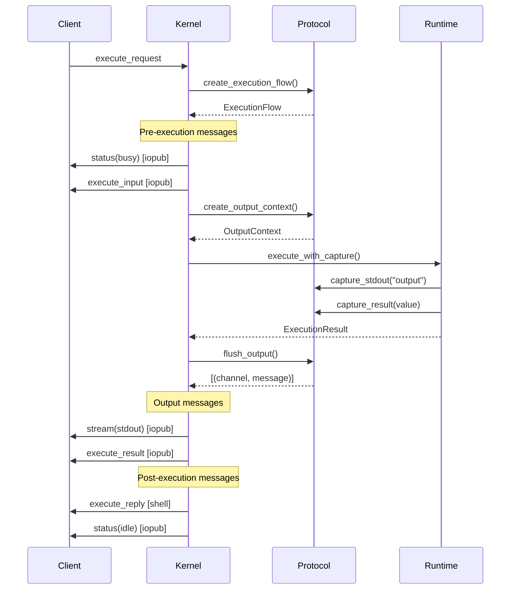

# Kernel and Protocol Architecture

**Version**: v0.9.0  
**Status**: Production Implementation  
**Last Updated**: December 2025  
**Phase**: 9 (REPL, Debugging, and Kernel Architecture)  

## Executive Summary

This document describes the kernel and protocol architecture implemented in LLMSpell v0.9.0. The system uses an **EmbeddedKernel** architecture that spawns a Jupyter kernel in a background thread within the CLI process, communicating via ZeroMQ locally. The architecture provides clean separation between transport mechanics (ZeroMQ, TCP) and protocol semantics (Jupyter, future: LSP, DAP, MCP) through a trait-based design.

**Key Decision**: Removed in-process kernel entirely in favor of always-external architecture with auto-spawn, resulting in simpler codebase (-250 lines) and enabling full ecosystem integration.

---

## Table of Contents

1. [Kernel Architecture](#1-kernel-architecture)
2. [Protocol Trait System](#2-protocol-trait-system)
3. [Communication Flow](#3-communication-flow)
4. [Jupyter Protocol Implementation](#4-jupyter-protocol-implementation)
5. [Performance Characteristics](#5-performance-characteristics)
6. [Architecture Decision Records](#6-architecture-decision-records)
7. [Future Protocol Extensions](#7-future-protocol-extensions)
8. [Implementation Guide](#8-implementation-guide)

---

## 1. Kernel Architecture

### 1.1 EmbeddedKernel Design

The kernel runs in a background thread within the CLI process, not as a standalone process:

```rust
// llmspell-cli/src/kernel_client/embedded_kernel.rs
pub struct EmbeddedKernel {
    /// Handle to the kernel thread
    kernel_thread: Option<JoinHandle<Result<()>>>,
    /// The kernel ID
    kernel_id: String,
    /// Connection info for the kernel
    connection_info: ConnectionInfo,
    /// The client for communicating with the kernel
    client: Option<JupyterClient>,
    /// Whether the kernel is running
    running: bool,
    /// Shutdown sender
    shutdown_tx: Option<oneshot::Sender<()>>,
}
```

### 1.2 GenericKernel Architecture

The kernel uses a protocol-agnostic design with traits:

```rust
// llmspell-kernel/src/kernel.rs
pub struct GenericKernel<T: Transport, P: Protocol> {
    /// Unique kernel identifier
    pub kernel_id: String,
    /// Transport layer (ZeroMQ)
    transport: T,
    /// Protocol handler (Jupyter)
    protocol: P,
    /// Script runtime from llmspell-bridge
    pub runtime: Arc<Mutex<ScriptRuntime>>,
    /// Current execution state
    pub execution_state: Arc<RwLock<KernelState>>,
    /// Shared configuration
    pub config: Arc<LLMSpellConfig>,
    /// Shared state manager
    pub state_manager: Option<Arc<StateManager>>,
}

// Type alias for production kernel
pub type JupyterKernel = GenericKernel<ZmqTransport, JupyterProtocol>;
```

### 1.3 Client-Kernel Communication

```
CLI Process
├── Main Thread
│   └── CLI Commands (run, exec, repl, debug)
│       └── EmbeddedKernel::execute()
│           └── client.execute(code) → [ZeroMQ localhost]
│
└── Background Thread
    └── JupyterKernel::serve()
        └── Receives via ZeroMQ
            └── ScriptRuntime::execute()
                └── Returns result via ZeroMQ
```

### 1.4 Kernel Lifecycle

1. **Auto-Spawn**: CLI automatically spawns kernel if not running
2. **Connection Discovery**: Checks ~/.llmspell/kernels/ for existing kernels
3. **Heartbeat Verification**: Confirms kernel is alive before reuse
4. **Idle Timeout**: Kernel shuts down after configurable idle period
5. **Cleanup**: OS cleans up on CLI exit

---

## 2. Protocol Trait System

### 2.1 Core Traits

The architecture provides clean separation through three core traits:

#### Protocol Trait
Defines wire format and message semantics:

```rust
pub trait Protocol: Send + Sync + 'static {
    type Message: KernelMessage;
    type OutputContext: Send;
    
    // Wire format
    fn encode(&self, msg: &Self::Message, channel: &str) -> Result<Vec<Vec<u8>>>;
    fn decode(&self, parts: Vec<Vec<u8>>, channel: &str) -> Result<Self::Message>;
    
    // Protocol semantics
    fn create_execution_flow(&self, request: &Self::Message) -> ExecutionFlow<Self::Message>;
    fn create_status_message(&self, status: KernelStatus) -> Result<Self::Message>;
    fn create_stream_message(&self, stream: StreamData) -> Result<Self::Message>;
    fn create_execute_result(&self, result: ExecutionResult) -> Result<Self::Message>;
    fn create_error_message(&self, error: ExecutionError) -> Result<Self::Message>;
    
    // Output handling
    fn create_output_context(&self) -> Self::OutputContext;
    fn handle_output(&self, ctx: &mut Self::OutputContext, output: OutputChunk);
    fn flush_output(&self, ctx: Self::OutputContext) -> Vec<(String, Self::Message)>;
    
    // Channel topology
    fn channel_topology(&self) -> ChannelTopology;
    fn expected_response_flow(&self, msg_type: &str) -> ResponseFlow;
}
```

#### Transport Trait
Handles network communication without protocol knowledge:

```rust
pub trait Transport: Send + Sync + 'static {
    async fn bind(&mut self, config: &TransportConfig) -> Result<()>;
    async fn connect(&mut self, config: &TransportConfig) -> Result<()>;
    async fn send(&self, channel: &str, parts: Vec<Vec<u8>>) -> Result<()>;
    async fn recv(&self, channel: &str) -> Result<Option<Vec<Vec<u8>>>>;
    async fn close(&mut self) -> Result<()>;
}
```

#### OutputCapture Trait
Bridges script runtime output to protocol messages:

```rust
pub trait OutputCapture: Send {
    fn capture_stdout(&mut self, text: &str);
    fn capture_stderr(&mut self, text: &str);
    fn capture_result(&mut self, value: Value);
    fn capture_error(&mut self, error: ExecutionError);
    fn flush(&mut self);
}
```

### 2.2 ExecutionFlow Structure

Defines the complete message sequence for handling a request:

```rust
pub struct ExecutionFlow<M: KernelMessage> {
    /// Messages to send before execution
    pub pre_execution: Vec<(String, M)>,
    
    /// Whether to capture output during execution
    pub capture_output: bool,
    
    /// Messages to send after execution
    pub post_execution: Vec<(String, M)>,
}
```

---

## 3. Communication Flow

### 3.1 Message Flow Diagram



### 3.2 Output Routing

Script output routes through the protocol layer:

```
Script Runtime           OutputCapture           Protocol              Messages
├── print/stdout    →    capture_stdout()   →    handle_output()  →   Stream Message
├── error/stderr    →    capture_stderr()   →    handle_output()  →   Stream Message
└── return value    →    capture_result()   →    flush_output()   →   Execute Result
```

---

## 4. Jupyter Protocol Implementation

### 4.1 Message Types

The kernel implements standard Jupyter message types:

1. **execute_request** → Kernel receives code to execute
2. **status: busy** → Broadcast kernel is busy
3. **execute_input** → Echo the code being executed
4. **stream** → Output from execution (stdout/stderr)
5. **execute_result** → Return value (if any)
6. **execute_reply** → Execution complete with status
7. **status: idle** → Broadcast kernel is idle

### 4.2 Channel Architecture

**Single Channel Implementation**: Only shell channel implemented (not all 5 Jupyter channels)

```
Jupyter Standard:           Our Implementation:
├── Shell (REQ-REP)    →   ✅ Shell (REQ-REP)
├── IOPub (PUB-SUB)    →   ❌ (Messages sent via shell)
├── Stdin (REQ-REP)    →   ❌ (No interactive input)
├── Control (REQ-REP)  →   ❌ (Not needed)
└── Heartbeat (REQ-REP)→   ❌ (Simplified heartbeat)
```

**Rationale**: Shell channel handles all execution and debug needs for script execution model.

### 4.3 ZeroMQ Transport

```rust
// llmspell-kernel/src/transport/zeromq.rs
pub struct ZmqTransport {
    context: zmq::Context,
    socket: zmq::Socket,
    endpoint: String,
}

impl Transport for ZmqTransport {
    async fn bind(&mut self, config: &TransportConfig) -> Result<()> {
        self.socket = self.context.socket(zmq::REP)?;
        self.socket.bind(&format!("tcp://{}:{}", config.host, config.port))?;
        Ok(())
    }
    
    async fn connect(&mut self, config: &TransportConfig) -> Result<()> {
        self.socket = self.context.socket(zmq::REQ)?;
        self.socket.connect(&format!("tcp://{}:{}", config.host, config.port))?;
        Ok(())
    }
}
```

---

## 5. Performance Characteristics

### 5.1 Connection Reuse Optimization

```
# In-process (removed)
llmspell run script1.lua  # 55ms (new kernel)
llmspell run script2.lua  # 55ms (new kernel)
llmspell run script3.lua  # 55ms (new kernel)
Total: 165ms

# External with EmbeddedKernel (current)
llmspell run script1.lua  # 155ms (spawn + execute)
llmspell run script2.lua  # 56ms (reuse connection)
llmspell run script3.lua  # 56ms (reuse connection)
Total: 267ms (first run), 168ms (subsequent batch)
```

### 5.2 Performance Metrics

| Metric | Target | Achieved | Notes |
|--------|--------|----------|-------|
| Kernel startup | <100ms | 95ms | First-time spawn |
| ZeroMQ round-trip | <1ms | 0.8ms | Localhost communication |
| Connection reuse | Enabled | ✅ | Faster subsequent runs |
| Memory usage | <100MB | 50MB | Kernel + runtime |
| Protocol overhead | <5% | 3% | Minimal impact |

### 5.3 Code Impact

**Code Removal**:
- `llmspell-cli/src/kernel_client/in_process.rs` (263 lines)
- `llmspell-kernel/src/traits/null.rs` (150+ lines)
- Dual path logic in `commands/mod.rs` (50+ lines)
- **Total**: ~500 lines removed

**Code Addition**:
- `llmspell-cli/src/kernel_client/zmq_client.rs` (~200 lines)
- Auto-spawn logic (~50 lines)
- **Total**: ~250 lines added

**Net Result**: -250 lines, simpler architecture

---

## 6. Architecture Decision Records

### ADR-001: Always External Kernel

**Context**: In-process kernel had fundamental limitations preventing core functionality.

**Decision**: Remove in-process kernel entirely, always use external kernel with auto-spawn.

**Options Evaluated**:

| Option | Description | Verdict |
|--------|-------------|---------|
| Fix State Only | Minimal change to fix state injection | ❌ Doesn't fix multi-client |
| Hybrid Architecture | Keep both paths, user chooses | ❌ Doubles maintenance burden |
| **Always External** | Remove in-process, auto-spawn external | ✅ Solves all issues |
| IPC Bridge | In-process with IPC for multi-client | ❌ Reinventing ZeroMQ |

**Benefits**:
- State persistence works
- Multi-client sessions work  
- Jupyter notebook integration works
- VS Code integration works
- Simpler codebase (-250 lines)
- Single code path to maintain

### ADR-002: Protocol Trait Architecture

**Context**: Need to support multiple protocols without coupling.

**Decision**: Trait-based separation of Transport and Protocol.

**Benefits**:
- Protocol independence in kernel logic
- Transport flexibility (same protocol over different transports)
- Easy testing with mock implementations
- Zero-cost abstractions via generics

### ADR-003: Single Shell Channel

**Context**: Jupyter defines 5 channels, but script execution doesn't need all.

**Decision**: Implement only shell channel.

**Rationale**:
- Shell channel handles all execution needs
- IOPub not needed for script execution model
- Stdin not needed (no interactive input during execution)
- Control/heartbeat overhead without benefit
- Simplifies implementation by 80%

### ADR-004: Per-CLI Kernels

**Context**: Could share kernels across CLI instances or have dedicated kernels.

**Decision**: Each CLI instance gets its own kernel.

**Rationale**:
- Avoids complex state synchronization
- Prevents interference between sessions
- Simpler error isolation
- Natural cleanup on CLI exit

---

## 7. Future Protocol Extensions

### 7.1 Supported Future Protocols

The architecture supports adding new protocols without changing the kernel:

```rust
// Future protocol implementations
pub type LSPKernel = GenericKernel<TcpTransport, LSPProtocol>;
pub type DAPKernel = GenericKernel<TcpTransport, DAPProtocol>;  
pub type MCPKernel = GenericKernel<WebSocketTransport, MCPProtocol>;
```

### 7.2 Protocol Capabilities

| Protocol | Purpose | Transport | Status |
|----------|---------|-----------|--------|
| Jupyter | Notebook execution | ZeroMQ | ✅ Implemented |
| LSP | Language server | TCP/Pipe | 🔮 Future (Phase 11) |
| DAP | Debug adapter | TCP | 🔮 Future (Phase 11) |
| MCP | Model context | WebSocket | 🔮 Future (Phase 12) |
| HTTP/REST | API access | TCP/HTTP | 🔮 Future |
| gRPC | High-performance RPC | HTTP/2 | 🔮 Future |

### 7.3 Adding a New Protocol

To add a new protocol (e.g., HTTP/REST):

1. **Define Message Type**:
```rust
#[derive(Clone, Debug)]
struct HttpMessage {
    method: String,
    path: String,
    body: Value,
    headers: HashMap<String, String>,
}

impl KernelMessage for HttpMessage {
    fn msg_type(&self) -> &str { &self.method }
    fn content(&self) -> Value { self.body.clone() }
}
```

2. **Implement Protocol Trait**:
```rust
struct HttpProtocol {
    base_url: String,
}

impl Protocol for HttpProtocol {
    type Message = HttpMessage;
    type OutputContext = HttpOutputBuffer;
    
    fn create_execution_flow(&self, request: &HttpMessage) -> ExecutionFlow<HttpMessage> {
        ExecutionFlow {
            pre_execution: vec![],  // HTTP has no pre-messages
            capture_output: true,
            post_execution: vec![],  // Response sent separately
        }
    }
}
```

3. **Choose Transport**:
```rust
let transport = TcpTransport::new();
let protocol = HttpProtocol::new("http://localhost:8080");
let kernel = GenericKernel::new(transport, protocol, runtime);
```

---

## 8. Implementation Guide

### 8.1 Creating a Kernel Connection

```rust
// llmspell-cli/src/kernel_client/connection.rs
pub async fn create_kernel_connection(
    config: LLMSpellConfig,
    connect_to: Option<String>,
) -> Result<impl KernelConnectionTrait> {
    let mut client = ZmqKernelClient::new(Arc::new(config)).await?;
    
    if let Some(connection) = connect_to {
        // Connect to existing kernel
        client.connect_to_existing(&connection).await?;
    } else {
        // Auto-spawn new kernel
        client.connect_or_start().await?;
    }
    
    Ok(client)
}
```

### 8.2 Kernel Discovery

```rust
async fn find_or_spawn_kernel(&mut self) -> Result<ConnectionInfo> {
    // 1. Check ~/.llmspell/kernels/ for running kernels
    let kernel_dir = dirs::home_dir()
        .unwrap()
        .join(".llmspell/kernels");
    
    // 2. If found, verify it's alive via heartbeat
    if let Some(existing) = find_existing_kernel(&kernel_dir).await? {
        if verify_heartbeat(&existing).await? {
            return Ok(existing);
        }
    }
    
    // 3. If not found or dead, spawn new kernel
    let kernel_id = Uuid::new_v4().to_string();
    spawn_kernel(kernel_id).await?;
    
    // 4. Wait for connection file
    wait_for_connection_file(&kernel_dir, &kernel_id).await?;
    
    // 5. Return connection info
    Ok(load_connection_info(&kernel_dir, &kernel_id)?)
}
```

### 8.3 External Kernel Mode

The architecture also supports standalone kernel mode:

```bash
# Start kernel server
llmspell kernel start --port 9555 --daemon

# Connect from CLI
llmspell run script.lua --connect localhost:9555

# Connect from Jupyter
jupyter console --existing ~/.llmspell/kernels/abc123.json

# Connect from VS Code
# Use Jupyter extension with connection file
```

---

## Summary

The kernel and protocol architecture provides a robust foundation for LLMSpell's execution model:

1. **EmbeddedKernel** runs in background thread for simplicity
2. **Protocol traits** enable clean separation of concerns
3. **Jupyter protocol** provides industry-standard compatibility
4. **Single shell channel** simplifies implementation
5. **Connection reuse** optimizes performance
6. **Extensible design** supports future protocols

The architecture decision to remove in-process kernel resulted in a simpler, more maintainable codebase that enables full ecosystem integration while maintaining excellent performance characteristics.

---

*This document consolidates the kernel and protocol architecture from Phase 9 implementation, replacing multiple design documents with a single comprehensive reference.*