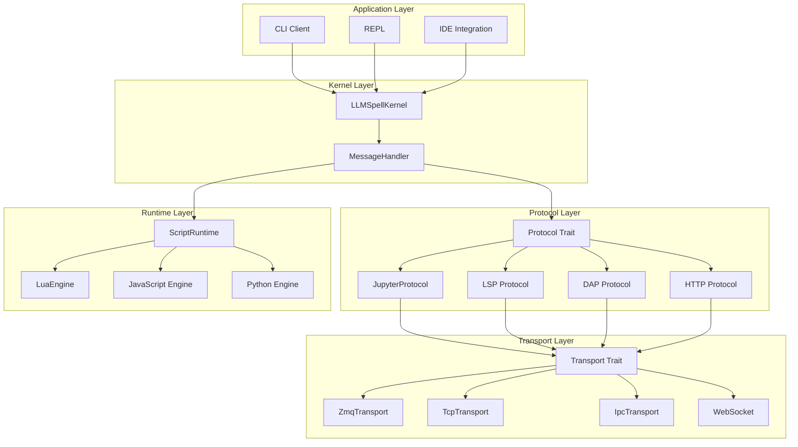
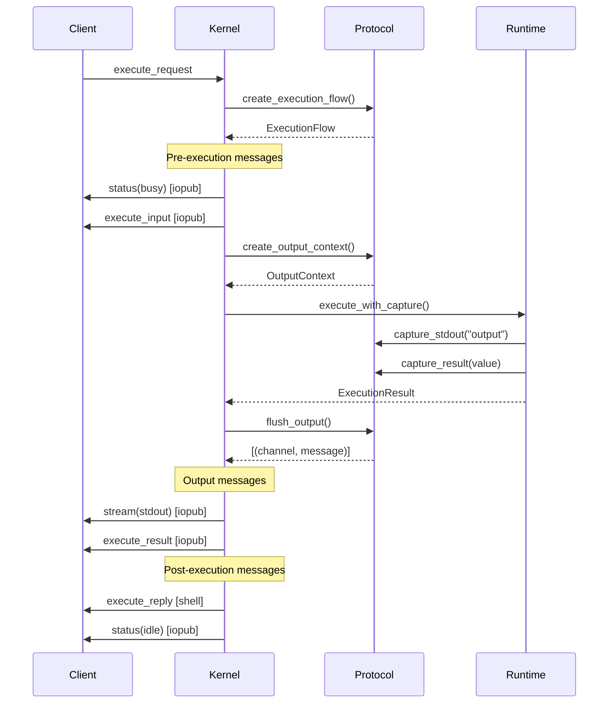
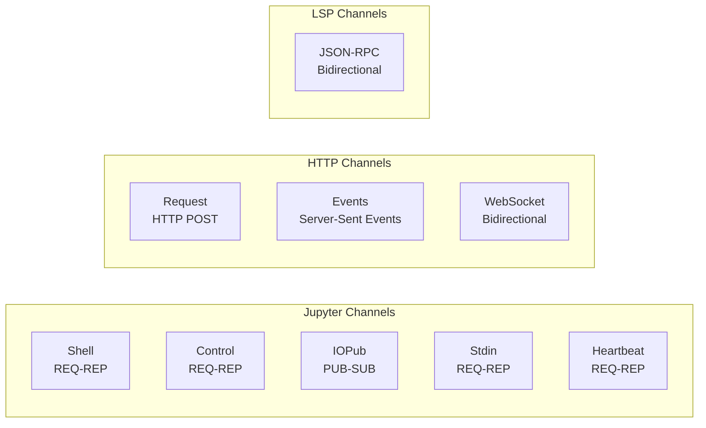
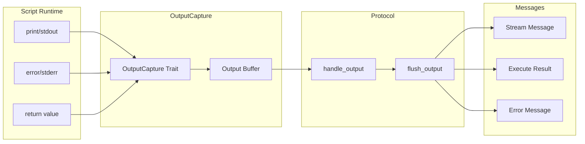
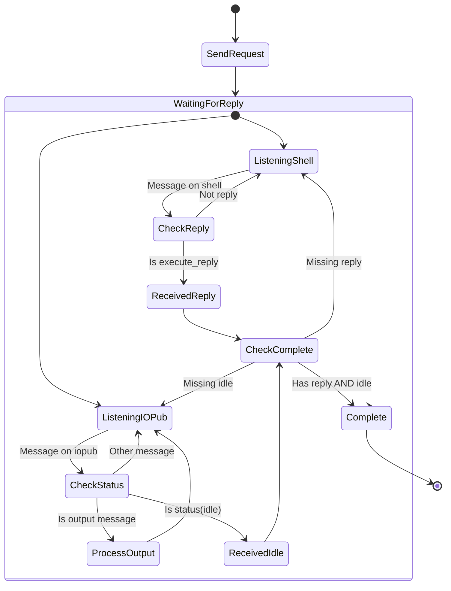

# Protocol Trait Architecture

## Overview

The Protocol trait architecture provides a clean separation between transport mechanics (ZeroMQ, TCP, IPC) and protocol semantics (Jupyter, LSP, DAP, MCP). This design enables rs-llmspell to support multiple protocols and transports without coupling them together.

## Architecture Layers



## Core Traits

### Protocol Trait

The Protocol trait defines both wire format and message semantics:

```rust
pub trait Protocol: Send + Sync {
    type Message: KernelMessage;
    type OutputContext: Send;
    
    // Wire format
    fn encode(&self, msg: &Self::Message, channel: &str) -> Result<Vec<Vec<u8>>>;
    fn decode(&self, parts: Vec<Vec<u8>>, channel: &str) -> Result<Self::Message>;
    
    // Protocol semantics
    fn create_execution_flow(&self, request: &Self::Message) -> ExecutionFlow<Self::Message>;
    fn create_status_message(&self, status: KernelStatus) -> Result<Self::Message>;
    fn create_stream_message(&self, stream: StreamData) -> Result<Self::Message>;
    fn create_execute_result(&self, result: ExecutionResult) -> Result<Self::Message>;
    fn create_error_message(&self, error: ExecutionError) -> Result<Self::Message>;
    
    // Output handling
    fn create_output_context(&self) -> Self::OutputContext;
    fn handle_output(&self, ctx: &mut Self::OutputContext, output: OutputChunk);
    fn flush_output(&self, ctx: Self::OutputContext) -> Vec<(String, Self::Message)>;
    
    // Channel topology
    fn channel_topology(&self) -> ChannelTopology;
    fn expected_response_flow(&self, msg_type: &str) -> ResponseFlow;
}
```

### Transport Trait

The Transport trait handles network communication without protocol knowledge:

```rust
pub trait Transport: Send + Sync {
    async fn bind(&mut self, config: &TransportConfig) -> Result<()>;
    async fn connect(&mut self, config: &TransportConfig) -> Result<()>;
    async fn send(&self, channel: &str, parts: Vec<Vec<u8>>) -> Result<()>;
    async fn recv(&self, channel: &str) -> Result<Option<Vec<Vec<u8>>>>;
    async fn close(&mut self) -> Result<()>;
}
```

### OutputCapture Trait

The OutputCapture trait bridges script runtime output to protocol messages:

```rust
pub trait OutputCapture: Send {
    fn capture_stdout(&mut self, text: &str);
    fn capture_stderr(&mut self, text: &str);
    fn capture_result(&mut self, value: Value);
    fn capture_error(&mut self, error: ExecutionError);
    fn flush(&mut self);
}
```

## Message Flow

### Jupyter Protocol Message Sequence



## ExecutionFlow Structure

The ExecutionFlow defines the complete message sequence for handling a request:

```rust
pub struct ExecutionFlow<M: KernelMessage> {
    /// Messages to send before execution
    pub pre_execution: Vec<(String, M)>,
    
    /// Whether to capture output during execution
    pub capture_output: bool,
    
    /// Messages to send after execution
    pub post_execution: Vec<(String, M)>,
}
```

### Example: Jupyter ExecuteRequest Flow

```rust
impl Protocol for JupyterProtocol {
    fn create_execution_flow(&self, request: &JupyterMessage) -> ExecutionFlow<JupyterMessage> {
        ExecutionFlow {
            pre_execution: vec![
                ("iopub", self.create_status_message(KernelStatus::Busy)),
                ("iopub", self.create_execute_input_message(code, count)),
            ],
            capture_output: true,
            post_execution: vec![
                ("shell", self.create_execute_reply(request, result)),
                ("iopub", self.create_status_message(KernelStatus::Idle)),
            ],
        }
    }
}
```

## Channel Topology

Different protocols have different channel requirements:



## Output Routing

The architecture routes script output through the protocol layer:



## Client Message Handling

The client must handle the complete protocol flow:



## Adding New Protocols

To add a new protocol (e.g., HTTP/REST):

1. **Define Message Type**:
```rust
#[derive(Clone, Debug)]
struct HttpMessage {
    method: String,
    path: String,
    body: Value,
    headers: HashMap<String, String>,
}

impl KernelMessage for HttpMessage {
    fn msg_type(&self) -> &str { &self.method }
    fn content(&self) -> Value { self.body.clone() }
    // ...
}
```

2. **Implement Protocol Trait**:
```rust
struct HttpProtocol {
    base_url: String,
}

impl Protocol for HttpProtocol {
    type Message = HttpMessage;
    type OutputContext = HttpOutputBuffer;
    
    fn create_execution_flow(&self, request: &HttpMessage) -> ExecutionFlow<HttpMessage> {
        // HTTP doesn't have pre-execution messages
        ExecutionFlow {
            pre_execution: vec![],
            capture_output: true,
            post_execution: vec![], // Response sent separately
        }
    }
    
    fn flush_output(&self, ctx: HttpOutputBuffer) -> Vec<(String, HttpMessage)> {
        // Convert buffered output to HTTP response
        vec![("response", HttpMessage {
            method: "RESPONSE".to_string(),
            path: "/execute".to_string(),
            body: json!({
                "output": ctx.stdout,
                "errors": ctx.stderr,
                "result": ctx.result,
            }),
            headers: HashMap::new(),
        })]
    }
}
```

3. **Choose Transport**:
```rust
// HTTP can use TCP transport with HTTP framing
let transport = TcpTransport::new();
let protocol = HttpProtocol::new("http://localhost:8080");
let kernel = LLMSpellKernel::new(transport, protocol, runtime);
```

## Benefits of This Architecture

1. **Protocol Independence**: Kernel logic doesn't know about specific protocols
2. **Transport Flexibility**: Same protocol can work over different transports
3. **Output Control**: Each protocol controls how output is presented
4. **Extensibility**: Easy to add new protocols without changing kernel
5. **Testing**: Can test with mock protocols and transports
6. **Performance**: Zero-copy message passing where possible

## Future Protocols

The architecture supports future protocol implementations:

- **LSP (Language Server Protocol)**: For IDE integration
- **DAP (Debug Adapter Protocol)**: For debugging support
- **MCP (Model Context Protocol)**: For LLM tool integration
- **GraphQL**: For flexible API queries
- **gRPC**: For high-performance RPC

Each protocol can define its own message flow, output handling, and channel topology while reusing the same kernel and transport infrastructure.