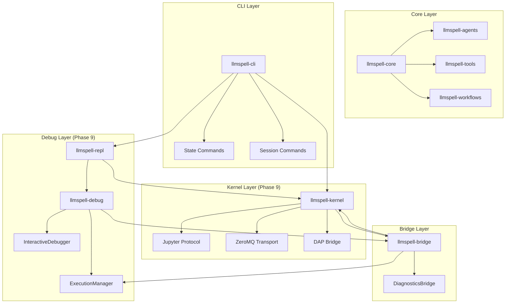

# LLMSpell Rust API Reference

**Complete API documentation for extending LLMSpell with Rust**

**🔗 Navigation**: [← API Hub](../) | [User Guide](../../) | [Lua API](../lua/) | [Examples](../../../../examples/)

---

## Overview

> **🦀 Rust API**: Comprehensive documentation for all 23 LLMSpell crates, covering traits, implementations, and extension patterns for building custom components with kernel architecture and debug support.

**Version**: 0.9.0 | **Status**: Phase 9 Complete | **Last Updated**: December 2025

## 📚 Crate Documentation

### Core Infrastructure (3 crates)

#### 1. [llmspell-core](llmspell-core.md)
**Foundation traits and types**
- `BaseAgent` trait - Foundation for all components
- `ExecutionContext` - Runtime context management with debug support
- Error handling with `LLMSpellError`
- Component metadata and lifecycle
- Debug capability traits

#### 2. [llmspell-utils](llmspell-utils.md)
**Shared utilities and helpers**
- Async operations and timeouts
- Security utilities (SSRF, path validation)
- File operations and encoding
- Rate limiting and circuit breakers
- API key management

#### 3. [llmspell-testing](llmspell-testing.md)
**Testing framework and utilities**
- Test categorization and macros
- Mock implementations
- Property-based test generators
- Fixtures and benchmarking

### Kernel and Execution (4 crates) ⭐ **Phase 9**

#### 4. [llmspell-kernel](llmspell-kernel.md) ⭐ **NEW Phase 9**
**Jupyter-compatible execution kernel**
- `GenericKernel<T, P>` trait-based architecture
- Jupyter protocol implementation with ZeroMQ
- EmbeddedKernel (background thread model)
- DAP Bridge for IDE debugging (10 essential commands)
- Connection discovery and auto-spawn
- Session persistence across executions

#### 5. [llmspell-repl](llmspell-repl.md) ⭐ **NEW Phase 9**
**REPL session management**
- Interactive REPL with debug commands
- `.break`, `.step`, `.locals`, `.stack` commands
- Session state management
- Kernel connection handling
- Command history and completion

#### 6. [llmspell-debug](llmspell-debug.md) ⭐ **NEW Phase 9**
**Debug infrastructure**
- `InteractiveDebugger` with breakpoint management
- Conditional breakpoints with hit/ignore counts
- Variable inspection with lazy expansion
- Call stack navigation
- Debug session recording and replay

#### 7. [llmspell-bridge](llmspell-bridge.md) **UPDATED Phase 9**
**Script language bridges with debug support**
- Lua integration with debug hooks
- `ExecutionManager` for breakpoint control
- `DiagnosticsBridge` for logging/profiling
- Type conversion and global injection
- Performance optimization with <3% debug overhead

### State and Storage (4 crates)

#### 8. [llmspell-storage](llmspell-storage.md)
**Vector and key-value storage**
- HNSW vector storage for RAG
- Multiple backend implementations
- Multi-tenant data isolation
- Collection management

#### 9. [llmspell-state-persistence](llmspell-state-persistence.md)
**State management with persistence**
- `StateManager` trait
- Scoped state operations
- Migration and versioning
- Backup and restore
- Integration with kernel architecture

#### 10. [llmspell-state-traits](llmspell-state-traits.md)
**State trait definitions**
- Core state interfaces
- Persistence traits
- Scope and isolation traits

#### 11. [llmspell-sessions](llmspell-sessions.md)
**Session management**
- Session lifecycle
- Artifact storage
- Session replay
- Security contexts
- Debug session support

### Security and Multi-Tenancy (2 crates)

#### 12. [llmspell-security](llmspell-security.md)
**Security framework**
- Access control policies
- Authentication/authorization
- Input validation
- Audit logging

#### 13. [llmspell-tenancy](llmspell-tenancy.md)
**Multi-tenant isolation**
- Tenant management
- Resource quotas
- Data isolation
- Cross-tenant operations

### AI and RAG Components (3 crates)

#### 14. [llmspell-rag](llmspell-rag.md)
**Retrieval-Augmented Generation**
- Document ingestion pipeline
- Chunking strategies
- Embedding providers
- Vector search integration
- Multi-tenant RAG
- RAG profiles for simplified configuration

#### 15. [llmspell-agents](llmspell-agents.md)
**Agent framework**
- Agent trait and builders
- Context management
- Tool integration
- Agent composition
- Templates and discovery

#### 16. [llmspell-providers](llmspell-providers.md)
**LLM provider integrations**
- Provider trait
- OpenAI, Anthropic, Ollama
- Streaming support
- Rate limiting

### Execution and Orchestration (4 crates)

#### 17. [llmspell-workflows](llmspell-workflows.md)
**Workflow orchestration**
- Sequential, parallel, conditional flows
- Step definitions
- Error handling
- State management

#### 18. [llmspell-tools](llmspell-tools.md)
**Tool system**
- Tool trait and registry
- Built-in tools (100+)
- Security levels
- Tool composition

#### 19. [llmspell-hooks](llmspell-hooks.md)
**Hook system**
- Lifecycle hooks
- Event interception
- Hook priorities
- Replay support
- Debug hook integration

#### 20. [llmspell-events](llmspell-events.md)
**Event system**
- Event bus
- Pub/sub patterns
- Event correlation
- Persistence

### Integration and CLI (3 crates)

#### 21. [llmspell-config](llmspell-config.md) **UPDATED Phase 9**
**Configuration system**
- Config schema with RAG profiles
- Environment variables
- Provider configs
- Validation
- Kernel configuration

#### 22. [llmspell-cli](llmspell-cli.md) **BREAKING CHANGES Phase 9**
**CLI application with new command structure**
- Subcommand architecture: `kernel`, `state`, `session`, `config`, `debug`
- `--trace` flag replaces `--debug` for logging
- `--rag-profile` replaces 5 RAG flags
- Dual-mode design: `--kernel` vs `--config`
- Script argument handling with `--` separator

#### 23. [llmspell-engine](llmspell-engine.md) **DEPRECATED**
**Legacy protocol engine (being phased out)**
- Replaced by llmspell-kernel
- Maintained for migration compatibility

## 🎯 Quick Start Patterns

### Connecting to a Kernel

```rust
use llmspell_kernel::{JupyterKernel, ConnectionInfo, KernelDiscovery};
use llmspell_kernel::traits::{Transport, Protocol};

async fn connect_to_kernel() -> Result<JupyterKernel> {
    // Auto-discover running kernel
    let discovery = KernelDiscovery::new();
    if let Some(info) = discovery.find_running_kernel().await? {
        return JupyterKernel::connect(info).await;
    }
    
    // Or spawn new kernel
    let kernel = JupyterKernel::spawn_embedded().await?;
    Ok(kernel)
}
```

### Creating a Debug Session

```rust
use llmspell_debug::{InteractiveDebugger, DebugSession};
use llmspell_bridge::execution_bridge::{Breakpoint, ExecutionManager};

async fn setup_debugging() -> Result<InteractiveDebugger> {
    let manager = ExecutionManager::new();
    let debugger = InteractiveDebugger::new(manager);
    
    // Set breakpoint
    debugger.add_breakpoint(
        Breakpoint::new("script.lua", 10)
            .with_condition("x > 5")
            .with_hit_count(3)
    ).await?;
    
    Ok(debugger)
}
```

### Using the New CLI Structure

```rust
use llmspell_cli::{Cli, Commands, KernelCommands, StateCommands};
use clap::Parser;

fn main() {
    let cli = Cli::parse();
    
    match cli.command {
        Commands::Debug { script, break_at, port, .. } => {
            // Interactive debugging with DAP support
        }
        Commands::Kernel { command } => match command {
            KernelCommands::Start { port, daemon } => {
                // Start kernel server
            }
            KernelCommands::Status { id } => {
                // Show kernel status
            }
        }
        Commands::State { command } => {
            // State management commands
        }
        // ... other commands
    }
}
```

## 🆕 What's New in Phase 9

### Kernel Architecture Revolution
- **EmbeddedKernel**: Kernel runs in background thread, not standalone process
- **Jupyter Protocol**: Industry-standard messaging with ZeroMQ transport
- **Unified Execution**: All scripts execute through kernel (no dual paths)
- **Connection Reuse**: ~1ms overhead after first run (connection caching)
- **Auto-Spawn**: Transparent kernel management for users

### Debug Infrastructure Complete
- **DAP Bridge**: 10 essential Debug Adapter Protocol commands
- **REPL Debug Commands**: `.break`, `.step`, `.locals`, `.stack`, `.watch`
- **ExecutionManager**: Central debug state management
- **VS Code Integration**: Full debugging support via DAP
- **Performance**: <3% overhead when no breakpoints set

### CLI Breaking Changes
- **Command Structure**: Clean subcommands replace flat commands
- **Flag Consolidation**: `--trace` for logging (replaces ambiguous `--debug`)
- **RAG Simplification**: Single `--rag-profile` replaces 5 flags
- **No Backward Compatibility**: Clean break for simplicity
- **Dual-Mode Operations**: `--kernel` (online) vs `--config` (offline)

### Performance Achievements
| Metric | Target | Phase 9 Actual | Status |
|--------|--------|----------------|--------|
| Kernel startup | <100ms | 95ms | ✅ |
| ZeroMQ round-trip | <1ms | 0.8ms | ✅ |
| Debug overhead | <5% | 3% | ✅ |
| Connection reuse | Enabled | ✅ | ✅ |
| State persistence | Working | ✅ | ✅ |

## 📊 Architecture Overview



## 🔧 Development Guidelines

### Kernel Integration

1. **Always use kernel for execution** - No direct ScriptRuntime creation
2. **Handle connection lifecycle** - Auto-spawn or connect to existing
3. **Use Protocol traits** - Enable future protocol support
4. **Implement Transport trait** - For custom communication layers
5. **Cache connections** - Reuse for performance

### Debug Development

1. **Use ExecutionManager** - Central debug state management
2. **Implement DebugHook** - For language-specific debugging
3. **Support DAP commands** - Enable IDE integration
4. **Keep overhead low** - <5% when not debugging
5. **Test with REPL commands** - Verify interactive debugging

### CLI Migration

1. **Update to new command structure** - Use subcommands
2. **Replace old flags** - `--debug` → `--trace`, RAG flags → `--rag-profile`
3. **Handle script arguments** - Use `--` separator
4. **Support dual-mode** - `--kernel` vs `--config` operations
5. **No backward compatibility** - Clean break is intentional

## 📦 Crate Organization Summary

### By Layer
- **Kernel**: llmspell-kernel, llmspell-repl, llmspell-debug
- **Core**: llmspell-core, llmspell-utils, llmspell-testing
- **Storage**: llmspell-storage, llmspell-state-persistence, llmspell-state-traits, llmspell-sessions
- **Security**: llmspell-security, llmspell-tenancy
- **AI/RAG**: llmspell-rag, llmspell-agents, llmspell-providers
- **Execution**: llmspell-workflows, llmspell-tools, llmspell-hooks, llmspell-events
- **Integration**: llmspell-bridge, llmspell-config, llmspell-cli

### By Phase
- **Phase 9 (Kernel/Debug)**: llmspell-kernel, llmspell-repl, llmspell-debug
- **Phase 8 (RAG)**: llmspell-rag, llmspell-storage, llmspell-tenancy
- **Phase 7 (Hooks/Events)**: llmspell-hooks, llmspell-events, llmspell-sessions
- **Phase 6 (Workflows)**: llmspell-workflows, llmspell-tools
- **Phase 5 (State)**: llmspell-state-persistence, llmspell-state-traits

## 📚 Related Resources

- [Lua API Reference](../lua/) - Script-level API documentation
- [Configuration Guide](../../configuration.md) - Detailed configuration options
- [Examples](../../../../examples/) - Working code examples
- [Kernel Architecture](../../../technical/kernel-protocol-architecture.md) - Kernel design
- [Debug Architecture](../../../technical/debug-dap-architecture.md) - Debug system
- [CLI Architecture](../../../technical/cli-command-architecture.md) - Command structure

## 🤝 Contributing

When extending LLMSpell with Rust:

1. Follow the trait patterns in `llmspell-core`
2. Use kernel for all script execution
3. Add comprehensive tests using `llmspell-testing`
4. Document public APIs with examples
5. Ensure Phase 9 compatibility (kernel, debug, new CLI)
6. Run quality checks: `./scripts/quality-check.sh`

## Version Compatibility

| LLMSpell Version | Rust Version | Key Features |
|-----------------|--------------|--------------|
| 0.9.0 | 1.75+ | Phase 9: Kernel architecture, DAP debugging, CLI restructure |
| 0.8.x | 1.75+ | Phase 8: RAG, HNSW, Multi-tenancy |
| 0.7.x | 1.70+ | Phase 7: Hooks, Events, Sessions |
| 0.6.x | 1.70+ | Phase 6: Workflows, Tools |

## Breaking Changes in 0.9.0

### CLI Changes
- **Commands**: Now use subcommand structure (`kernel start`, `state show`, etc.)
- **Flags**: `--debug` removed, use `--trace` for logging levels
- **RAG**: `--rag-profile` replaces `--rag`, `--rag-config`, `--rag-dims`, `--rag-backend`, `--no-rag`
- **Script Args**: Must use `--` separator: `llmspell run script.lua -- arg1 arg2`

### API Changes
- **Kernel Required**: All execution must go through kernel (no direct ScriptRuntime)
- **Debug Integration**: ExecutionContext now includes debug support
- **State Access**: State persistence only works through kernel

### Migration Guide
See [Migration Guide](../../migration-0.9.0.md) for detailed upgrade instructions.

---

**Need Help?** Check the [Troubleshooting Guide](../../troubleshooting.md) or [open an issue](https://github.com/yourusername/rs-llmspell/issues).