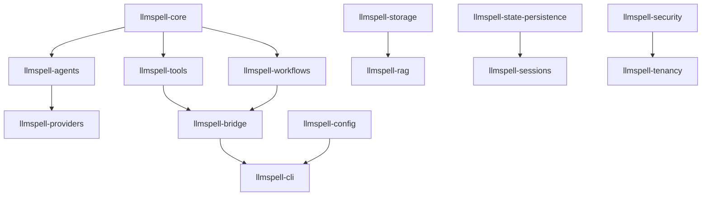

# LLMSpell Rust API Reference

**Complete API documentation for extending LLMSpell with Rust**

**🔗 Navigation**: [← API Hub](../) | [User Guide](../../) | [Lua API](../lua/) | [Examples](../../../../examples/)

---

## Overview

> **🦀 Rust API**: Comprehensive documentation for all 19 LLMSpell crates, covering traits, implementations, and extension patterns for building custom components.

**Version**: 0.8.0 | **Status**: Phase 8 Complete | **Last Updated**: December 2024

## 📚 Crate Documentation

### Core Infrastructure (3 crates)

#### 1. [llmspell-core](llmspell-core.md)
**Foundation traits and types**
- `BaseAgent` trait - Foundation for all components
- `ExecutionContext` - Runtime context management
- Error handling with `LLMSpellError`
- Component metadata and lifecycle

#### 2. [llmspell-utils](llmspell-utils.md)
**Shared utilities and helpers**
- Async operations and timeouts
- Security utilities (SSRF, path validation)
- File operations and encoding
- Rate limiting and circuit breakers
- API key management

#### 3. [llmspell-testing](llmspell-testing.md)
**Testing framework and utilities**
- Test categorization and macros
- Mock implementations
- Property-based test generators
- Fixtures and benchmarking

### State and Storage (4 crates)

#### 4. [llmspell-storage](llmspell-storage.md) ⭐ **Phase 8**
**Vector and key-value storage**
- HNSW vector storage for RAG
- Multiple backend implementations
- Multi-tenant data isolation
- Collection management

#### 5. [llmspell-state-persistence](llmspell-state-persistence.md)
**State management with persistence**
- `StateManager` trait
- Scoped state operations
- Migration and versioning
- Backup and restore

#### 6. [llmspell-state-traits](llmspell-state-traits.md)
**State trait definitions**
- Core state interfaces
- Persistence traits
- Scope and isolation traits

#### 7. [llmspell-sessions](llmspell-sessions.md)
**Session management**
- Session lifecycle
- Artifact storage
- Session replay
- Security contexts

### Security and Multi-Tenancy (3 crates)

#### 8. [llmspell-security](llmspell-security.md)
**Security framework**
- Access control policies
- Authentication/authorization
- Input validation
- Audit logging

#### 9. [llmspell-tenancy](llmspell-tenancy.md) ⭐ **Phase 8**
**Multi-tenant isolation**
- Tenant management
- Resource quotas
- Data isolation
- Cross-tenant operations

### AI and RAG Components (3 crates)

#### 10. [llmspell-rag](llmspell-rag.md) ⭐ **Phase 8**
**Retrieval-Augmented Generation**
- Document ingestion pipeline
- Chunking strategies
- Embedding providers
- Vector search integration
- Multi-tenant RAG

#### 11. [llmspell-agents](llmspell-agents.md)
**Agent framework**
- Agent trait and builders
- Context management
- Tool integration
- Agent composition
- Templates and discovery

#### 12. [llmspell-providers](llmspell-providers.md)
**LLM provider integrations**
- Provider trait
- OpenAI, Anthropic, Ollama
- Streaming support
- Rate limiting

### Execution and Orchestration (4 crates)

#### 13. [llmspell-workflows](llmspell-workflows.md)
**Workflow orchestration**
- Sequential, parallel, conditional flows
- Step definitions
- Error handling
- State management

#### 14. [llmspell-tools](llmspell-tools.md)
**Tool system**
- Tool trait and registry
- Built-in tools (100+)
- Security levels
- Tool composition

#### 15. [llmspell-hooks](llmspell-hooks.md)
**Hook system**
- Lifecycle hooks
- Event interception
- Hook priorities
- Replay support

#### 16. [llmspell-events](llmspell-events.md)
**Event system**
- Event bus
- Pub/sub patterns
- Event correlation
- Persistence

### Integration and Runtime (3 crates)

#### 17. [llmspell-bridge](llmspell-bridge.md)
**Script language bridges**
- Lua integration
- Type conversion
- Global injection
- Performance optimization

#### 18. [llmspell-config](llmspell-config.md)
**Configuration system**
- Config schema
- Environment variables
- Provider configs
- Validation

#### 19. [llmspell-cli](llmspell-cli.md)
**CLI application**
- Command parsing
- Runtime initialization
- Script execution
- Output formatting

## 🎯 Quick Start Patterns

### Creating a Custom Component

```rust
use llmspell_core::{
    BaseAgent, ComponentMetadata, ExecutionContext,
    Result, LLMSpellError,
    types::{AgentInput, AgentOutput}
};
use async_trait::async_trait;

pub struct MyComponent {
    metadata: ComponentMetadata,
}

#[async_trait]
impl BaseAgent for MyComponent {
    fn metadata(&self) -> &ComponentMetadata {
        &self.metadata
    }
    
    async fn execute_impl(
        &self,
        input: AgentInput,
        context: ExecutionContext,
    ) -> Result<AgentOutput> {
        // Your logic here
        Ok(AgentOutput::text("Result"))
    }
    
    async fn validate_input(&self, input: &AgentInput) -> Result<()> {
        // Validation logic
        Ok(())
    }
    
    async fn handle_error(&self, error: LLMSpellError) -> Result<AgentOutput> {
        Err(error)
    }
}
```

### Implementing a Custom Tool

```rust
use llmspell_core::traits::Tool;
use llmspell_tools::{ToolCategory, SecurityLevel, ToolSchema};

pub struct CustomTool {
    metadata: ComponentMetadata,
}

#[async_trait]
impl Tool for CustomTool {
    fn category(&self) -> ToolCategory {
        ToolCategory::Custom
    }
    
    fn security_level(&self) -> SecurityLevel {
        SecurityLevel::Safe
    }
    
    fn schema(&self) -> ToolSchema {
        ToolSchema::new("custom_tool", "Description")
            .with_parameter("input", ParameterType::String, true)
            .with_returns(ParameterType::String)
    }
}
```

### Building a RAG Application

```rust
use llmspell_rag::{RAGPipeline, RAGConfig};
use llmspell_storage::vector::HNSWVectorStorage;

async fn setup_rag() -> Result<RAGPipeline> {
    let config = RAGConfig::default()
        .with_collection("knowledge_base")
        .with_embedding_model("text-embedding-3-small");
    
    RAGPipeline::new(config).await
}
```

## 📊 Architecture Overview



## 🔧 Development Guidelines

### Trait Implementation

1. **Always implement `BaseAgent`** for executable components
2. **Use async-trait** for async trait methods
3. **Provide meaningful metadata** in `ComponentMetadata`
4. **Handle errors gracefully** in `handle_error()`
5. **Validate inputs thoroughly** in `validate_input()`

### Performance Best Practices

- Use `Arc` for shared components
- Implement streaming for large responses
- Cache expensive computations
- Batch operations when possible
- Profile with `llmspell-testing` benchmarks

### Security Requirements

- Validate all external inputs
- Use `llmspell-security` for path validation
- Implement rate limiting for external calls
- Never expose sensitive data in errors
- Follow multi-tenant isolation patterns

## 📚 Related Resources

- [Lua API Reference](../lua/) - Script-level API documentation
- [Configuration Guide](../../configuration.md) - Detailed configuration options
- [Examples](../../../../examples/) - Working code examples
- [Architecture](../../../technical/master-architecture-vision.md) - System design

## 🤝 Contributing

When extending LLMSpell with Rust:

1. Follow the trait patterns in `llmspell-core`
2. Add comprehensive tests using `llmspell-testing`
3. Document public APIs with examples
4. Ensure Phase 8 compatibility (RAG, multi-tenancy)
5. Run quality checks: `./scripts/quality-check.sh`

## Version Compatibility

| LLMSpell Version | Rust Version | Key Features |
|-----------------|--------------|--------------|
| 0.8.x | 1.75+ | Phase 8: RAG, HNSW, Multi-tenancy |
| 0.7.x | 1.70+ | Phase 7: Hooks, Events, Sessions |
| 0.6.x | 1.70+ | Phase 6: Workflows, Tools |

---

**Need Help?** Check the [Troubleshooting Guide](../../troubleshooting.md) or [open an issue](https://github.com/yourusername/rs-llmspell/issues).